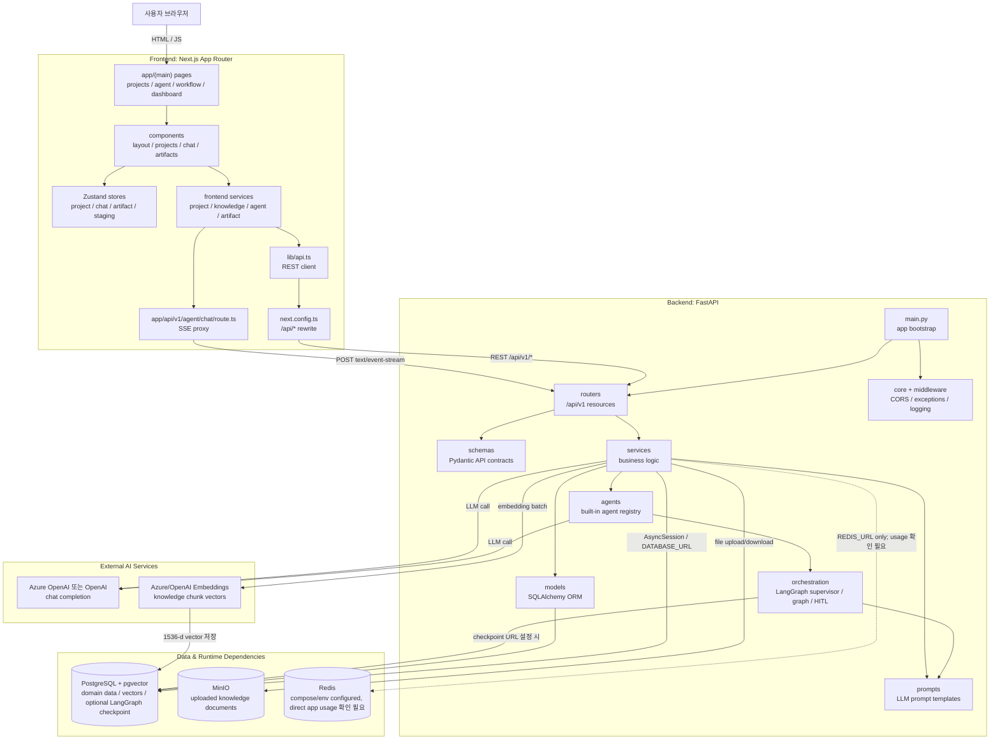
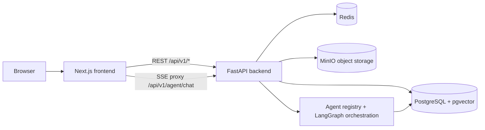
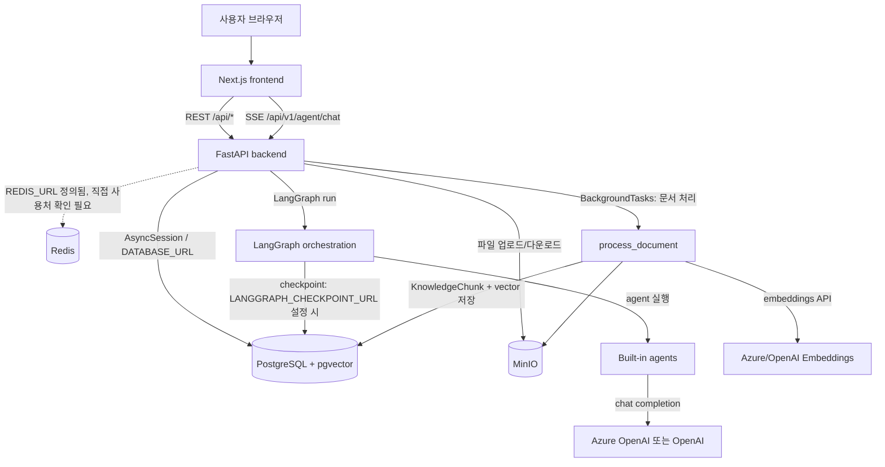
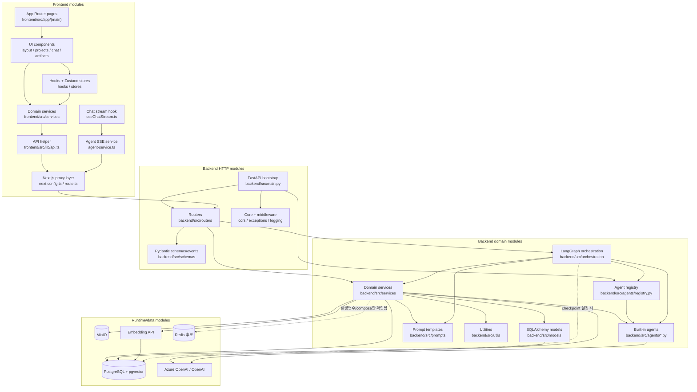
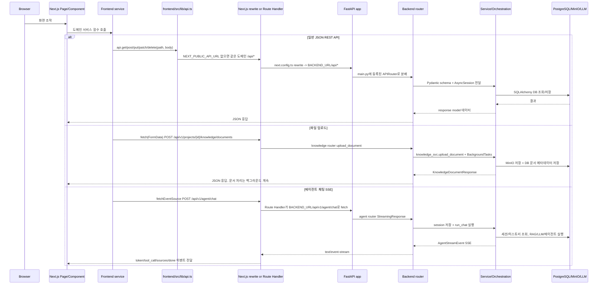
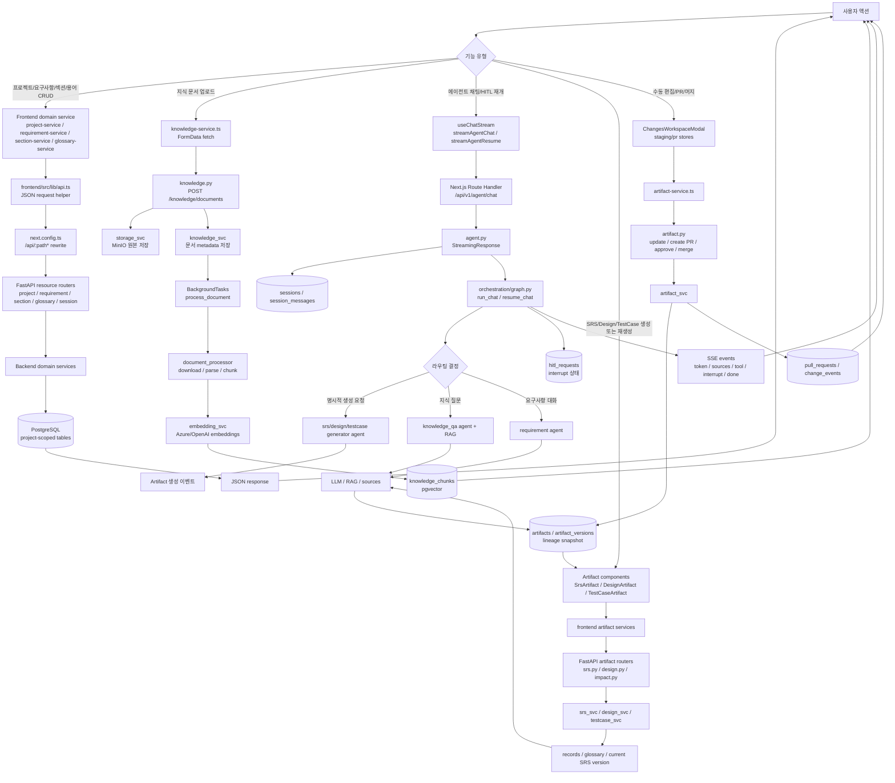
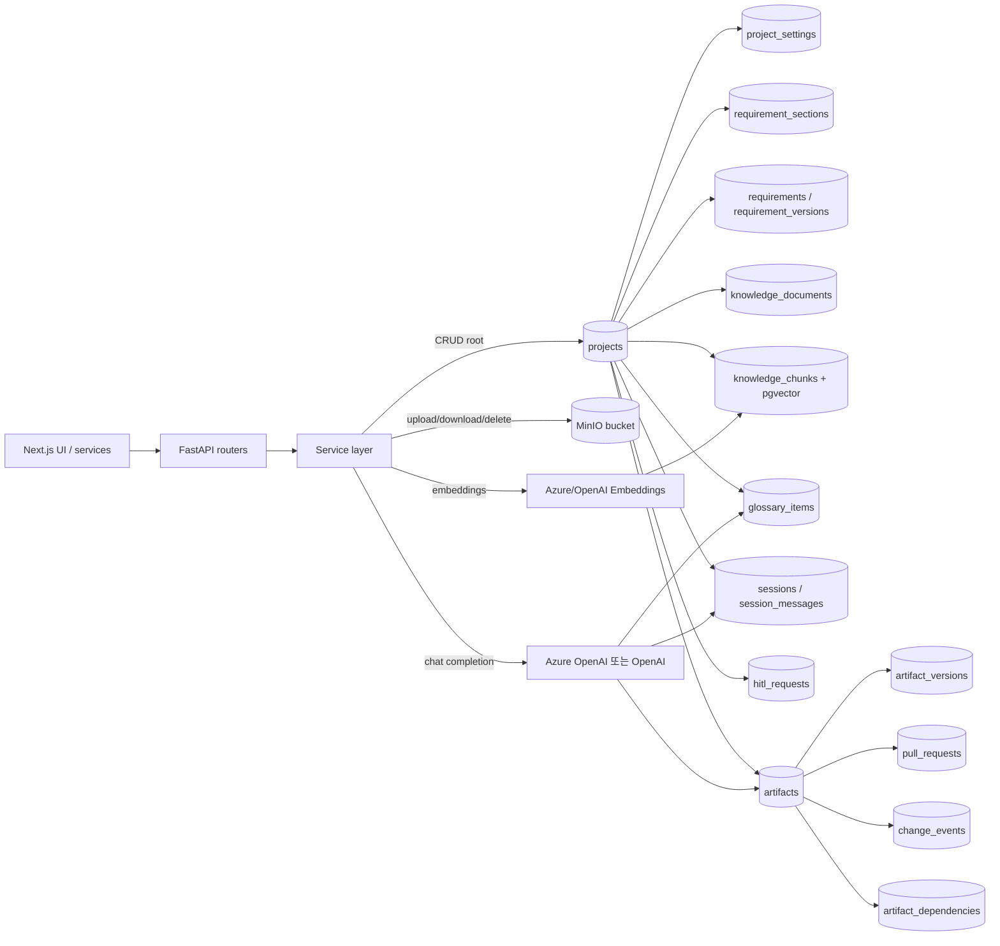
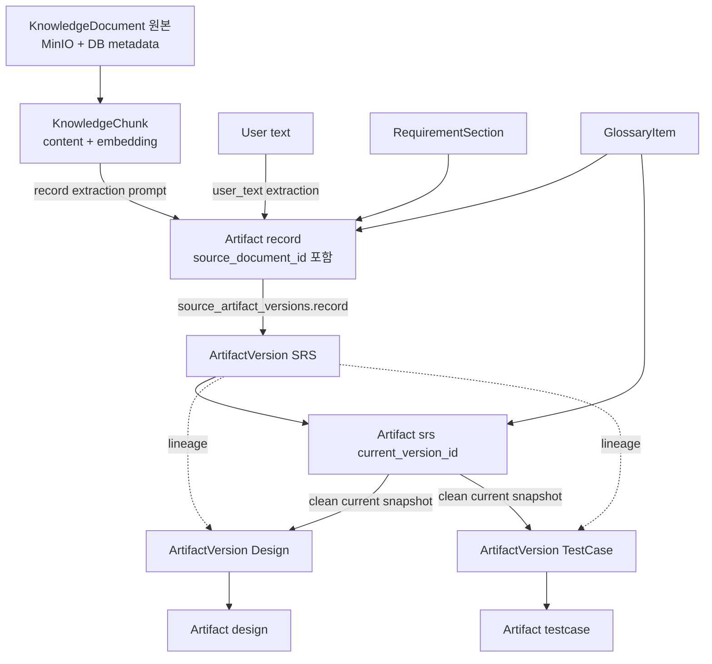

# Architecture

이 문서는 AISE+ 코드베이스를 처음 보는 신입 개발자가 실행 진입점과 주요 애플리케이션 모듈을 빠르게 파악하기 위한 아키텍처 개요이다.

## 아키텍처 개요

AISE+는 프로젝트별 지식 문서, 요구사항, 용어, SRS/설계/테스트케이스 같은 산출물, 그리고 에이전트 대화를 한 곳에서 관리하기 위한 AI 지원 요구공학 웹 애플리케이션이다. 코드에서 확인되는 핵심 목적은 프로젝트 자료를 업로드해 검색 가능한 지식베이스로 만들고, 사용자가 요구사항을 정리하거나 산출물을 생성할 때 RAG, LLM, 에이전트 오케스트레이션, Human-in-the-Loop 흐름을 결합해 반복 작업을 줄이는 것이다.

이 시스템이 해결하려는 문제는 요구사항 문서화 과정에서 자주 생기는 정보 분산, 용어 불일치, 수동 정제 부담, 산출물 간 추적성 부족이다. 프론트엔드는 프로젝트, 지식 저장소, 용어집, 요구사항, 아티팩트 작업 공간, 에이전트 채팅 화면을 제공하고, 백엔드는 프로젝트 단위 데이터 격리, 파일 처리/임베딩, 벡터 검색, LLM 생성, 리뷰/영향도 분석, 아티팩트 버전 lineage, HITL 상태 저장을 담당한다.

주요 사용자는 요구사항 분석가, 기획자/PM, QA 또는 테스트케이스 작성자, 설계 문서 작성자, 그리고 이 기능을 운영·유지보수하는 개발자이다. 사용자는 브라우저에서 프로젝트를 만들고 지식 문서를 업로드한 뒤, 요구사항 정제나 SRS/Design/TC 생성 요청을 에이전트 또는 각 기능 화면에서 수행한다. 운영자는 Docker Compose 또는 개별 개발 서버로 Next.js와 FastAPI를 실행하고, PostgreSQL/pgvector, MinIO, Redis 후보 의존성, Azure OpenAI/OpenAI 계정 연결 상태를 관리한다.

현재 코드 기준 런타임은 Next.js 프론트엔드, FastAPI 백엔드, PostgreSQL/pgvector, Redis, MinIO로 구성된다. 로컬 또는 컨테이너 실행 시 사용자는 브라우저에서 Next.js 앱에 접속하고, 프론트엔드는 REST API 또는 SSE 스트림을 통해 FastAPI 백엔드와 통신한다. 백엔드는 라우터, 서비스, 모델, 에이전트 오케스트레이션 계층으로 나뉘며 데이터는 PostgreSQL과 MinIO에 저장된다. 실제 운영 서버, 클라우드 계정, CI/CD 절차, 비밀 주입 방식, 장애 대응 기준은 저장소만으로 확정할 수 없어 `확인 필요`로 다룬다.

| 관점 | 코드에서 확인한 내용 | 주요 근거 파일 | 확인 필요 |
| --- | --- | --- | --- |
| 제품 목적 | 프로젝트별 지식, 요구사항, 용어, 아티팩트, 에이전트 대화를 통합 관리하고 LLM/RAG 기반 문서화 흐름을 지원한다. | `DESIGN.md`, `FRONTEND_DESIGN.md`, `frontend/src/config/navigation.ts`, `backend/src/main.py`, `backend/src/routers/*.py` | 실제 조직 내 사용 부서, 운영 SLA, 제품 범위 확정 기준은 확인 필요. |
| 해결 문제 | 지식 문서 검색, 요구사항 정제, SRS/설계/테스트케이스 생성, 리뷰/영향도 분석, 산출물 버전 추적을 자동화 또는 보조한다. | `backend/src/services/knowledge_svc.py`, `backend/src/services/rag_svc.py`, `backend/src/services/requirement_svc.py`, `backend/src/services/srs_svc.py`, `backend/src/services/design_svc.py`, `backend/src/services/testcase_svc.py`, `backend/src/services/impact_svc.py`, `backend/src/services/artifact_svc.py` | 각 기능의 업무상 승인 절차와 산출물 품질 기준은 확인 필요. |
| 주요 사용자 | 프로젝트 관리자/기획자, 요구사항 분석가, QA/테스트 담당자, 설계 문서 작성자, 개발/운영 담당자가 주요 독자와 사용자가 된다. | `frontend/src/app/(main)/projects`, `frontend/src/app/(main)/agent`, `frontend/src/components/projects`, `frontend/src/components/requirements`, `frontend/src/components/artifacts`, `frontend/src/components/chat` | 실제 권한 모델, 사용자 역할별 접근 범위, 인증/인가 정책은 확인 필요. |
| 운영 맥락 | Docker Compose 또는 개발 서버로 frontend/backend/DB/MinIO/Redis 후보 의존성을 함께 실행하고, 외부 LLM/Embedding API를 환경변수로 연결한다. | `docker-compose.yml`, `docker-compose.preview.yml`, `start-local.sh`, `start-dev.sh`, `.env.prod.example`, `.env.preview.example`, `backend/src/services/llm_svc.py`, `backend/src/services/embedding_svc.py` | 운영 서버, 클라우드 계정, CI/CD, 배포 승인, 롤백, 장애 대응 기준은 확인 필요. |

### 전체 시스템 구조

아래 다이어그램은 현재 코드와 compose 설정에서 확인한 런타임 구성, 프론트엔드/백엔드 내부 계층, 저장소, 외부 AI 의존성을 한 장으로 묶은 전체 구조이다. 운영 서버, TLS 종료 지점, 인증/인가 경계, CI/CD 파이프라인처럼 코드에서 확정할 수 없는 내용은 이 문서의 `아키텍처 확인 필요 항목` 섹션에 분리해 남긴다.



이 다이어그램의 구성 요소는 크게 사용자 브라우저, Next.js 프론트엔드, FastAPI 백엔드, 데이터/런타임 의존성, 외부 AI 서비스로 나뉜다. 프론트엔드 안에서는 페이지가 컴포넌트와 Zustand store를 사용하고, 서비스 계층이 공통 API 클라이언트 또는 SSE 프록시를 통해 백엔드로 요청을 보낸다. 백엔드는 `main.py`에서 라우터와 미들웨어를 조립하고, 라우터는 Pydantic 스키마를 경계로 서비스 계층에 업무 처리를 위임한다.

흐름은 왼쪽의 사용자 요청에서 시작해 프론트엔드 서비스, Next.js rewrite 또는 SSE Route Handler, FastAPI 라우터, 백엔드 서비스 순서로 읽으면 된다. 저장이 필요한 데이터는 PostgreSQL/pgvector 또는 MinIO로 이동하고, 생성/검색 기능은 Azure OpenAI 또는 OpenAI 호출을 거쳐 결과만 다시 DB와 응답에 반영된다. Redis는 compose와 환경변수에는 있지만 현재 코드에서 직접 사용 흐름이 확인되지 않으므로 점선 의존성으로 표시했다.



위 축약 다이어그램은 전체 구조를 더 빠르게 훑기 위한 런타임 요약이다. 브라우저는 Next.js만 직접 상대하고, Next.js가 REST와 SSE 요청을 FastAPI로 넘긴다. FastAPI는 영속 데이터는 PostgreSQL/pgvector, 파일은 MinIO, 에이전트 실행은 Agent registry와 LangGraph 오케스트레이션으로 연결한다.

### 인프라 의존성 요약

| 분류 | 의존성 | 코드에서 확인한 사용 방식 | 관련 파일 | 확인 필요 |
| --- | --- | --- | --- | --- |
| 관계형/벡터 데이터 저장소 | PostgreSQL + pgvector | `DATABASE_URL`로 async SQLAlchemy 엔진을 만들고 API 라우터/서비스가 `AsyncSession`을 통해 접근한다. Alembic 마이그레이션에는 프로젝트, 요구사항, 세션, SRS, 지식 문서/청크, 용어집, 리뷰, 아티팩트, HITL, 버전 lineage 관련 테이블이 포함된다. 지식 청크 임베딩은 pgvector 기반 모델 필드에 저장되어 RAG 검색에 사용된다. | `backend/src/core/database.py`, `backend/src/models/*.py`, `backend/alembic/versions/*.py`, `backend/src/services/rag_svc.py`, `backend/src/models/knowledge.py` | 운영 DB 백업/복구, 마이그레이션 승인 절차, pgvector 인덱스 운영 기준은 확인 필요. |
| 오브젝트 스토리지 | MinIO | 지식 문서 업로드 시 `{project_id}/{document_id}/{filename}` 키로 원본 파일을 저장한다. 문서 처리 백그라운드 작업은 MinIO에서 파일을 다시 다운로드한 뒤 파싱, 청킹, 임베딩, DB 저장을 수행한다. 프로젝트/문서 삭제 시 단일 객체 또는 prefix 단위 삭제가 가능하다. | `backend/src/services/storage_svc.py`, `backend/src/services/knowledge_svc.py`, `backend/src/services/document_processor.py`, `docker-compose.yml`, `docker-compose.preview.yml` | 운영 버킷 정책, TLS/암호화, lifecycle, 백업, 용량 알림 기준은 확인 필요. |
| 인메모리 저장소/큐 후보 | Redis | `docker-compose.yml`과 `.env.*.example`에는 Redis 서비스와 `REDIS_URL`이 정의되어 있고 backend 의존성에도 `redis` 패키지가 포함된다. 현재 검색된 애플리케이션 코드에서는 Redis 클라이언트 직접 사용처가 확인되지 않는다. `.env.prod.example` 주석에는 LangGraph state cache 및 향후 Celery broker 용도가 적혀 있다. | `docker-compose.yml`, `.env.prod.example`, `.env.preview.example`, `backend/pyproject.toml` | 실제 운영 사용 여부, 캐시/큐 키 설계, 장애 시 영향도, Celery 도입 여부는 확인 필요. |
| LangGraph 체크포인트 저장소 | 메모리 또는 PostgreSQL | `LANGGRAPH_CHECKPOINT_URL`이 없으면 `MemorySaver`를 사용하고, 설정되면 `AsyncPostgresSaver`와 `psycopg_pool.AsyncConnectionPool`을 초기화해 LangGraph checkpoint 테이블을 준비한다. compose 운영 구성은 backend에 PostgreSQL 기반 checkpoint URL을 주입한다. | `backend/src/orchestration/graph.py`, `backend/src/orchestration/state.py`, `docker-compose.yml`, `.env.prod.example`, `.env.preview.example` | 운영에서 체크포인트 보존 기간, 정리 작업, 장기 세션 복구 정책은 확인 필요. |
| 외부 LLM | Azure OpenAI 또는 OpenAI | `LLM_PROVIDER` 기본값은 `azure`이다. Azure 모드에서는 SRS/TC 용도별 `SRS_API_KEY`, `SRS_ENDPOINT`, `TC_API_KEY`, `TC_ENDPOINT`와 모델명을 사용하고 LiteLLM이 `azure/{model}` 형식으로 호출한다. OpenAI 모드에서는 `OPENAI_API_KEY`, `OPENAI_MODEL`을 사용한다. | `backend/src/services/llm_svc.py`, `.env.prod.example`, `.env.preview.example`, `references/2026-03-27_azure-openai-responses-api.md` | 실제 계정, 배포명, 키 관리, rate limit, 비용 통제, 장애 우회 절차는 확인 필요. |
| 외부 임베딩 API | Azure OpenAI 또는 OpenAI embeddings | 임베딩 서비스는 `LLM_PROVIDER`에 따라 `AZURE_EMBEDDING_MODEL` 기본 `text-embedding-3-large` 또는 `OPENAI_EMBEDDING_MODEL` 기본 `text-embedding-3-small`을 선택한다. 100개 단위 batch로 embeddings API를 호출하고 1536차원 벡터를 저장한다. | `backend/src/services/embedding_svc.py`, `backend/src/services/document_processor.py`, `backend/src/services/rag_svc.py` | 운영 임베딩 모델 확정값, 차원 변경 시 마이그레이션 전략, 실패 재시도 정책은 확인 필요. |
| 백그라운드 작업 | FastAPI `BackgroundTasks`, 요청 내 `asyncio.create_task` | 지식 문서 업로드/재처리는 응답 후 `process_document(document_id)`를 BackgroundTasks에 등록한다. 이 작업은 독립 DB 세션으로 MinIO 다운로드, 파일 파싱, 청킹, 임베딩, `KnowledgeChunk` 저장, 문서 상태 갱신을 수행한다. 아티팩트 레코드 추출 SSE는 요청 처리 중 `asyncio.create_task`로 LLM 추출 작업을 실행하고 heartbeat 이벤트를 보낸다. 별도 워커, Celery, 스케줄러 구현은 현재 확인되지 않는다. | `backend/src/routers/knowledge.py`, `backend/src/services/knowledge_svc.py`, `backend/src/services/document_processor.py`, `backend/src/services/artifact_record_svc.py` | 장시간 작업 타임아웃, 재시도/재처리 정책, 워커 분리 여부, 실패 알림 기준은 확인 필요. |
| 배포 런타임 의존성 | Docker Compose 서비스 네트워크 | 기본 compose는 PostgreSQL(pgvector), MinIO, Redis, backend, frontend를 같은 compose 네트워크에서 실행한다. backend는 `postgres`, `redis`, `minio` 서비스명을 사용하고 frontend는 `BACKEND_URL=http://backend:8081`로 Next.js rewrite/SSE proxy 대상 백엔드에 접근한다. preview compose는 master와 포트/볼륨/컨테이너명을 분리한다. | `docker-compose.yml`, `docker-compose.preview.yml`, `frontend/next.config.ts`, `frontend/src/app/api/v1/agent/chat/route.ts`, `backend/Dockerfile`, `frontend/Dockerfile` | 실제 운영 서버, TLS 종료 지점, 로드밸런서, CI/CD, 롤백, 비밀 주입 방식은 확인 필요. |
| 외부 업무 시스템 연동 자리 | Jira, Polarion 패키지 | `backend/src/integrations/jira`와 `backend/src/integrations/polarion` 패키지는 존재하지만 현재 `__init__.py` 외 구체 구현이나 라우터 연결은 확인되지 않는다. | `backend/src/integrations/jira/__init__.py`, `backend/src/integrations/polarion/__init__.py` | 실제 연동 사용 여부, 인증 방식, API 엔드포인트, 장애 대응 기준은 확인 필요. |

주요 인프라 흐름은 다음과 같다.



이 다이어그램은 인프라 관점에서 백엔드가 어떤 외부/내부 런타임 자원을 사용하는지 보여준다. Next.js와 FastAPI 사이에는 일반 REST 요청과 에이전트 SSE 요청이 모두 존재하고, FastAPI 내부 작업은 DB, MinIO, LangGraph, LLM, Embedding API로 갈라진다. 문서 처리처럼 응답 후 계속되는 작업은 `BackgroundTasks` 노드로 따로 표현해 일반 요청/응답 흐름과 구분했다.

신입 개발자가 장애 지점을 찾을 때는 화살표 라벨을 기준으로 보면 된다. DB 연결 문제는 `DATABASE_URL`과 SQLAlchemy 세션 경로, 파일 문제는 MinIO 업로드/다운로드 경로, 에이전트 중단/재개 문제는 LangGraph checkpoint와 HITL 상태 저장 경로, RAG 검색 품질 문제는 문서 처리와 embedding 저장 경로를 우선 확인한다.

### 관련 파일 경로

이 섹션은 코드베이스를 처음 보는 개발자가 아키텍처를 추적할 때 먼저 확인할 주요 디렉터리와 핵심 파일 경로이다. 각 경로는 현재 저장소에서 확인한 파일/디렉터리 기준이다.

#### 아키텍처 경계별 코드/설정 파일 매핑

아래 표는 전체 시스템 다이어그램의 각 경계가 저장소의 어떤 코드와 설정 파일로 구현되는지 연결한 지도이다. 장애 분석이나 기능 변경을 시작할 때는 먼저 이 표에서 해당 경계를 찾고, 설정 파일에서 런타임 값을 확인한 뒤 코드 진입점으로 이동한다.

| 아키텍처 경계 | 코드 진입점 | 설정/빌드 파일 | 확인한 연결 방식 | 확인 필요 |
| --- | --- | --- | --- | --- |
| 브라우저 -> Next.js 화면 | `frontend/src/app/layout.tsx`, `frontend/src/app/(main)/layout.tsx`, `frontend/src/app/(main)/projects/[id]/page.tsx`, `frontend/src/app/(main)/agent/[[...sessionId]]/page.tsx` | `frontend/package.json`, `frontend/next.config.ts`, `frontend/tsconfig.json`, `frontend/eslint.config.mjs` | App Router가 제품 화면과 레이아웃을 구성하고 `pnpm dev`, `pnpm build`, `pnpm start` 스크립트로 실행된다. | 운영 도메인, 사용자 인증/세션 적용 방식은 확인 필요. |
| Next.js 화면 -> 프론트엔드 상태/API 계층 | `frontend/src/services/*-service.ts`, `frontend/src/lib/api.ts`, `frontend/src/hooks/useChatStream.ts`, `frontend/src/stores/*.ts` | `frontend/package.json`, `frontend/src/config/navigation.ts`, `frontend/src/config/layout.ts` | 화면 컴포넌트가 도메인 service와 Zustand store를 사용하고, 일반 REST 호출은 `frontend/src/lib/api.ts`, SSE 채팅은 `useChatStream()` 경로를 탄다. | 운영에서 `NEXT_PUBLIC_API_URL`을 직접 백엔드로 둘지, Next.js rewrite를 사용할지는 확인 필요. |
| Next.js -> FastAPI 프록시 | `frontend/next.config.ts`, `frontend/src/app/api/v1/agent/chat/route.ts` | `docker-compose.yml`, `docker-compose.preview.yml`, `.env.prod.example`, `.env.preview.example` | 일반 `/api/:path*`는 `BACKEND_URL`로 rewrite되고, `/api/v1/agent/chat`은 Route Handler가 `text/event-stream`을 직접 중계한다. compose에서는 `BACKEND_URL=http://backend:8081`을 주입한다. | 운영 프록시, 로드밸런서, TLS 종료, SSE 버퍼링/타임아웃 정책은 확인 필요. |
| FastAPI 앱 조립 -> API 라우터 | `backend/src/main.py`, `backend/src/routers/__init__.py`, `backend/src/routers/*.py` | `backend/pyproject.toml`, `backend/Dockerfile`, `backend/alembic.ini` | `main.py`가 `.env` 로드, 로깅, CORS, 예외 처리, 요청 로깅 미들웨어, 라우터 등록, 빌트인 에이전트 로드를 수행한다. | 운영 CORS origin, API 인증/인가 경계, 외부 API Gateway 사용 여부는 확인 필요. |
| API 라우터 -> 업무 서비스/스키마 | `backend/src/routers/*.py`, `backend/src/services/*.py`, `backend/src/schemas/api/*.py`, `backend/src/schemas/events.py` | `backend/pyproject.toml` | 라우터가 Pydantic 스키마로 요청/응답을 검증하고 `Depends(get_db)`로 DB 세션을 받은 뒤 서비스 계층에 업무 처리를 위임한다. SSE 이벤트는 `schemas/events.py`와 `docs/events.md`의 이벤트 계약을 따른다. | API 버전 관리, 외부 소비자 호환성 정책은 확인 필요. |
| 서비스 계층 -> PostgreSQL/pgvector | `backend/src/core/database.py`, `backend/src/models/*.py`, `backend/alembic/versions/*.py`, `backend/src/services/rag_svc.py` | `docker-compose.yml`, `docker-compose.preview.yml`, `.env.prod.example`, `.env.preview.example`, `backend/alembic.ini` | `DATABASE_URL`로 async SQLAlchemy 엔진을 만들고 Alembic migration이 테이블/제약/pgvector 관련 구조를 관리한다. compose는 `pgvector/pgvector:pg16` 이미지를 사용한다. | 운영 DB 백업/복구, migration 승인, pgvector 인덱스 튜닝 기준은 확인 필요. |
| 서비스 계층 -> MinIO | `backend/src/services/storage_svc.py`, `backend/src/services/knowledge_svc.py`, `backend/src/services/document_processor.py` | `docker-compose.yml`, `docker-compose.preview.yml`, `.env.prod.example`, `.env.preview.example` | `MINIO_ENDPOINT`, `MINIO_ACCESS_KEY`, `MINIO_SECRET_KEY`, `MINIO_BUCKET`으로 MinIO client를 초기화하고 지식 문서 원본을 `{project_id}/{document_id}/{filename}` 키로 저장한다. | 운영 버킷 정책, 암호화, lifecycle, 백업, 파일 크기 제한은 확인 필요. |
| 서비스 계층 -> Redis 후보 | 현재 애플리케이션 직접 사용처는 확인되지 않음 | `docker-compose.yml`, `docker-compose.preview.yml`, `.env.prod.example`, `.env.preview.example`, `backend/pyproject.toml` | compose와 예시 환경변수에 `REDIS_URL`이 있고 `redis` 패키지가 의존성에 포함되어 있지만 코드 검색 기준 클라이언트 사용 흐름은 확인되지 않는다. | 실제 운영 사용 여부, 캐시/큐 설계, 장애 영향도는 확인 필요. |
| 에이전트/오케스트레이션 -> LLM/RAG/HITL | `backend/src/agents/registry.py`, `backend/src/agents/*.py`, `backend/src/orchestration/graph.py`, `backend/src/orchestration/supervisor.py`, `backend/src/orchestration/retrieval_gate.py`, `backend/src/services/hitl_state_svc.py` | `docker-compose.yml`, `.env.prod.example`, `.env.preview.example`, `backend/pyproject.toml` | `load_builtin_agents()`가 에이전트를 등록하고 LangGraph가 supervisor, retrieval gate, HITL interrupt, checkpoint를 관리한다. `LANGGRAPH_CHECKPOINT_URL`이 있으면 PostgreSQL checkpoint를 사용한다. | checkpoint 보존/정리, HITL 만료, 장기 세션 복구 기준은 확인 필요. |
| LLM/Embedding 외부 호출 | `backend/src/services/llm_svc.py`, `backend/src/services/embedding_svc.py`, `backend/src/prompts/*`, `backend/src/agents/*.py` | `.env.prod.example`, `.env.preview.example`, `backend/pyproject.toml` | `LLM_PROVIDER`에 따라 Azure OpenAI 또는 OpenAI 경로를 선택하고, 생성/리뷰/RAG/임베딩 기능에서 외부 모델 API를 호출한다. | 실제 계정, 모델 배포명, 키 관리, rate limit, 비용 통제, 장애 우회 절차는 확인 필요. |
| 컨테이너/배포 스크립트 | `backend/Dockerfile`, `frontend/Dockerfile`, `deploy.sh`, `deploy/preview.sh` | `docker-compose.yml`, `docker-compose.preview.yml`, `.env.prod.example`, `.env.preview.example`, `frontend/docker-compose.yml` | 루트 compose는 backend, frontend, PostgreSQL, Redis, MinIO를 연결하고 preview compose는 포트/볼륨/컨테이너명을 분리한다. `frontend/docker-compose.yml`은 프론트엔드 단독 개발/컨테이너 실행 보조 파일이다. | 실제 운영 서버, CI/CD, 비밀 주입, 롤백, 승인 절차는 확인 필요. |

| 구분 | 주요 경로 | 설명 | 먼저 볼 파일 |
| --- | --- | --- | --- |
| 저장소 루트 | `docker-compose.yml`, `docker-compose.preview.yml`, `start-local.sh`, `start-dev.sh`, `deploy.sh`, `.env.prod.example`, `.env.preview.example` | 로컬/프리뷰/운영 후보 실행 구성을 확인하는 시작점이다. compose 파일은 PostgreSQL, MinIO, Redis, backend, frontend 서비스 연결을 정의하고, 시작 스크립트는 개발 환경 실행 흐름을 보조한다. 실제 운영 서버, 비밀 주입, CI/CD 절차는 코드에서 확인되지 않아 확인 필요이다. | `docker-compose.yml`, `start-local.sh`, `.env.prod.example` |
| 백엔드 앱 진입점 | `backend/src/main.py` | FastAPI 애플리케이션을 생성하고 `.env` 로드, 로깅 초기화, 빌트인 에이전트 로드, CORS/예외/미들웨어/라우터 등록을 수행한다. 백엔드 요청 흐름을 읽을 때 가장 먼저 확인할 파일이다. | `backend/src/main.py` |
| 백엔드 설정/공통 인프라 | `backend/src/core`, `backend/src/middleware`, `backend/pyproject.toml`, `backend/alembic.ini` | DB 엔진/세션, CORS, 예외 처리, 로깅, 요청 로깅 미들웨어, Python 의존성, Alembic 설정이 위치한다. 운영 CORS 최종값과 로깅 수집 대상은 확인 필요이다. | `backend/src/core/database.py`, `backend/src/core/cors.py`, `backend/src/core/logging.py`, `backend/src/middleware/logging_middleware.py`, `backend/pyproject.toml` |
| 백엔드 API 라우터 | `backend/src/routers` | `/api/v1` 하위 REST API와 SSE/개발용 라우터가 위치한다. 라우터는 Pydantic 스키마로 요청/응답을 받고 대부분 업무 로직을 서비스 계층으로 위임한다. | `backend/src/routers/__init__.py`, `backend/src/routers/agent.py`, `backend/src/routers/knowledge.py`, `backend/src/routers/project.py`, `backend/src/routers/requirement.py` |
| 백엔드 서비스 계층 | `backend/src/services` | 프로젝트, 요구사항, 지식 문서, RAG, 임베딩, LLM, 아티팩트, 리뷰, 영향도, 세션, 스토리지 등 업무 로직이 분리되어 있다. 기능 변경 시 라우터보다 이 계층에서 실제 동작을 확인하는 경우가 많다. | `backend/src/services/project_svc.py`, `backend/src/services/requirement_svc.py`, `backend/src/services/knowledge_svc.py`, `backend/src/services/document_processor.py`, `backend/src/services/rag_svc.py`, `backend/src/services/llm_svc.py`, `backend/src/services/storage_svc.py` |
| 백엔드 데이터 모델/스키마 | `backend/src/models`, `backend/src/schemas`, `backend/alembic/versions` | SQLAlchemy 영속 모델, API 요청/응답 Pydantic 스키마, DB 마이그레이션 이력이 위치한다. 테이블 구조를 바꾸는 변경은 모델과 Alembic migration을 함께 확인해야 한다. | `backend/src/models/project.py`, `backend/src/models/requirement.py`, `backend/src/models/knowledge.py`, `backend/src/models/artifact.py`, `backend/src/schemas/api`, `backend/alembic/versions` |
| 백엔드 에이전트/오케스트레이션 | `backend/src/agents`, `backend/src/orchestration`, `backend/src/prompts` | 빌트인 에이전트 구현, 에이전트 레지스트리, LangGraph supervisor/graph/state, 검색 게이트, LLM 프롬프트가 위치한다. 에이전트 채팅과 생성형 기능 흐름을 추적할 때 핵심이다. | `backend/src/agents/registry.py`, `backend/src/agents/general_chat.py`, `backend/src/agents/knowledge_qa.py`, `backend/src/orchestration/graph.py`, `backend/src/orchestration/supervisor.py`, `backend/src/prompts/supervisor.py` |
| 백엔드 유틸/외부 연동 자리 | `backend/src/utils`, `backend/src/integrations` | 텍스트 청킹, JSON 파싱, 정렬, DB 유틸과 Jira/Polarion 연동 패키지가 위치한다. Jira/Polarion은 현재 구체 구현이 확인되지 않아 실제 사용 여부와 인증 방식은 확인 필요이다. | `backend/src/utils/text_chunker.py`, `backend/src/utils/json_parser.py`, `backend/src/integrations/jira/__init__.py`, `backend/src/integrations/polarion/__init__.py` |
| 백엔드 테스트/운영 보조 | `backend/tests`, `backend/scripts`, `backend/Dockerfile` | pytest 기반 백엔드 테스트, 테스트 DB 준비 스크립트, LangGraph smoke 스크립트, 백엔드 컨테이너 빌드 정의가 위치한다. 신규 기능 변경 시 관련 테스트를 먼저 찾아 실행 범위를 정한다. | `backend/tests/conftest.py`, `backend/tests/test_orchestration.py`, `backend/tests/test_requirement.py`, `backend/scripts/setup_test_db.sh`, `backend/scripts/smoke_langgraph_chat.py`, `backend/Dockerfile` |
| 프론트엔드 앱 진입점 | `frontend/src/app`, `frontend/next.config.ts` | Next.js App Router 페이지/레이아웃과 API proxy/rewrite 설정이 위치한다. `(main)`은 주요 제품 화면, `api/v1/agent/chat`은 SSE 프록시 Route Handler를 담당한다. | `frontend/src/app/layout.tsx`, `frontend/src/app/(main)/layout.tsx`, `frontend/src/app/(main)/projects/[id]/page.tsx`, `frontend/src/app/api/v1/agent/chat/route.ts`, `frontend/next.config.ts` |
| 프론트엔드 API/상태 계층 | `frontend/src/lib`, `frontend/src/services`, `frontend/src/stores`, `frontend/src/hooks`, `frontend/src/types` | 공통 API 클라이언트, 도메인별 서비스 함수, Zustand store, React hook, 타입 정의가 위치한다. 화면에서 백엔드 호출 흐름을 추적할 때 컴포넌트에서 서비스, `lib/api.ts`, 백엔드 라우터 순서로 따라가면 된다. | `frontend/src/lib/api.ts`, `frontend/src/services/agent-service.ts`, `frontend/src/services/project-service.ts`, `frontend/src/services/knowledge-service.ts`, `frontend/src/stores/chat-store.ts`, `frontend/src/types/agent-events.ts` |
| 프론트엔드 UI 구성 | `frontend/src/components`, `frontend/src/config`, `frontend/src/constants`, `frontend/src/app/globals.css`, `frontend/public` | 레이아웃, 프로젝트, 요구사항, 채팅, 아티팩트, HITL, 공통 UI 컴포넌트와 네비게이션/레이아웃 설정, 상수, 전역 스타일, 로고 이미지가 위치한다. | `frontend/src/components/layout`, `frontend/src/components/chat`, `frontend/src/components/artifacts`, `frontend/src/components/requirements`, `frontend/src/config/navigation.ts`, `frontend/src/app/globals.css`, `frontend/public/logo.png` |
| 프론트엔드 빌드/개발 설정 | `frontend/package.json`, `frontend/pnpm-lock.yaml`, `frontend/tsconfig.json`, `frontend/eslint.config.mjs`, `frontend/Dockerfile`, `frontend/components.json` | Node 의존성, 실행 스크립트, TypeScript/ESLint 설정, shadcn/ui 구성, 프론트엔드 컨테이너 빌드 정의가 위치한다. | `frontend/package.json`, `frontend/tsconfig.json`, `frontend/eslint.config.mjs`, `frontend/Dockerfile` |
| 문서/참고자료 | `docs`, `references`, `ANALYSIS.md`, `DESIGN.md`, `FRONTEND_DESIGN.md`, `INTEGRATION_TEST_PHASE3_HITL.md`, `MIGRATION_PLAN.md`, `PLAN_ARTIFACT_LINEAGE.md`, `PROGRESS.md` | 현재 작성 중인 인수인계 문서와 과거 분석/설계/마이그레이션/진행 기록이다. 코드와 맞지 않을 수 있으므로 최종 판단은 소스 코드와 설정 파일을 우선한다. | `docs/README.md`, `docs/setup.md`, `docs/architecture.md`, `docs/features.md`, `references/README.md` |

### 구성 요소 책임과 상호작용

이 섹션은 다이어그램을 실제 코드 탐색 단위로 바꿔 읽기 위한 구성요소 책임 지도이다. 신입 개발자는 기능을 고치기 전에 먼저 "어느 계층이 어떤 책임을 갖는가"를 확인하고, 해당 계층의 진입 파일에서 시작하면 된다. 현재 코드 기준으로 확인되는 큰 경계는 브라우저 UI, Next.js 프론트엔드, FastAPI HTTP 경계, 백엔드 서비스/모델, 에이전트 오케스트레이션, 데이터/외부 런타임 의존성이다.

#### 계층별 책임 지도

| 계층 | 책임 | 책임이 아닌 것 | 주로 확인할 파일 | 변경 시 검증 명령 |
| --- | --- | --- | --- | --- |
| 화면/사용자 상호작용 계층 | 페이지 라우팅, 레이아웃, 폼/모달/패널, 채팅 UI, 아티팩트 편집 UI를 제공한다. 사용자가 보는 상태와 입력 이벤트를 도메인 service/store로 넘기는 역할을 한다. | DB 직접 접근, LLM 호출, 영속 비즈니스 규칙 처리는 담당하지 않는다. | `frontend/src/app/(main)`, `frontend/src/components/layout`, `frontend/src/components/projects`, `frontend/src/components/chat`, `frontend/src/components/artifacts`, `frontend/src/components/requirements` | `cd frontend && pnpm lint`, `cd frontend && pnpm build` |
| 프론트엔드 상태/API 계층 | Zustand store, React hook, 도메인 service, 공통 API 클라이언트로 화면과 백엔드 API 사이를 연결한다. JSON API는 `frontend/src/lib/api.ts`를 통하고, 파일 업로드나 SSE처럼 전송 방식이 특수한 경우는 service/hook에서 직접 `fetch`를 사용한다. | 백엔드 응답 스키마를 임의로 재해석하거나 서버 검증을 대체하지 않는다. | `frontend/src/lib/api.ts`, `frontend/src/services/*-service.ts`, `frontend/src/hooks/useChatStream.ts`, `frontend/src/stores/*.ts`, `frontend/src/types/*.ts` | `cd frontend && pnpm lint`, 관련 백엔드 API 테스트 |
| Next.js 프록시/런타임 계층 | 브라우저가 같은 origin의 `/api`로 호출할 수 있도록 rewrite를 제공하고, 에이전트 채팅 SSE는 Route Handler에서 `text/event-stream`으로 중계한다. standalone 빌드 설정도 이 경계에 있다. | 실제 업무 로직, 데이터 검증, 인증/인가 정책 확정은 담당하지 않는다. 현재 인증/권한 구현은 코드에서 확정되지 않는다. | `frontend/next.config.ts`, `frontend/src/app/api/v1/agent/chat/route.ts`, `frontend/package.json`, `frontend/Dockerfile` | `curl -I http://localhost:3009`, SSE 수동 확인, `cd frontend && pnpm build` |
| FastAPI 앱/HTTP 경계 | `.env` 로드, 로깅 초기화, 빌트인 에이전트 등록, CORS/예외/로깅 미들웨어, `/api/v1` 라우터 등록을 담당한다. 라우터는 요청/응답 스키마와 HTTP 상태를 다루고 서비스 계층을 호출한다. | 복잡한 업무 규칙을 라우터에 누적하지 않는다. 장시간 작업 자체를 요청 핸들러 안에서 직접 끝까지 처리하지 않는 경향이 있다. | `backend/src/main.py`, `backend/src/routers/__init__.py`, `backend/src/routers/*.py`, `backend/src/schemas/api/*.py`, `backend/src/core/*.py`, `backend/src/middleware/*.py` | `cd backend && uv run pytest`, `curl -s http://localhost:8081/api/v1/sample/health` |
| 백엔드 서비스 계층 | 프로젝트, 요구사항, 지식 문서, 문서 처리, RAG, 용어집, 리뷰, 아티팩트, SRS/설계/테스트케이스 생성, 세션, 스토리지, LLM/임베딩 호출의 업무 로직을 담당한다. | HTTP 라우팅, UI 상태, 운영 배포 절차는 담당하지 않는다. | `backend/src/services/*.py`, `backend/src/utils/*.py`, `backend/src/prompts/*` | `cd backend && uv run pytest backend/tests/test_<domain>.py`, smoke 명령은 `docs/setup.md` 참고 |
| 데이터 모델/마이그레이션 계층 | SQLAlchemy 모델, Pydantic API schema, Alembic migration으로 영속 데이터 구조와 API 계약을 표현한다. pgvector 기반 지식 청크 임베딩도 이 경계에 포함된다. | UI 표시 순서나 LLM 프롬프트 문구 같은 표현 로직은 담당하지 않는다. | `backend/src/models/*.py`, `backend/src/schemas/api/*.py`, `backend/alembic/versions/*.py`, `backend/src/core/database.py` | `cd backend && uv run alembic upgrade head`, `cd backend && uv run pytest` |
| 에이전트/오케스트레이션 계층 | 빌트인 에이전트 등록, supervisor 라우팅, LangGraph 실행, HITL interrupt, SSE 이벤트 변환, RAG 게이트, checkpoint 선택을 담당한다. 명시적 산출물 생성 요청은 생성 에이전트로 라우팅된다. | 일반 CRUD 서비스나 프론트 UI 렌더링은 담당하지 않는다. | `backend/src/agents/registry.py`, `backend/src/agents/*.py`, `backend/src/orchestration/graph.py`, `backend/src/orchestration/supervisor.py`, `backend/src/orchestration/state.py`, `backend/src/services/hitl_state_svc.py`, `backend/src/schemas/events.py` | `cd backend && uv run pytest backend/tests/test_orchestration.py backend/tests/test_agent*.py`, `cd backend && uv run python scripts/smoke_langgraph_chat.py` |
| 데이터/외부 의존성 계층 | PostgreSQL/pgvector는 도메인 데이터와 벡터를 저장하고, MinIO는 업로드 원본 파일을 저장하며, 외부 LLM/Embedding API는 생성과 임베딩을 수행한다. Redis는 compose와 환경변수에는 있지만 현재 직접 사용처가 확인되지 않는다. | 클라우드 계정, 백업 정책, 장애 대응 기준, Secret 관리 정책은 코드에서 확정할 수 없다. | `docker-compose.yml`, `docker-compose.preview.yml`, `backend/src/core/database.py`, `backend/src/services/storage_svc.py`, `backend/src/services/llm_svc.py`, `backend/src/services/embedding_svc.py`, `backend/src/services/rag_svc.py` | `docker compose ps`, `docker compose logs backend postgres minio redis`, 운영 정책은 확인 필요 |

#### 주요 구성요소별 상세 책임

| 구성 요소 | 주요 책임 | 상호작용 | 관련 파일 | 확인 필요 |
| --- | --- | --- | --- | --- |
| 브라우저 클라이언트 | 사용자가 프로젝트, 요구사항, 지식 문서, 아티팩트, 에이전트 채팅 화면을 조작하는 실행 환경이다. | Next.js 화면을 로드하고, 프론트엔드 서비스 계층을 통해 REST API와 SSE 스트림을 호출한다. | `frontend/src/app/(main)`, `frontend/src/components/layout`, `frontend/src/components/projects`, `frontend/src/components/chat`, `frontend/src/components/artifacts` | 운영 인증/권한 정책은 코드에서 확인되지 않는다. 확인 필요. |
| Next.js 프론트엔드 | App Router 기반 화면 라우팅, 전역 Provider 구성, UI 컴포넌트 렌더링, 클라이언트 상태 관리를 담당한다. | `frontend/src/services`가 `frontend/src/lib/api.ts`의 공통 API 클라이언트를 호출한다. `NEXT_PUBLIC_API_URL`이 없으면 같은 도메인의 `/api` 경로를 사용한다. | `frontend/src/app/layout.tsx`, `frontend/src/app/(main)/layout.tsx`, `frontend/src/services/*-service.ts`, `frontend/src/stores/*.ts`, `frontend/src/lib/api.ts` | 실제 운영 도메인과 인증 세션 전달 방식은 확인 필요. |
| Next.js API 프록시 | 브라우저와 FastAPI 사이의 프록시 역할을 한다. 일반 API는 rewrite로 전달하고, 에이전트 채팅 SSE는 Route Handler에서 스트림을 직접 전달한다. | `/api/:path*` 요청은 `BACKEND_URL`의 FastAPI `/api/:path*`로 전달된다. `/api/v1/agent/chat` POST는 백엔드 SSE 응답을 `text/event-stream`으로 반환한다. | `frontend/next.config.ts`, `frontend/src/app/api/v1/agent/chat/route.ts` | 운영 프록시 앞단의 로드밸런서, TLS 종료, 타임아웃 설정은 확인 필요. |
| FastAPI 애플리케이션 | 백엔드 앱 조립 지점이다. `.env` 로드, 로깅 초기화, 빌트인 에이전트 등록, CORS, 예외 핸들러, 로깅 미들웨어, 라우터 등록을 수행한다. | 프론트엔드에서 들어온 `/api/v1/*` 요청을 각 라우터로 분배하고, 라우터는 서비스 계층과 DB 세션을 사용한다. | `backend/src/main.py`, `backend/src/core/cors.py`, `backend/src/core/exceptions.py`, `backend/src/core/logging.py`, `backend/src/middleware/logging_middleware.py`, `backend/src/routers/__init__.py` | 운영 CORS 허용 origin의 최종 목록은 확인 필요. |
| 백엔드 API 라우터 | 프로젝트, 요구사항, 섹션, 지식, 용어집, 리뷰, 아티팩트, SRS, 설계, 영향도, 세션, 에이전트 API 엔드포인트를 제공한다. | 요청/응답 Pydantic 스키마를 사용하고, 세부 업무 처리는 `backend/src/services`로 위임한다. | `backend/src/routers/*.py`, `backend/src/routers/dev/chat.py`, `backend/src/schemas/api/*.py`, `backend/src/schemas/events.py` | 외부 API 게이트웨이 또는 버전 관리 정책은 확인 필요. |
| 백엔드 서비스 계층 | 라우터에서 호출되는 업무 로직을 담당한다. 요구사항/문서 처리, RAG, 임베딩, 생성형 아티팩트, 리뷰, 영향도, 세션, 스토리지 처리를 분리한다. | SQLAlchemy 모델과 DB 세션을 사용하고, 파일은 MinIO 스토리지 서비스로 저장하며, LLM 호출은 `llm_svc`와 에이전트에서 수행한다. | `backend/src/services/*.py`, `backend/src/models/*.py`, `backend/src/utils/*.py` | 서비스별 SLO, 재시도 정책, 장애 대응 기준은 확인 필요. |
| PostgreSQL + pgvector | 영속 데이터 저장소이다. 프로젝트, 요구사항, 세션, SRS, 지식 문서/청크, 용어집, 리뷰, 아티팩트, HITL 상태와 벡터 검색 데이터를 저장한다. | `DATABASE_URL`로 생성된 async SQLAlchemy 엔진을 통해 서비스 계층과 라우터가 접근한다. LangGraph 체크포인터도 `LANGGRAPH_CHECKPOINT_URL`이 있으면 PostgreSQL을 사용한다. | `backend/src/core/database.py`, `backend/src/models/*.py`, `backend/alembic/versions/*.py`, `docker-compose.yml` | 운영 백업, 복구, 마이그레이션 승인 절차는 확인 필요. |
| MinIO 오브젝트 스토리지 | 업로드된 지식 문서와 파일성 데이터를 버킷/prefix 단위로 저장, 다운로드, 삭제한다. | `storage_svc`가 MinIO 클라이언트를 지연 초기화하고 `MINIO_ENDPOINT`, `MINIO_ACCESS_KEY`, `MINIO_SECRET_KEY`, `MINIO_BUCKET` 환경변수를 읽는다. | `backend/src/services/storage_svc.py`, `docker-compose.yml` | 운영 버킷 정책, 수명주기, 암호화, 백업 방식은 확인 필요. |
| Redis | 컨테이너 구성에 포함된 인메모리 저장소이다. | `docker-compose.yml`에서 backend에 `REDIS_URL`을 주입하지만, 현재 확인한 애플리케이션 코드에서는 직접 사용처가 검색되지 않았다. | `docker-compose.yml`, `backend/pyproject.toml` | 실제 사용 목적, 장애 영향도, 운영 설정은 확인 필요. |
| 에이전트 레지스트리 | decorator 기반으로 빌트인 에이전트를 등록하고 이름/tag/capability로 조회한다. | 앱 시작 시 `load_builtin_agents()`가 일반 채팅, 지식 QA, 요구사항, SRS 생성, 설계 생성, 테스트케이스 생성, critic 에이전트 모듈을 import한다. 오케스트레이션 계층은 이름으로 에이전트를 조회해 실행한다. | `backend/src/agents/registry.py`, `backend/src/agents/*.py`, `backend/src/main.py` | 신규 에이전트 추가 시 제품 승인 절차는 확인 필요. |
| LangGraph 오케스트레이션 | 에이전트 채팅 요청의 supervisor 라우팅, 단일 에이전트 실행, 순차 plan 실행, SSE 이벤트 변환, HITL interrupt 전달을 담당한다. | `START -> supervisor -> knowledge_qa/requirement -> END` 그래프를 구성하고, 명시적 아티팩트 생성 요청은 생성 에이전트로 라우팅한다. 체크포인터는 기본 메모리, `LANGGRAPH_CHECKPOINT_URL` 설정 시 PostgreSQL을 사용한다. | `backend/src/orchestration/graph.py`, `backend/src/orchestration/supervisor.py`, `backend/src/orchestration/state.py`, `backend/src/orchestration/retrieval_gate.py`, `backend/src/services/hitl_state_svc.py` | 운영에서 체크포인터 DB를 반드시 쓰는지와 장기 세션 보존 정책은 확인 필요. |
| LLM/임베딩 외부 서비스 | 생성, 요약, RAG 응답, 임베딩 등 AI 기능에 필요한 외부 모델 호출을 담당한다. | `llm_svc`는 `LLM_PROVIDER`에 따라 OpenAI 또는 Azure OpenAI를 선택하고 LiteLLM으로 chat completion을 호출한다. 임베딩과 일부 legacy 경로는 OpenAI SDK 클라이언트를 사용한다. | `backend/src/services/llm_svc.py`, `backend/src/services/embedding_svc.py`, `backend/src/services/rag_svc.py`, `backend/src/agents/*.py` | 실제 Azure/OpenAI 계정, 모델 배포명, 키 관리, 사용량 제한, 장애 우회 절차는 확인 필요. |
| 배포/컨테이너 구성 | 로컬 또는 서버에서 프론트엔드, 백엔드, PostgreSQL, MinIO, Redis를 함께 실행하는 런타임 구성을 제공한다. | `frontend` 컨테이너는 `BACKEND_URL=http://backend:8081`로 백엔드에 접근하고, `backend` 컨테이너는 compose 네트워크의 `postgres`, `redis`, `minio` 서비스명을 사용한다. | `docker-compose.yml`, `docker-compose.preview.yml`, `backend/Dockerfile`, `frontend/Dockerfile`, `deploy.sh`, `deploy/preview.sh` | 실제 운영 CI/CD, 서버 접속, 배포 승인, 롤백 절차는 확인 필요. |

#### 변경 업무별 시작 지점

| 변경하려는 업무 | 먼저 볼 구성요소 | 이어서 볼 파일 | 주의할 책임 경계 |
| --- | --- | --- | --- |
| 프로젝트/요구사항/용어집 같은 CRUD API 변경 | FastAPI 라우터, 서비스, 모델/스키마 | `backend/src/routers/project.py`, `backend/src/routers/requirement.py`, `backend/src/routers/glossary.py`, `backend/src/services/project_svc.py`, `backend/src/services/requirement_svc.py`, `backend/src/models/*.py`, `backend/src/schemas/api/*.py` | 라우터에는 HTTP 계약을 두고, 저장/검증/정렬 같은 업무 규칙은 서비스와 모델 경계에서 처리한다. |
| 화면에 새 API 호출 추가 | 프론트엔드 service/store, 백엔드 라우터 | `frontend/src/services/*-service.ts`, `frontend/src/lib/api.ts`, `frontend/src/stores/*.ts`, `backend/src/routers/*.py`, `backend/src/schemas/api/*.py` | 컴포넌트가 URL과 fetch 세부 구현을 직접 많이 알게 만들지 않는다. 타입 변경은 프론트 `types`와 백엔드 schema를 함께 맞춘다. |
| 지식 문서 업로드/검색/RAG 품질 변경 | 지식 서비스, 문서 처리, 임베딩, RAG | `backend/src/routers/knowledge.py`, `backend/src/services/knowledge_svc.py`, `backend/src/services/document_processor.py`, `backend/src/services/embedding_svc.py`, `backend/src/services/rag_svc.py`, `backend/src/utils/text_chunker.py`, `backend/src/models/knowledge.py` | 원본 파일은 MinIO, 메타데이터/청크/벡터는 DB에 나뉘어 저장된다. 삭제/재처리 시 양쪽 정합성을 확인한다. |
| 에이전트 채팅, HITL, SSE 이벤트 변경 | 오케스트레이션, 에이전트, 이벤트 스키마, 프론트 채팅 hook | `backend/src/orchestration/graph.py`, `backend/src/orchestration/supervisor.py`, `backend/src/agents/*.py`, `backend/src/services/hitl_state_svc.py`, `backend/src/schemas/events.py`, `frontend/src/hooks/useChatStream.ts`, `frontend/src/types/agent-events.ts`, `docs/events.md` | 이벤트 이름이나 payload를 바꾸면 백엔드 스키마, 프론트 타입/렌더링, 문서를 함께 갱신한다. |
| SRS/설계/테스트케이스 생성 로직 변경 | 생성 서비스, 생성 에이전트, 프롬프트, 아티팩트 저장 | `backend/src/services/srs_svc.py`, `backend/src/services/design_svc.py`, `backend/src/services/testcase_svc.py`, `backend/src/agents/srs_generator.py`, `backend/src/agents/design_generator.py`, `backend/src/agents/testcase_generator.py`, `backend/src/prompts/*/generate.py`, `backend/src/services/artifact_svc.py` | LLM 출력 JSON 구조와 DB 저장 payload, 프론트 아티팩트 표시 컴포넌트가 서로 맞는지 확인한다. |
| 배포 포트, 컨테이너, 외부 의존성 변경 | compose/Dockerfile, Next.js rewrite, 백엔드 env 사용처 | `docker-compose.yml`, `docker-compose.preview.yml`, `backend/Dockerfile`, `frontend/Dockerfile`, `frontend/next.config.ts`, `backend/src/core/database.py`, `backend/src/services/storage_svc.py`, `backend/src/services/llm_svc.py` | 실제 운영 서버, Secret 주입, TLS, CI/CD, 롤백 기준은 저장소에서 확정되지 않으므로 반드시 `확인 필요` 항목을 운영 담당자와 확인한다. |

#### 주요 컴포넌트 간 요청/데이터 흐름 요약

아래 표는 상세 시퀀스 다이어그램을 읽기 전 빠르게 확인할 수 있는 컴포넌트 간 흐름 지도이다. 요청 흐름은 위에서 아래로, 데이터 흐름은 오른쪽 저장소/외부 서비스 방향으로 읽으면 된다.

| 출발 컴포넌트 | 도착 컴포넌트 | 전달되는 요청/데이터 | 코드 근거 | 유지보수 포인트 |
| --- | --- | --- | --- | --- |
| Next.js page/component | Frontend service, hook, Zustand store | 사용자 입력, 현재 프로젝트 ID, 탭/패널/임시 편집 상태 | `frontend/src/app/(main)`, `frontend/src/components`, `frontend/src/services/*-service.ts`, `frontend/src/hooks/useChatStream.ts`, `frontend/src/stores/*.ts` | 화면에서 API 호출을 직접 흩뿌리기보다 도메인 service와 store 경계를 유지한다. |
| Frontend service | `frontend/src/lib/api.ts` 또는 직접 `fetch` | JSON REST body, query string, `FormData`, SSE request body | `frontend/src/lib/api.ts`, `frontend/src/services/knowledge-service.ts`, `frontend/src/services/agent-service.ts`, `frontend/src/services/artifact-record-service.ts` | JSON API는 공통 `api` 클라이언트를 쓰고, 파일 업로드/SSE처럼 전송 방식이 다른 경로만 직접 `fetch`를 사용한다. |
| Next.js rewrite/Route Handler | FastAPI backend | `/api/v1/*` REST 요청, `/api/v1/agent/chat` SSE 스트림 | `frontend/next.config.ts`, `frontend/src/app/api/v1/agent/chat/route.ts`, `docker-compose.yml` | SSE는 rewrite 버퍼링 영향을 받을 수 있어 Route Handler 경로와 운영 프록시 버퍼링 설정을 함께 확인한다. |
| FastAPI app/router | Backend service layer | Pydantic으로 검증된 요청 객체, path/query parameter, `AsyncSession`, `BackgroundTasks` | `backend/src/main.py`, `backend/src/routers/*.py`, `backend/src/core/database.py`, `backend/src/schemas/api/*.py` | 라우터는 HTTP 경계와 검증에 집중하고, 업무 규칙은 서비스 계층에 둔다. |
| Backend service layer | PostgreSQL/pgvector | 프로젝트, 요구사항, 지식 청크, 세션, HITL, 아티팩트, 버전, PR, lineage 데이터 | `backend/src/services/*.py`, `backend/src/models/*.py`, `backend/alembic/versions/*.py` | 신규 모델/필드 추가 시 SQLAlchemy 모델, Pydantic schema, Alembic migration, 관련 테스트를 함께 갱신한다. |
| Backend service layer | MinIO | 업로드 원본 파일, 문서 다운로드/삭제, 프로젝트 prefix 삭제 | `backend/src/services/storage_svc.py`, `backend/src/services/knowledge_svc.py`, `backend/src/services/document_processor.py` | DB 메타데이터와 MinIO 객체가 분리되어 있으므로 삭제/실패/재처리 시 orphan 객체 가능성을 확인한다. |
| Agent orchestration | Agent registry, RAG, HITL state, LLM | 라우팅 결정, 에이전트 실행 컨텍스트, source/token/tool/interrupt 이벤트 | `backend/src/orchestration/graph.py`, `backend/src/orchestration/supervisor.py`, `backend/src/agents/registry.py`, `backend/src/services/hitl_state_svc.py`, `backend/src/schemas/events.py` | 이벤트 payload를 바꾸면 백엔드 `schemas/events.py`, 프론트엔드 `types/agent-events.ts`, `docs/events.md`를 같이 맞춘다. |
| Generation services | LLM/Embedding APIs | 프롬프트, 레코드/용어/청크 컨텍스트, embedding batch, 생성 결과 JSON | `backend/src/services/llm_svc.py`, `backend/src/services/embedding_svc.py`, `backend/src/prompts/*`, `backend/src/services/srs_svc.py`, `backend/src/services/design_svc.py`, `backend/src/services/testcase_svc.py` | 모델명, 벡터 차원, 프롬프트 결과 JSON 구조 변경은 저장 payload와 하위 산출물 lineage에 영향을 준다. |

#### 모듈 관계와 의존성

아래 다이어그램은 코드 탐색 시 가장 자주 마주치는 애플리케이션 모듈의 의존 방향을 표현한다. 실선은 일반적인 제어 흐름, 점선은 응답 후 비동기 처리나 이벤트 스트림처럼 요청/응답과 생명주기가 다른 흐름이다. 의존성은 대체로 `화면 -> frontend service/store -> Next.js proxy -> FastAPI router -> backend service -> model/storage/external API` 방향으로 흐르며, 하위 모듈이 상위 UI 모듈을 호출하는 역방향 의존은 코드에서 확인되지 않는다.



이 관계를 코드에서 따라갈 때는 먼저 화면 모듈이 어떤 service/hook/store를 호출하는지 확인한다. 예를 들어 프로젝트 화면은 `frontend/src/services/project-service.ts`를 거쳐 `backend/src/routers/project.py`와 `backend/src/services/project_svc.py`로 이어지고, 에이전트 채팅은 `frontend/src/hooks/useChatStream.ts`와 `frontend/src/services/agent-service.ts`에서 Next.js SSE Route Handler를 거쳐 `backend/src/routers/agent.py`, `backend/src/orchestration/graph.py`, `backend/src/agents/*.py`로 이어진다. 백엔드 내부에서는 라우터가 HTTP 계약과 DB 세션 주입을 담당하고, 실제 상태 변경과 외부 호출은 서비스/오케스트레이션 모듈이 수행한다.

| 모듈 관계 | 제어 흐름 | 데이터 흐름 | 관련 파일 | 유지보수 포인트 |
| --- | --- | --- | --- | --- |
| App Router/컴포넌트 -> hook/store/service | 사용자의 클릭, 입력, 탭 전환, 채팅 전송이 컴포넌트에서 hook/store/service 함수 호출로 바뀐다. | 프로젝트 ID, 입력값, 로딩/편집/스트리밍 상태가 store와 service 인자로 전달된다. | `frontend/src/app/(main)`, `frontend/src/components`, `frontend/src/hooks/*.ts`, `frontend/src/stores/*.ts`, `frontend/src/services/*-service.ts` | UI 컴포넌트가 백엔드 URL, SSE 파싱, DB 구조를 직접 알지 않도록 service/hook 경계를 유지한다. |
| Frontend service -> API helper/Next.js proxy | JSON REST는 `api.get/post/...`를 호출하고, 파일 업로드/SSE는 전송 방식 때문에 직접 `fetch` 또는 stream helper를 사용한다. | JSON body, query string, `FormData`, SSE request body가 `/api/v1/*` 경로로 이동한다. | `frontend/src/lib/api.ts`, `frontend/src/services/knowledge-service.ts`, `frontend/src/services/agent-service.ts`, `frontend/src/app/api/v1/agent/chat/route.ts`, `frontend/next.config.ts` | 일반 API는 공통 오류 처리와 타입 관리를 위해 `api.ts`를 우선 사용한다. SSE는 운영 프록시 버퍼링/타임아웃 영향을 별도로 확인해야 한다. |
| Next.js proxy -> FastAPI router | same-origin `/api` 요청을 `BACKEND_URL`의 FastAPI로 넘긴다. 에이전트 채팅은 Route Handler가 백엔드 stream body를 그대로 반환한다. | 브라우저 요청 header/body가 FastAPI 라우터로 전달되고, JSON 또는 `text/event-stream` 응답이 다시 UI로 돌아간다. | `frontend/next.config.ts`, `frontend/src/app/api/v1/agent/chat/route.ts`, `backend/src/main.py`, `backend/src/routers/*.py` | 운영에서 `NEXT_PUBLIC_API_URL` 직접 호출 방식과 rewrite 방식 중 무엇을 쓰는지 확인 필요. |
| FastAPI router -> schema/service | 라우터가 path/query/body를 Pydantic schema로 검증하고 `Depends(get_db)` 또는 session factory를 주입한 뒤 service를 호출한다. | 검증된 요청 객체, 프로젝트 ID, DB 세션, `BackgroundTasks`가 서비스 계층으로 이동한다. | `backend/src/routers/*.py`, `backend/src/schemas/api/*.py`, `backend/src/schemas/events.py`, `backend/src/core/database.py`, `backend/src/services/*.py` | 라우터에는 HTTP 상태/계약을 두고, 프로젝트 격리, 상태 전이, lineage 같은 업무 규칙은 서비스 계층에 둔다. |
| Backend service -> model/storage/external API | 서비스가 SQLAlchemy model을 조회/저장하고, 필요하면 MinIO, LLM, Embedding API를 호출한다. | PostgreSQL row/JSONB/vector, MinIO object key, LLM prompt/result, embedding vector가 이동한다. | `backend/src/services/*.py`, `backend/src/models/*.py`, `backend/src/services/storage_svc.py`, `backend/src/services/llm_svc.py`, `backend/src/services/embedding_svc.py` | 신규 데이터 필드는 모델, schema, migration, 프론트 타입, 테스트를 함께 바꾼다. MinIO와 DB가 분리된 흐름은 실패 시 정합성을 확인한다. |
| Agent router/orchestration -> registry/agent/service | `agent.py` 라우터가 세션 메시지를 저장하고 `run_chat()` 또는 `resume_chat()`을 호출한다. LangGraph는 명시적 생성 의도, retrieval gate, supervisor 결과에 따라 agent를 선택한다. | 세션 히스토리, project context, RAG source, HITL interrupt state, SSE event payload가 모듈 사이를 흐른다. | `backend/src/routers/agent.py`, `backend/src/orchestration/graph.py`, `backend/src/orchestration/supervisor.py`, `backend/src/orchestration/retrieval_gate.py`, `backend/src/agents/registry.py`, `backend/src/agents/*.py`, `backend/src/services/hitl_state_svc.py` | 이벤트 payload 변경은 `backend/src/schemas/events.py`, `frontend/src/types/agent-events.ts`, `docs/events.md`를 동시에 갱신한다. |
| BackgroundTasks/async task -> processor/service | 문서 업로드 응답 후 `process_document()`가 별도 DB 세션으로 파일 처리와 임베딩 저장을 수행한다. 일부 SSE 추출 경로는 요청 안에서 `asyncio.create_task`를 사용한다. | MinIO 원본 파일, 파싱 텍스트, 청크, embedding vector, 처리 상태가 이동한다. | `backend/src/routers/knowledge.py`, `backend/src/services/knowledge_svc.py`, `backend/src/services/document_processor.py`, `backend/src/services/artifact_record_svc.py` | 별도 워커/큐가 아니므로 장시간 작업 타임아웃, 재시도, 실패 알림, 운영 중 작업 유실 기준은 확인 필요. |

모듈 간 상호작용에서 가장 중요한 규칙은 프로젝트 단위 격리와 이벤트/스키마 계약을 유지하는 것이다. 대부분의 백엔드 조회는 `project_id`를 기준으로 필터링하며, 지식 문서/청크, 요구사항, 용어, 세션, 산출물 모두 프로젝트 하위 데이터로 연결된다. 채팅과 아티팩트 생성처럼 여러 모듈을 가로지르는 기능은 세션 메시지, RAG source, HITL 상태, 아티팩트 버전 lineage가 함께 움직이므로 한 파일만 수정해서는 전체 동작을 보장하기 어렵다.

### 실행 진입점

| 영역 | 진입점 | 역할 | 관련 파일 |
| --- | --- | --- | --- |
| 백엔드 애플리케이션 | `src.main:app` | FastAPI 앱 생성, `.env` 로드, 로깅 초기화, 빌트인 에이전트 등록, 예외 핸들러/미들웨어/라우터 등록 | `backend/src/main.py` |
| 백엔드 개발 서버 | `uv run uvicorn src.main:app --port=8081 --reload --host 0.0.0.0` | FastAPI 앱을 8081 포트에서 실행하는 개발 명령. 파일 주석에 실행 예시가 명시되어 있다. | `backend/src/main.py`, `backend/pyproject.toml` |
| 프론트엔드 애플리케이션 | Next.js App Router | 전역 HTML, 테마, 폰트, Store/Overlay/Tooltip/Toast Provider, 상단 로딩바를 구성 | `frontend/src/app/layout.tsx` |
| 프론트엔드 개발 서버 | `pnpm dev` | Next.js 개발 서버 실행 | `frontend/package.json` |
| 프론트엔드 프로덕션 서버 | `pnpm build`, `pnpm start` | Next.js 빌드 및 standalone 실행 | `frontend/package.json`, `frontend/next.config.ts` |
| 컨테이너 실행 | `docker-compose.yml` | PostgreSQL, MinIO, Redis, backend, frontend 서비스를 함께 구성 | `docker-compose.yml`, `backend/Dockerfile`, `frontend/Dockerfile` |

#### 로컬 구동 명령으로 보는 런타임 연결

아키텍처를 실제 프로세스로 확인할 때는 아래 순서대로 실행한다. 이 명령은 브라우저 -> Next.js -> FastAPI -> PostgreSQL/MinIO/Redis 연결을 로컬에서 재현하기 위한 최소 경로이며, 자세한 환경 파일 작성과 실패 대응은 `docs/setup.md`를 따른다.

```bash
# 1. 저장소 루트에서 인프라 서비스 실행
docker compose up -d postgres minio redis

# 2. backend/frontend 개발 서버 동시 실행
./start-dev.sh

# 3. 요청 흐름 확인
curl -s http://localhost:9999/api/v1/sample/health
curl -I http://localhost:3009
```

컨테이너 경계까지 포함해 아키텍처를 확인하려면 기본 compose 전체 구성을 실행한다. 이 경로는 `docker-compose.yml`, `backend/Dockerfile`, `frontend/Dockerfile`, `frontend/next.config.ts`의 연결을 함께 검증한다.

```bash
docker compose up -d --build
docker compose ps
curl -s http://localhost:8081/api/v1/sample/health
curl -I http://localhost:4000
```

#### 아키텍처 변경 후 테스트 실행 명령

아키텍처 경계를 바꾸는 작업은 한 계층만 수정한 것처럼 보여도 프론트엔드 프록시, FastAPI 라우터, DB migration, Agent/SSE 계약까지 영향을 줄 수 있다. 아래 명령은 이 문서의 주요 경계별로 코드에서 확인 가능한 테스트와 정적 검증을 묶은 기본 세트다.

```bash
# 백엔드 테스트 DB 준비
docker compose up -d postgres
cd backend
bash scripts/setup_test_db.sh
uv sync

# FastAPI 라우터, 서비스, DB 모델, Agent/HITL 경계 검증
uv run pytest tests/test_project.py tests/test_requirement.py tests/test_section.py
uv run pytest tests/test_artifact_svc.py tests/test_artifact_record.py
uv run pytest tests/test_agent.py tests/test_agents_router.py tests/test_agent_registry.py
uv run pytest tests/test_orchestration.py tests/test_hitl_interrupt.py

# 전체 백엔드 회귀 테스트
uv run pytest
```

```bash
# 프론트엔드 API 계층, Next.js rewrite/SSE proxy, UI 타입 변경 검증
cd ..
cd frontend
pnpm install
pnpm lint
pnpm format:check
pnpm build
```

관련 파일:

- 백엔드 테스트 설정: `backend/pyproject.toml`, `backend/tests/conftest.py`, `backend/scripts/setup_test_db.sh`
- 백엔드 아키텍처 경계 테스트: `backend/tests/test_project.py`, `backend/tests/test_artifact_svc.py`, `backend/tests/test_agent.py`, `backend/tests/test_orchestration.py`, `backend/tests/test_hitl_interrupt.py`
- 프론트엔드 검증 설정: `frontend/package.json`, `frontend/eslint.config.mjs`, `frontend/next.config.ts`, `frontend/src/app/api/v1/agent/chat/route.ts`

#### 아키텍처 경계별 빌드 및 패키징 명령

아키텍처 변경은 런타임 연결뿐 아니라 실제 패키징 산출물에도 영향을 준다. 특히 Next.js rewrite/SSE proxy, FastAPI entrypoint, Docker service name, compose build args를 바꾸면 로컬 개발 서버에서는 통과해도 컨테이너 이미지에서 실패할 수 있으므로 아래 명령을 분리해서 확인한다.

| 경계 | 빌드/패키징 명령 | 확인할 산출물 또는 결과 | 근거 파일 | 확인 필요 |
| --- | --- | --- | --- | --- |
| Frontend App Router와 rewrite | `cd frontend && BACKEND_URL=http://backend:8081 pnpm build` | `frontend/.next/`와 standalone build 생성 | `frontend/package.json`, `frontend/next.config.ts`, `frontend/src/app/api/v1/agent/chat/route.ts` | 운영/preview별 `BACKEND_URL`, `NEXT_PUBLIC_API_URL` 표준 값 |
| Backend FastAPI 앱 | `docker build -t aise2-backend:local ./backend` | `uv sync --frozen --no-dev` 성공, `8081/tcp` 노출 | `backend/Dockerfile`, `backend/pyproject.toml`, `backend/uv.lock`, `backend/src/main.py` | Python 3.14 RC 기반 이미지 운영 사용 여부 |
| Frontend standalone 이미지 | `docker build -t aise2-frontend:local ./frontend` | `.next/standalone` 복사, `3000/tcp` 노출 | `frontend/Dockerfile`, `frontend/package.json`, `frontend/next.config.ts` | `npm ci`와 pnpm lockfile/정책 불일치 |
| 기본 compose 아키텍처 | `docker compose build && docker compose up -d` | PostgreSQL, MinIO, Redis, backend, frontend가 같은 compose 네트워크에서 기동 | `docker-compose.yml`, `backend/Dockerfile`, `frontend/Dockerfile` | production/staging/local 용도 구분 |
| Preview compose 아키텍처 | `docker compose -f docker-compose.preview.yml build` | preview 포트와 볼륨 분리 기준으로 이미지 빌드 | `docker-compose.preview.yml`, `deploy/preview.sh` | preview Redis 사용 여부와 image tag 정책 |

확인 필요:

- Docker frontend build는 `frontend/Dockerfile`의 `npm ci`와 `frontend/package.json`의 pnpm 정책이 일치하지 않아 현재 저장소 기준 성공 여부를 확인해야 한다.
- 프론트엔드 단위 테스트와 E2E 테스트 실행 명령은 `frontend/package.json`에서 확인되지 않는다.
- CI/CD에서 위 테스트 세트를 자동 실행하거나 배포 게이트로 강제하는지는 확인 필요다.
- 운영 도메인, TLS, 리버스 프록시, CI/CD 실행 위치는 코드에서 확인되지 않으므로 로컬 아키텍처 명령과 별도로 확인해야 한다.

### 프론트엔드 주요 모듈

| 모듈 | 역할 | 관련 파일 |
| --- | --- | --- |
| App Router | 화면 라우팅과 레이아웃을 담당한다. `(main)` 그룹에는 대시보드, 프로젝트, 워크플로, 에이전트 채팅 화면이 있고 `(auth)` 그룹은 인증 레이아웃을 분리한다. | `frontend/src/app/layout.tsx`, `frontend/src/app/(main)/layout.tsx`, `frontend/src/app/(main)/page.tsx`, `frontend/src/app/(main)/dashboard/page.tsx`, `frontend/src/app/(main)/projects/page.tsx`, `frontend/src/app/(main)/projects/[id]/page.tsx`, `frontend/src/app/(main)/projects/[id]/requirements/page.tsx`, `frontend/src/app/(main)/workflow/page.tsx`, `frontend/src/app/(main)/agent/[[...sessionId]]/page.tsx` |
| API 클라이언트 | `NEXT_PUBLIC_API_URL`이 있으면 직접 백엔드로 호출하고, 없으면 같은 도메인의 `/api` 경로를 사용한다. 오류 응답을 `ApiError`로 표준화하고 401/4xx/5xx 글로벌 처리를 수행한다. | `frontend/src/lib/api.ts` |
| Next.js API 프록시 | 일반 `/api/:path*` 요청은 `next.config.ts` rewrites로 백엔드에 전달된다. SSE 채팅은 Next.js rewrite 버퍼링을 피하기 위해 Route Handler에서 백엔드 스트림을 그대로 반환한다. | `frontend/next.config.ts`, `frontend/src/app/api/v1/agent/chat/route.ts` |
| 서비스 계층 | 프로젝트, 요구사항, 지식, 용어집, 리뷰, 아티팩트, 세션, 에이전트 API 호출을 화면 컴포넌트에서 분리한다. | `frontend/src/services/*-service.ts` |
| 상태 관리 | Zustand 기반 store로 프로젝트, 채팅, 아티팩트, 패널, 토스트, 오버레이, HITL, 스테이징 상태를 관리한다. | `frontend/src/stores/*.ts`, `frontend/src/components/providers/StoreProvider.tsx`, `frontend/src/components/providers/OverlayProvider.tsx`, `frontend/src/components/providers/ToastProvider.tsx` |
| UI 컴포넌트 | 레이아웃, 프로젝트, 요구사항, 채팅, 아티팩트, HITL 모달, 공통 UI 컴포넌트를 제공한다. | `frontend/src/components/layout`, `frontend/src/components/projects`, `frontend/src/components/requirements`, `frontend/src/components/chat`, `frontend/src/components/artifacts`, `frontend/src/components/hitl`, `frontend/src/components/ui` |

### 백엔드 주요 모듈

| 모듈 | 역할 | 관련 파일 |
| --- | --- | --- |
| FastAPI 조립 | 앱 생성, 로깅, 에이전트 로드, CORS, 예외 핸들러, 로깅 미들웨어, 라우터 등록을 수행한다. | `backend/src/main.py`, `backend/src/core/logging.py`, `backend/src/core/cors.py`, `backend/src/core/exceptions.py`, `backend/src/middleware/logging_middleware.py` |
| API 라우터 | `/api/v1` 하위의 프로젝트, 요구사항, 섹션, 지식, 용어집, 리뷰, 아티팩트, SRS, 설계, 영향도, 세션, 에이전트 API와 `/api/dev` 개발용 채팅 API를 제공한다. | `backend/src/routers/__init__.py`, `backend/src/routers/*.py`, `backend/src/routers/dev/chat.py` |
| 서비스 계층 | 라우터에서 호출하는 업무 로직이다. 프로젝트/요구사항/SRS/설계/테스트케이스/지식/RAG/임베딩/리뷰/영향도/세션/스토리지/아티팩트 관련 처리를 분리한다. | `backend/src/services/*.py` |
| 데이터 모델 | SQLAlchemy 모델을 정의한다. 프로젝트, 요구사항, 세션, SRS, 지식 문서, 용어집, 리뷰, 아티팩트, HITL 상태가 포함된다. | `backend/src/models/*.py` |
| 스키마 | API 요청/응답과 이벤트 페이로드의 Pydantic 스키마를 정의한다. | `backend/src/schemas/api/*.py`, `backend/src/schemas/events.py` |
| 데이터베이스 | `DATABASE_URL` 환경변수 또는 기본 로컬 PostgreSQL URL로 async SQLAlchemy 엔진과 세션 팩토리를 생성한다. | `backend/src/core/database.py`, `backend/alembic/versions/*.py` |
| 스토리지 | MinIO 클라이언트를 지연 초기화하고 문서 파일 업로드, 다운로드, 삭제, prefix 삭제를 담당한다. | `backend/src/services/storage_svc.py` |
| 에이전트 레지스트리 | 빌트인 에이전트를 명시 목록으로 import하여 decorator 기반으로 등록한다. 등록 대상은 일반 채팅, 지식 QA, 요구사항, SRS 생성, 설계 생성, 테스트케이스 생성, critic 에이전트이다. | `backend/src/agents/registry.py`, `backend/src/agents/*.py` |
| 오케스트레이션 | LangGraph `StateGraph`로 `START -> supervisor -> knowledge_qa/requirement -> END` 흐름을 구성하고, 계획 실행과 SSE 이벤트 변환을 담당한다. 체크포인터는 `LANGGRAPH_CHECKPOINT_URL`이 있으면 PostgreSQL, 없으면 메모리를 사용한다. | `backend/src/orchestration/graph.py`, `backend/src/orchestration/supervisor.py`, `backend/src/orchestration/state.py`, `backend/src/orchestration/retrieval_gate.py` |
| 외부 연동 자리 | Jira, Polarion 연동 패키지가 존재하지만 현재 확인한 파일에서는 구체 구현이 비어 있다. 실제 계정/인증/운영 절차는 확인 필요이다. | `backend/src/integrations/jira/__init__.py`, `backend/src/integrations/polarion/__init__.py` |

### 주요 흐름: 요청 처리 흐름

AISE+의 요청 진입점은 브라우저에서 시작해 Next.js 화면/서비스 계층을 거친 뒤 FastAPI 라우터로 들어간다. 일반 JSON API는 공통 `api` 클라이언트가 처리하고, 파일 업로드는 `FormData`를 보내야 하므로 `fetch`를 직접 사용한다. 에이전트 채팅은 토큰 단위 스트리밍을 위해 Next.js Route Handler와 FastAPI `StreamingResponse`가 별도 경로로 처리한다.



이 시퀀스 다이어그램은 사용자가 화면에서 어떤 동작을 했을 때 요청이 어떤 계층을 순서대로 통과하는지 보여준다. 공통 등장인물은 브라우저, Next.js 화면/컴포넌트, 프론트엔드 서비스, 공통 API 클라이언트, Next.js rewrite 또는 Route Handler, FastAPI 앱, 백엔드 라우터, 서비스/오케스트레이션, 저장소/LLM이다.

일반 JSON API는 `frontend/src/lib/api.ts`를 통해 Next.js rewrite를 지나 FastAPI 라우터로 전달된다. 파일 업로드는 JSON 클라이언트를 쓰지 않고 `FormData`를 직접 보내며, 백엔드는 응답을 반환한 뒤 백그라운드 문서 처리를 이어간다. 에이전트 채팅은 SSE 스트림이므로 Next.js Route Handler가 백엔드 `StreamingResponse`를 그대로 중계하고, 프론트엔드는 `token`, `sources`, `done` 같은 이벤트를 순서대로 렌더링한다.

#### 기능별 요청/처리 플로우

아래 플로우 다이어그램은 같은 요청 진입점을 기능 관점에서 다시 펼친 것이다. 신규 개발자는 화면에서 문제가 발생했을 때 먼저 왼쪽의 사용자 액션을 찾고, 가운데의 프론트엔드 서비스/프록시 경로를 따라간 뒤, 오른쪽의 백엔드 라우터와 서비스/저장소를 확인하면 된다. 다이어그램의 각 경로는 `frontend/src/services/*-service.ts`, `frontend/src/app/api/v1/agent/chat/route.ts`, `backend/src/routers/*.py`, `backend/src/services/*.py`에서 확인한 코드 흐름을 기준으로 작성했다.



이 다이어그램은 기능 유형별로 읽는다. 프로젝트/요구사항/섹션/용어 CRUD는 공통 JSON 서비스와 FastAPI resource router를 거쳐 PostgreSQL에 저장되고, 지식 문서 업로드는 MinIO 원본 저장과 백그라운드 파싱/임베딩 저장으로 이어진다. 에이전트 채팅은 Next.js SSE 프록시, FastAPI agent router, LangGraph 라우팅 결정, 개별 agent 실행, SSE 이벤트 반환 순서로 흘러간다.

아티팩트 계열 기능은 두 갈래로 나뉜다. SRS/Design/TestCase 생성은 입력 snapshot과 LLM 결과를 `artifacts`/`artifact_versions`에 저장하는 흐름이고, 수동 편집/PR/머지는 working copy, PR, version, change event 상태 전이를 관리하는 흐름이다. 따라서 UI 문제를 볼 때는 먼저 기능 유형을 정하고, 그 유형의 프론트엔드 서비스 파일과 백엔드 라우터/서비스 파일을 같은 줄로 따라가면 된다.

#### 요청 진입점별 처리 경로

| 요청 유형 | 프론트엔드 진입점 | 전송 방식 | 백엔드 진입점 | 처리 경로 | 관련 파일 |
| --- | --- | --- | --- | --- | --- |
| 일반 REST JSON API | 화면 컴포넌트 또는 hook이 `frontend/src/services/*-service.ts` 호출 | `frontend/src/lib/api.ts`의 `request()`가 JSON body와 `Content-Type: application/json`을 구성한다. `NEXT_PUBLIC_API_URL`이 있으면 직접 백엔드로, 없으면 같은 도메인 `/api/*`로 보낸다. | `backend/src/main.py`에서 등록한 `APIRouter` | `next.config.ts`의 `/api/:path*` rewrite가 `BACKEND_URL`로 전달한다. FastAPI 라우터는 Pydantic 스키마로 요청을 받고 `Depends(get_db)`로 `AsyncSession`을 주입받은 뒤 서비스 계층을 호출한다. | `frontend/src/lib/api.ts`, `frontend/next.config.ts`, `backend/src/main.py`, `backend/src/core/database.py`, `backend/src/routers/*.py`, `backend/src/services/*.py` |
| 프로젝트/요구사항/섹션 등 CRUD | `projectService`, `requirementService`, `sectionService`, `glossaryService`, `sessionService` 등 | 공통 `api` 클라이언트 기반 GET/POST/PUT/PATCH/DELETE | `/api/v1/projects`, `/api/v1/projects/{project_id}/requirements`, `/api/v1/sessions` 등 | 라우터가 입력값을 UUID와 Pydantic 모델로 검증하고 서비스 함수로 위임한다. 서비스는 SQLAlchemy 모델을 조회/변경하고 commit 또는 응답 모델 생성을 수행한다. | `frontend/src/services/project-service.ts`, `frontend/src/services/requirement-service.ts`, `frontend/src/services/session-service.ts`, `backend/src/routers/project.py`, `backend/src/routers/requirement.py`, `backend/src/routers/session.py`, `backend/src/services/project_svc.py`, `backend/src/services/requirement_svc.py`, `backend/src/services/session_svc.py` |
| 지식 문서 업로드 | `knowledgeService.upload()` | `FormData`를 직접 `fetch()`로 전송한다. 이 경로는 JSON 전용 `api` 클라이언트를 사용하지 않는다. | `POST /api/v1/projects/{project_id}/knowledge/documents` | `knowledge.py` 라우터가 `UploadFile`, `BackgroundTasks`, `AsyncSession`을 받고 `knowledge_svc.upload_document()`를 호출한다. 서비스는 원본 파일을 MinIO에 저장하고 문서 메타데이터를 DB에 기록한 뒤 `process_document(document_id)`를 백그라운드 작업으로 등록한다. | `frontend/src/services/knowledge-service.ts`, `backend/src/routers/knowledge.py`, `backend/src/services/knowledge_svc.py`, `backend/src/services/storage_svc.py`, `backend/src/services/document_processor.py` |
| 지식 검색/채팅 | 지식 화면 또는 관련 서비스 호출 | JSON REST API | `POST /api/v1/projects/{project_id}/knowledge/chat` | `knowledge_chat()`이 `rag_svc.chat()`으로 위임한다. RAG 서비스는 활성 지식 청크를 검색하고 LLM 응답 생성에 활용한다. | `backend/src/routers/knowledge.py`, `backend/src/services/rag_svc.py`, `backend/src/services/embedding_svc.py`, `backend/src/models/knowledge.py` |
| 에이전트 채팅 SSE | `useChatStream()` -> `streamAgentChat()` | `@microsoft/fetch-event-source`가 POST SSE 요청을 보낸다. `Accept: text/event-stream`을 사용한다. | `POST /api/v1/agent/chat` | Next.js rewrite는 SSE를 버퍼링할 수 있어 `frontend/src/app/api/v1/agent/chat/route.ts`가 백엔드에 직접 fetch하고 `ReadableStream`을 그대로 반환한다. FastAPI는 `StreamingResponse`로 `_stream_chat()`을 실행한다. `_stream_chat()`은 세션 프로젝트를 확인하고 사용자 메시지를 저장한 뒤 `run_chat()` 이벤트를 `data: {...}\n\n` 형식으로 흘린다. | `frontend/src/hooks/useChatStream.ts`, `frontend/src/services/agent-service.ts`, `frontend/src/app/api/v1/agent/chat/route.ts`, `backend/src/routers/agent.py`, `backend/src/orchestration/graph.py`, `docs/events.md` |
| HITL 재개 SSE | `useChatStream()` -> `streamAgentResume()` | POST SSE 요청 | `POST /api/v1/agent/resume/{thread_id}` | 프론트엔드는 `thread_id`와 `interrupt_id`를 함께 전송한다. 백엔드 라우터는 저장된 HITL 상태를 `hitl_state_svc`에서 조회하고 `resume_chat()`으로 중단된 에이전트 실행을 재개한다. 응답도 동일한 `AgentStreamEvent` SSE envelope을 사용한다. | `frontend/src/services/agent-service.ts`, `frontend/src/hooks/useChatStream.ts`, `backend/src/routers/agent.py`, `backend/src/orchestration/graph.py`, `backend/src/services/hitl_state_svc.py` |

#### 주요 사용자 기능별 실행 순서와 관련 컴포넌트

아래 흐름은 신입 개발자가 화면에서 사용자 동작을 재현하면서 프론트엔드 컴포넌트, 서비스 함수, 백엔드 라우터, 서비스/모델을 같은 순서로 추적하기 위한 기능 단위 지도이다. 화면 컴포넌트는 대부분 `useProjectStore`, `useArtifactStore`, `useStagingStore`, `usePrStore`, `useArtifactActionStore`, `useArtifactRefreshStore` 같은 Zustand store로 현재 프로젝트, 활성 탭, 생성 중 상태, 임시 편집본, PR 목록을 공유한다.

| 사용자 기능 | 실행 순서 | 관련 프론트엔드 컴포넌트/서비스 | 관련 백엔드 라우터/서비스/모델 | 확인 필요 |
| --- | --- | --- | --- | --- |
| 프로젝트 선택과 작업공간 진입 | 1. 사용자가 프로젝트 목록 또는 사이드바에서 프로젝트를 선택한다.<br/>2. 프로젝트 상세 라우트 `/(main)/projects/[id]`로 이동한다.<br/>3. 상세 화면 레이아웃이 현재 프로젝트를 store에 넣고 개요, 지식, 섹션, 용어집, 아티팩트 패널을 프로젝트 ID 기준으로 조회한다.<br/>4. 개요 탭은 프로젝트 메타데이터와 readiness를 조회하고, 수정/삭제 동작은 프로젝트 서비스 API를 호출한다. | `frontend/src/app/(main)/projects/[id]/layout.tsx`, `frontend/src/app/(main)/projects/[id]/page.tsx`, `frontend/src/components/layout/LeftSidebar.tsx`, `frontend/src/components/projects/ProjectOverviewTab.tsx`, `frontend/src/services/project-service.ts`, `frontend/src/stores/project-store.ts`, `frontend/src/stores/readiness-store.ts` | `backend/src/routers/project.py`, `backend/src/services/project_svc.py`, `backend/src/services/readiness_svc.py`, `backend/src/models/project.py`, `backend/src/models/requirement.py` | 사용자별 프로젝트 접근 권한과 멤버십 검증 흐름은 현재 코드에서 명확히 확인되지 않는다. 확인 필요. |
| 지식 문서 업로드와 RAG 준비 | 1. 사용자가 지식 탭에서 파일을 드래그/선택하거나 텍스트 입력 모드를 사용한다.<br/>2. `ProjectKnowledgeTab`이 `knowledgeService.upload()` 또는 텍스트 업로드 API를 호출하고, 처리 중인 문서가 있으면 5초 간격으로 목록을 다시 조회한다.<br/>3. 백엔드는 업로드 파일을 MinIO에 저장하고 `knowledge_documents` 메타데이터를 `processing` 상태로 저장한다.<br/>4. `BackgroundTasks`가 `process_document(document_id)`를 실행해 MinIO 원본 다운로드, 파싱, 청킹, 임베딩 생성, `knowledge_chunks` 저장, 문서 상태 갱신을 수행한다.<br/>5. 사용자가 활성 토글, 재처리, 삭제, 미리보기를 수행하면 같은 문서 ID 기준으로 knowledge API가 호출된다. | `frontend/src/components/projects/ProjectKnowledgeTab.tsx`, `frontend/src/components/projects/KnowledgePreviewModal.tsx`, `frontend/src/services/knowledge-service.ts`, `frontend/src/stores/readiness-store.ts` | `backend/src/routers/knowledge.py`, `backend/src/services/knowledge_svc.py`, `backend/src/services/storage_svc.py`, `backend/src/services/document_processor.py`, `backend/src/services/embedding_svc.py`, `backend/src/models/knowledge.py` | 운영 파일 크기 제한, 바이러스 검사, 장시간 처리 타임아웃, 실패 재시도/알림 기준은 확인 필요. |
| 레코드 추출, 수동 등록, 승인 | 1. 사용자가 아티팩트 패널의 Records 탭을 열면 `ArtifactRecordsPanel`이 record artifact 목록과 open PR 목록을 조회한다.<br/>2. 문서에서 추출을 실행하면 `streamExtractArtifactRecords()`가 `POST /artifacts/record/extract` SSE를 열고 진행 이벤트와 후보 목록을 받는다.<br/>3. 백엔드 `artifact_record_svc.stream_extract_records()`는 활성 섹션, 승인 용어, 활성/완료 지식 청크를 모아 LLM JSON 추출 작업을 수행하고 progress/done/error 이벤트를 보낸다.<br/>4. 사용자가 후보를 승인하면 `approve_records()`가 record `Artifact`를 일괄 생성한다. 수동 등록은 `create_record()`, 상태 변경은 `update_record_status()`, 순서 변경은 `reorder_records()`를 사용한다.<br/>5. record content에는 텍스트, 섹션, 출처 문서, confidence, order, `metadata.status`가 JSONB로 저장된다. | `frontend/src/components/artifacts/ArtifactPanel.tsx`, `frontend/src/components/artifacts/ArtifactRecordsPanel.tsx`, `frontend/src/components/artifacts/ManualRecordModal.tsx`, `frontend/src/components/artifacts/workspace/editor/ArtifactRecordEditor.tsx`, `frontend/src/services/artifact-record-service.ts`, `frontend/src/stores/artifact-record-store.ts`, `frontend/src/stores/staging-store.ts`, `frontend/src/stores/pr-store.ts` | `backend/src/routers/artifact_record.py`, `backend/src/services/artifact_record_svc.py`, `backend/src/prompts/extraction.py`, `backend/src/services/llm_svc.py`, `backend/src/models/artifact.py`, `backend/src/models/knowledge.py`, `backend/src/models/glossary.py`, `backend/src/models/requirement.py` | record 승인 권한, 품질 검수 기준, LLM 추출 실패 시 운영 재시도 정책은 확인 필요. |
| SRS 생성 | 1. 사용자가 SRS 탭에서 생성 버튼을 누른다.<br/>2. `SrsArtifact`가 생성 중 상태를 store에 표시하고 `srsService.generate(projectId)`를 호출한다.<br/>3. 백엔드 `generate_srs()`는 활성 섹션, record artifacts, 승인 용어, record 출처 문서명을 조회한다.<br/>4. 섹션별로 record를 묶어 SRS 프롬프트를 만들고 LLM 호출 결과를 `sections` payload로 조립한다.<br/>5. 프로젝트의 SRS artifact가 없으면 `SRS-001`을 만들고, 항상 새 `ArtifactVersion`을 추가한 뒤 `current_version_id`와 `working_status='clean'`을 갱신한다.<br/>6. 프론트엔드는 SRS 목록을 다시 조회해 최신 version을 선택하고, 기반 record lineage와 stale 상태를 표시한다. | `frontend/src/components/artifacts/SrsArtifact.tsx`, `frontend/src/components/artifacts/workspace/editor/SrsSectionEditor.tsx`, `frontend/src/services/srs-service.ts`, `frontend/src/stores/artifact-action-store.ts`, `frontend/src/stores/artifact-refresh-store.ts`, `frontend/src/stores/artifact-store.ts` | `backend/src/routers/srs.py`, `backend/src/services/srs_svc.py`, `backend/src/prompts/srs/generate.py`, `backend/src/services/llm_svc.py`, `backend/src/models/artifact.py`, `backend/src/models/requirement.py`, `backend/src/models/glossary.py`, `backend/src/models/knowledge.py` | SRS 생성 버튼을 누를 수 있는 역할, 생성 결과 승인 기준, LLM 비용/속도 제한 정책은 확인 필요. |
| Design/TestCase 생성 | 1. 사용자가 Design 또는 Test Cases 탭에서 생성/재생성을 실행한다.<br/>2. 프론트엔드 artifact 컴포넌트가 각 생성 서비스 또는 공통 artifact 조회 API를 호출하고 생성 중 상태를 탭에 표시한다.<br/>3. Design 생성 서비스는 clean 상태의 SRS current version snapshot을 입력으로 읽고 승인 용어를 컨텍스트로 붙여 LLM을 호출한다.<br/>4. TestCase 생성 서비스도 SRS current version을 기반으로 테스트케이스 payload를 만들며, 저장 단위는 통합 `Artifact`/`ArtifactVersion`이다.<br/>5. 생성된 downstream artifact는 `source_artifact_versions`에 SRS lineage를 남기므로 SRS가 갱신되면 영향도 분석에서 stale 후보가 된다. | `frontend/src/components/artifacts/DesignArtifact.tsx`, `frontend/src/components/artifacts/TestCaseArtifact.tsx`, `frontend/src/components/artifacts/ArtifactPanel.tsx`, `frontend/src/services/design-service.ts`, `frontend/src/services/artifact-service.ts`, `frontend/src/stores/artifact-action-store.ts`, `frontend/src/stores/artifact-refresh-store.ts` | `backend/src/routers/design.py`, `backend/src/services/design_svc.py`, `backend/src/services/testcase_svc.py`, `backend/src/prompts/design/generate.py`, `backend/src/prompts/testcase/generate.py`, `backend/src/models/artifact.py` | TestCase 전용 FastAPI 라우터는 현재 파일 목록에서 확인되지 않고 공통 artifact 조회와 서비스/에이전트 경로가 중심이다. 실제 노출 API 계약은 확인 필요. |
| 아티팩트 수동 편집, PR 생성, 승인/머지 | 1. 사용자가 record/SRS/Design/TestCase 화면에서 편집을 시작한다.<br/>2. 편집 모달의 저장은 즉시 서버에 쓰지 않고 `useStagingStore`의 unstaged draft로 누적한다.<br/>3. `ChangesWorkspaceModal`에서 stage, discard, PR 생성을 수행한다. 서버 반영 시 공통 `artifactService.update()`가 working copy를 `dirty`로 만들고, `createPR()`이 head version과 open PR을 만든다.<br/>4. reviewer 동작은 global PR API의 approve/reject/merge를 호출한다.<br/>5. merge 시 artifact의 `current_version_id`가 head version으로 이동하고 `working_status='clean'`이 되며, change event와 refresh store를 통해 화면 목록이 갱신된다. | `frontend/src/components/artifacts/workspace/ChangesWorkspaceModal.tsx`, `frontend/src/components/artifacts/workspace/WorkspaceStatusBar.tsx`, `frontend/src/components/artifacts/workspace/StagedChangesTray.tsx`, `frontend/src/components/artifacts/workspace/RecordVersionsModal.tsx`, `frontend/src/services/artifact-service.ts`, `frontend/src/stores/staging-store.ts`, `frontend/src/stores/pr-store.ts`, `frontend/src/stores/artifact-refresh-store.ts` | `backend/src/routers/artifact.py`, `backend/src/services/artifact_svc.py`, `backend/src/models/artifact.py` | reviewer/approver 권한, PR 알림, 감사 로그 보존 기간, 외부 형상관리 연동 여부는 확인 필요. |
| 영향도 분석과 자동 재생성 | 1. `ArtifactPanel`은 현재 프로젝트 기준으로 `useImpact()`를 실행하고 stale 목록이 있으면 탭바에 알림을 표시한다.<br/>2. 사용자가 영향도 모달을 열면 `ImpactPanel`이 stale artifact와 stale reason을 보여준다.<br/>3. 백엔드 `impact_svc.get_project_impact()`는 각 artifact current version의 `source_artifact_versions`와 입력 artifact의 현재 version number를 비교한다.<br/>4. 자동 재생성을 실행하면 `impact_svc.apply_regeneration()`이 SRS 또는 Design에 대해 생성 서비스를 다시 호출한다. record/testcase는 자동 재생성 미지원으로 skip된다.<br/>5. 새 version이 생기면 프론트엔드 refresh store와 영향도 hook이 다시 조회되어 stale 표시가 갱신된다. | `frontend/src/components/artifacts/ArtifactPanel.tsx`, `frontend/src/components/artifacts/workspace/ImpactPanel.tsx`, `frontend/src/components/artifacts/workspace/StaleBadge.tsx`, `frontend/src/hooks/useImpact.ts`, `frontend/src/services/impact-service.ts`, `frontend/src/stores/artifact-refresh-store.ts` | `backend/src/routers/impact.py`, `backend/src/services/impact_svc.py`, `backend/src/services/srs_svc.py`, `backend/src/services/design_svc.py`, `backend/src/models/artifact.py` | 자동 재생성 승인 절차, stale 알림의 운영 SLA, TestCase 자동 재생성 지원 계획은 확인 필요. |
| 에이전트 채팅과 HITL | 1. 사용자가 Agent 화면 또는 프로젝트 컨텍스트 채팅에서 메시지를 보낸다.<br/>2. `useChatStream()`이 UI 메시지를 optimistic하게 추가하고 `streamAgentChat()` SSE를 연다.<br/>3. Next.js Route Handler가 백엔드 SSE를 프록시하고, FastAPI agent router가 사용자 메시지와 세션 히스토리를 저장한다.<br/>4. `run_chat()`은 명시적 아티팩트 생성 의도, retrieval gate, supervisor 판단에 따라 `knowledge_qa`, `requirement`, plan/clarify, artifact generation 경로를 선택한다.<br/>5. 에이전트는 RAG, LLM, 도구 실행 결과를 `AgentStreamEvent`로 내보내고, 프론트엔드는 token/source/tool/HITL 이벤트를 렌더링한다.<br/>6. HITL interrupt가 발생하면 백엔드가 `hitl_requests`에 재개 상태를 저장하고, 사용자의 후속 승인/입력을 `resume_chat()` 경로로 이어간다. | `frontend/src/app/(main)/agent/[[...sessionId]]/page.tsx`, `frontend/src/components/chat/ChatArea.tsx`, `frontend/src/hooks/useChatStream.ts`, `frontend/src/services/agent-service.ts`, `frontend/src/app/api/v1/agent/chat/route.ts`, `frontend/src/stores/chat-store.ts`, `frontend/src/stores/hitl-store.ts`, `frontend/src/types/agent-events.ts` | `backend/src/routers/agent.py`, `backend/src/orchestration/graph.py`, `backend/src/orchestration/supervisor.py`, `backend/src/orchestration/retrieval_gate.py`, `backend/src/agents/registry.py`, `backend/src/agents/*.py`, `backend/src/services/session_svc.py`, `backend/src/services/hitl_state_svc.py`, `backend/src/models/session.py`, `backend/src/models/hitl.py`, `docs/events.md` | 운영 SSE 타임아웃, LangGraph checkpoint 보존 기간, HITL 만료/정리 작업, 에이전트별 권한 경계는 확인 필요. |

#### FastAPI 내부 처리 단계

1. `backend/src/main.py`는 `.env`를 로드한 뒤 로깅을 초기화하고 `load_builtin_agents()`로 빌트인 에이전트를 레지스트리에 등록한다.
2. 같은 파일에서 전역 예외 핸들러, CORS, `LoggingMiddleware`를 등록한다.
3. `backend/src/routers/__init__.py`에서 export한 라우터와 `backend/src/routers/artifact.py`의 복수 라우터를 `app.include_router()`로 등록한다.
4. 일반 API 라우터는 대부분 `Depends(get_db)`를 통해 `backend/src/core/database.py`의 `AsyncSession`을 주입받는다. 장기 실행 클로저가 필요한 에이전트 라우터는 `Depends(get_session_factory)`로 session factory를 받아 LangGraph 노드와 스트림 처리 중 새 DB 세션을 연다.
5. 라우터는 요청/응답 Pydantic 스키마를 경계로 사용하고, 실제 업무 처리는 `backend/src/services`에 위임한다.
6. 서비스 계층은 SQLAlchemy 모델, MinIO 스토리지, LLM/임베딩 서비스, RAG, 에이전트 오케스트레이션을 호출한다.

#### 에이전트 채팅 상세 흐름

1. `useChatStream()`이 사용자 메시지를 UI 상태에 추가하고 `streamAgentChat()`을 호출한다.
2. `streamAgentChat()`은 `fetchEventSource()`로 `/api/v1/agent/chat`에 POST한다. 브라우저 기준 URL은 `NEXT_PUBLIC_API_URL` 설정 여부에 따라 직접 백엔드 또는 같은 도메인 API 경로가 된다.
3. Next.js `frontend/src/app/api/v1/agent/chat/route.ts`는 요청 body를 읽어 `BACKEND_URL/api/v1/agent/chat`로 전달하고, 백엔드 응답 body를 `text/event-stream`으로 그대로 반환한다.
4. FastAPI `agent_chat()`은 `StreamingResponse`로 `_stream_chat()` generator를 반환한다.
5. `_stream_chat()`은 `session_id`로 프로젝트를 조회하고, 기존 세션 히스토리를 읽고, 사용자 메시지를 `session_messages`에 저장한다.
6. `_get_graph()`는 session factory 단위로 LangGraph orchestrator를 캐시한다. 체크포인터는 `LANGGRAPH_CHECKPOINT_URL`이 있으면 PostgreSQL, 없으면 메모리를 사용한다.
7. `run_chat()`은 명시적 아티팩트 생성 문구를 먼저 감지하고, 그 외에는 retrieval gate 또는 supervisor LLM으로 `knowledge_qa`, `requirement`, plan, clarify 중 경로를 결정한다.
8. 단일 에이전트 경로에서는 `AgentContext(db, project_id, session_id)`를 만들고 선택된 agent의 `run_stream()`을 소비한다. 에이전트가 내보내는 source/token/interrupt/final 이벤트는 `AgentStreamEvent`로 변환된다.
9. 라우터는 `token`, `tool_call`, `tool_result`, `sources`, `error`, `done` 이벤트를 `data: {json}\n\n` SSE 형식으로 프론트엔드에 전달한다.
10. 스트림 종료 시 `_stream_chat()`은 assistant 메시지, tool call 결과, source 메타데이터를 세션 메시지로 저장한다. HITL interrupt가 발생하면 `hitl_state_svc.save_persistent()`로 재개에 필요한 상태를 저장하고 `finish_reason="interrupt"`를 반환한다.

#### 요청 흐름 관련 확인 필요 항목

- 운영 환경에서 `NEXT_PUBLIC_API_URL`을 직접 백엔드 URL로 설정하는지, Next.js rewrite만 사용하는지는 배포 환경변수 실제 값 확인 필요.
- 운영 프록시, 로드밸런서, CDN 또는 Ingress가 SSE `text/event-stream`을 버퍼링하지 않는지 확인 필요.
- 운영 API 인증/인가 미들웨어는 현재 코드에서 명확히 확인되지 않는다. 인증 적용 범위와 세션 전달 방식은 확인 필요.
- 장시간 에이전트 스트림, 문서 처리 백그라운드 작업, LLM 호출에 대한 운영 타임아웃과 재시도 기준은 확인 필요.

### 주요 흐름: 핵심 데이터 흐름

AISE+의 데이터는 `Project`를 루트로 PostgreSQL에 저장되고, 업로드 원본 파일은 MinIO에 저장된다. LLM/Embedding 외부 호출은 데이터 저장소가 아니라 처리 단계이며, 호출 결과만 PostgreSQL의 `KnowledgeChunk.embedding`, `Artifact.content`, `ArtifactVersion.snapshot`, `SessionMessage.content/tool_data` 등에 남는다. 현재 코드 기준으로 Redis는 compose와 환경변수에는 있지만 애플리케이션 데이터 이동 경로에서 직접 읽기/쓰기가 확인되지 않는다.



이 데이터 흐름 다이어그램은 `Project`를 루트로 한 저장 구조를 보여준다. 프로젝트 하위에는 설정, 섹션, 요구사항, 지식 문서/청크, 용어집, 세션/HITL, 아티팩트/버전/PR/변경 이벤트가 연결된다. MinIO는 원본 파일 저장소이고, PostgreSQL은 메타데이터와 업무 데이터를 저장하며, pgvector가 포함된 `knowledge_chunks`는 RAG 검색의 핵심 데이터이다.

LLM과 Embedding API는 영속 저장소가 아니라 처리 단계로 이해해야 한다. Embedding 호출 결과는 `knowledge_chunks`의 벡터로 저장되고, LLM 호출 결과는 아티팩트 content/version snapshot, 용어, 세션 메시지 같은 애플리케이션 데이터로 저장된다. 신규 테이블이나 payload를 추가할 때는 이 다이어그램에서 어느 프로젝트 하위 데이터 묶음에 속하는지, 삭제/버전/영향도 전파가 필요한지 함께 확인한다.

#### 핵심 데이터 모델 관계

| 데이터 묶음 | 저장 모델/저장소 | 생성/갱신 경로 | 소비 경로 | 관련 파일 | 확인 필요 |
| --- | --- | --- | --- | --- | --- |
| 프로젝트 루트 | `projects`, `project_settings` | `project_svc.create_project()`가 프로젝트와 기본 설정을 만들고 `DEFAULT_SECTIONS` 기반 섹션 5종을 함께 생성한다. 삭제는 soft delete(`status='deleted'`)와 hard delete(DB cascade + MinIO prefix 삭제)로 분리된다. | 모든 프로젝트 하위 API가 `project_id`로 필터링한다. 준비도는 완료 지식 문서, 승인 용어, 활성 섹션 수를 집계한다. | `backend/src/models/project.py`, `backend/src/models/requirement.py`, `backend/src/services/project_svc.py`, `backend/src/routers/project.py` | 멤버/권한 모델은 `member_count=0` 주석 외 실제 구현이 확인되지 않는다. 운영 권한 정책은 확인 필요. |
| 요구사항/섹션 | `requirement_sections`, `requirements`, `requirement_versions` | 프로젝트 생성 시 기본 섹션이 자동 생성된다. 요구사항 CRUD는 display_id와 order_index를 프로젝트/타입 단위로 계산하고, `save_version()`은 현재 요구사항 목록을 JSON snapshot으로 저장한다. | 기존 요구사항 기반 용어 생성, 리뷰 제안 수락, UI 요구사항 화면에서 조회된다. 현재 SRS 생성의 주 입력은 legacy `requirements`가 아니라 `artifact_type='record'` 레코드이다. | `backend/src/models/requirement.py`, `backend/src/services/requirement_svc.py`, `backend/src/services/glossary_svc.py`, `backend/src/services/srs_svc.py` | legacy 요구사항 테이블과 신규 Artifact record 흐름을 제품에서 어떻게 구분해 노출할지는 확인 필요. |
| 지식 문서 원본/청크 | MinIO 객체, `knowledge_documents`, `knowledge_chunks` | 업로드 요청은 원본 파일을 MinIO에 `{project_id}/{document_id}/{filename}` 키로 저장하고 문서 메타데이터를 `processing` 상태로 DB에 만든다. `process_document()`가 파일 다운로드, 파싱, 청킹, 임베딩 API 호출, pgvector 저장, 상태 갱신을 수행한다. | RAG 검색, 지식 채팅, 레코드 추출, 용어 추출, 문서 미리보기에서 완료/활성 문서의 청크를 읽는다. 프로젝트 hard delete는 MinIO `{project_id}/` prefix도 삭제한다. | `backend/src/models/knowledge.py`, `backend/src/services/knowledge_svc.py`, `backend/src/services/document_processor.py`, `backend/src/services/storage_svc.py`, `backend/src/services/rag_svc.py`, `backend/src/services/artifact_record_svc.py`, `backend/src/services/glossary_svc.py` | 운영 MinIO 버킷 정책, 암호화, 백업, 대용량 파일 제한, 실패 재시도 정책은 확인 필요. |
| 용어집 | `glossary_items` | 수동 생성은 프로젝트 존재와 출처 문서 소속을 검증한 뒤 승인 상태로 저장한다. 자동 추출은 활성/완료 지식 청크를 문서별로 묶어 LLM에 보내 후보를 만들고, 승인 API가 `is_auto_extracted=True`, `is_approved=True`로 저장한다. legacy 생성은 `requirements` 텍스트를 입력으로 사용한다. | RAG 프롬프트, 레코드 추출 프롬프트, SRS/Design/TestCase 생성 프롬프트에서 프로젝트 도메인 컨텍스트로 읽힌다. | `backend/src/models/glossary.py`, `backend/src/services/glossary_svc.py`, `backend/src/services/rag_svc.py`, `backend/src/services/artifact_record_svc.py`, `backend/src/services/srs_svc.py`, `backend/src/services/design_svc.py`, `backend/src/services/testcase_svc.py` | 용어 승인/검수 책임자, 중복 병합 기준, 운영 품질 기준은 확인 필요. |
| 대화/에이전트 실행 | `sessions`, `session_messages`, `hitl_requests`, LangGraph checkpoint | 에이전트 채팅 라우터가 사용자 메시지를 세션 메시지에 저장하고 LangGraph 실행 결과를 SSE로 흘린다. 스트림 종료 시 assistant 메시지, tool call, source 메타데이터를 저장한다. HITL interrupt는 `hitl_requests`에 재개 상태를 저장한다. `LANGGRAPH_CHECKPOINT_URL` 설정 시 checkpoint는 PostgreSQL에 저장된다. | 프론트엔드 채팅 UI, 세션 목록/히스토리, HITL 재개 API, 에이전트 라우팅과 RAG 검색에서 사용된다. | `backend/src/models/session.py`, `backend/src/models/hitl.py`, `backend/src/routers/agent.py`, `backend/src/orchestration/graph.py`, `backend/src/services/session_svc.py`, `backend/src/services/hitl_state_svc.py`, `frontend/src/hooks/useChatStream.ts`, `frontend/src/services/agent-service.ts` | checkpoint 보존 기간, HITL 만료/정리 작업, 사용자별 세션 접근 제어는 확인 필요. |
| 통합 산출물/버전/PR | `artifacts`, `artifact_versions`, `pull_requests`, `change_events`, `artifact_dependencies` | 레코드, SRS, Design, TestCase가 모두 `Artifact`로 저장된다. 수동 편집은 working copy를 `dirty`로 만들고, PR 생성 시 `ArtifactVersion` head snapshot과 `PullRequest`가 생기며, merge 시 `current_version_id`가 head로 이동하고 `clean`이 된다. 생성형 SRS/Design/TC는 LLM 결과를 즉시 `ArtifactVersion`으로 커밋해 clean 상태로 만든다. | 아티팩트 패널, SRS/Design/TC 조회, diff, PR 승인/병합, 변경 이벤트 감사 로그, 영향도 전파에서 사용된다. `source_artifact_versions`와 `artifact_dependencies`가 lineage/영향도 근거이다. | `backend/src/models/artifact.py`, `backend/src/services/artifact_svc.py`, `backend/src/services/artifact_record_svc.py`, `backend/src/services/srs_svc.py`, `backend/src/services/design_svc.py`, `backend/src/services/testcase_svc.py`, `frontend/src/components/artifacts`, `frontend/src/components/artifacts/workspace` | 실제 리뷰 승인자/권한, PR 알림, 외부 형상관리 연동 여부는 확인 필요. |
| 외부 LLM/Embedding 호출 | Azure OpenAI 또는 OpenAI | `llm_svc.chat_completion()`은 `LLM_PROVIDER`에 따라 LiteLLM으로 Azure/OpenAI chat completion을 호출한다. `embedding_svc.get_embeddings()`는 OpenAI SDK 클라이언트로 100개 단위 embedding batch를 호출하고 1536차원 벡터를 반환한다. | RAG 응답, 레코드/용어 추출, SRS/Design/TestCase 생성, 에이전트 응답 생성에 사용된다. 저장되는 것은 호출 응답에서 만든 텍스트/JSON/벡터이며 API 원본 응답 전체 저장은 확인되지 않는다. | `backend/src/services/llm_svc.py`, `backend/src/services/embedding_svc.py`, `backend/src/agents/*.py`, `backend/src/prompts/*` | 실제 Azure/OpenAI 계정, 모델 배포명, 키 관리, rate limit, 비용 통제, 장애 우회 절차는 확인 필요. |

#### 데이터 이동 경로별 상세

| 흐름 | 이동 경로 | 저장/외부 연동 | 코드 근거 | 유지보수 포인트 |
| --- | --- | --- | --- | --- |
| 프로젝트 생성 | UI `project-service` -> `project.py` router -> `project_svc.create_project()` -> `Project`, `ProjectSettings`, `RequirementSection` insert | PostgreSQL | `frontend/src/services/project-service.ts`, `backend/src/routers/project.py`, `backend/src/services/project_svc.py`, `backend/src/models/project.py`, `backend/src/models/requirement.py` | 프로젝트 하위 데이터는 대부분 `project_id` cascade 또는 서비스 필터에 의존한다. 신규 모델 추가 시 hard delete preview/count와 cascade 정책도 함께 갱신해야 한다. |
| 문서 업로드와 RAG 준비 | UI `knowledge-service` FormData -> knowledge router -> MinIO upload -> `KnowledgeDocument` insert -> BackgroundTasks `process_document()` -> MinIO download -> parser/chunker -> embedding API -> `KnowledgeChunk` insert | MinIO, PostgreSQL/pgvector, Azure/OpenAI Embeddings | `frontend/src/services/knowledge-service.ts`, `backend/src/routers/knowledge.py`, `backend/src/services/knowledge_svc.py`, `backend/src/services/document_processor.py`, `backend/src/services/embedding_svc.py`, `backend/src/models/knowledge.py` | `KnowledgeChunk.embedding`은 1536차원으로 고정되어 있다. 모델 차원 변경 시 DB 컬럼/인덱스/기존 벡터 재생성 계획이 필요하다. |
| RAG 검색/지식 채팅 | 사용자 질문 -> `rag_svc.search_similar_chunks()` -> query embedding -> 활성/완료 문서 청크 pgvector cosine 검색 -> 용어집 조회 -> prompt 구성 -> LLM chat completion -> answer/sources 응답 | PostgreSQL/pgvector, Azure/OpenAI Embeddings, Azure/OpenAI Chat | `backend/src/services/rag_svc.py`, `backend/src/services/embedding_svc.py`, `backend/src/services/llm_svc.py`, `backend/src/prompts/knowledge/chat.py` | `project_id`, `KnowledgeDocument.project_id`, `is_active`, `status='completed'` 필터가 프로젝트 격리의 핵심이다. 검색 쿼리 변경 시 이 필터를 유지해야 한다. |
| 레코드 추출/승인 | 활성 섹션 + 승인 용어 + 활성 지식 청크 또는 사용자 입력 -> LLM JSON 추출 -> candidate 응답 -> 승인 API -> `Artifact(artifact_type='record')` insert | PostgreSQL, Azure/OpenAI Chat | `backend/src/services/artifact_record_svc.py`, `backend/src/prompts/extraction.py`, `backend/src/models/artifact.py` | 레코드는 `Artifact.content` JSONB에 텍스트, 섹션, 출처 문서, confidence, 상태를 담는다. payload schema 변경 시 프론트엔드 record editor와 SRS 생성 입력도 같이 확인해야 한다. |
| SRS 생성 | 활성 섹션 -> record artifacts 조회 -> 승인 용어 조회 -> record 출처 문서명 조회 -> 섹션별 LLM 생성 -> `Artifact(artifact_type='srs')` upsert -> `ArtifactVersion` append -> `current_version_id` 갱신 | PostgreSQL, Azure/OpenAI Chat | `backend/src/services/srs_svc.py`, `backend/src/prompts/srs/generate.py`, `backend/src/models/artifact.py` | SRS lineage는 `ArtifactVersion.source_artifact_versions={"record": ...}`에 기록된다. record가 dirty 상태여도 조회 대상에 포함되는지 검토가 필요할 수 있다. |
| Design/TestCase 생성 | clean SRS `Artifact.current_version_id` -> `ArtifactVersion.snapshot.sections` -> 승인 용어 조회 -> 섹션별 LLM 생성 -> Design 또는 TestCase artifact/version 저장 | PostgreSQL, Azure/OpenAI Chat | `backend/src/services/design_svc.py`, `backend/src/services/testcase_svc.py`, `backend/src/prompts/design/generate.py`, `backend/src/prompts/testcase/generate.py` | Design/TC는 검증된 SRS current version만 입력으로 사용한다. SRS 편집 후 PR merge 전에는 downstream 생성에 반영되지 않는다. |
| 아티팩트 편집/PR/감사 로그 | working copy 편집 -> `Artifact.working_status='dirty'` -> PR 생성 시 head `ArtifactVersion` + `PullRequest` -> approve/reject/merge -> `ChangeEvent` 기록 | PostgreSQL | `backend/src/services/artifact_svc.py`, `backend/src/models/artifact.py`, `frontend/src/components/artifacts/workspace` | `clean` artifact는 `current_version_id`가 있어야 하고, `staged` artifact는 `open_pr_id`가 있어야 하는 DB check constraint가 있다. 상태 전이를 우회하는 직접 DB 수정은 피해야 한다. |
| 프로젝트 영구 삭제 | hard delete 요청 -> MinIO `{project_id}/` prefix 삭제 시도 -> `Project` delete -> DB cascade로 하위 row 삭제 | MinIO, PostgreSQL | `backend/src/services/project_svc.py`, `backend/src/services/storage_svc.py`, `backend/src/models/*.py` | MinIO 삭제 실패 시 로그를 남기고 DB 삭제는 계속 진행한다. 운영에서는 orphan object 정리 절차와 삭제 감사 기준이 확인 필요이다. |

#### 주요 생성형 산출물 계보



이 다이어그램은 생성형 산출물이 어떤 입력에서 만들어지고 어떤 version lineage를 남기는지 보여준다. 지식 문서는 MinIO 원본과 DB 메타데이터로 저장된 뒤 청크와 embedding으로 변환되고, 청크/사용자 입력/섹션/용어집은 record 추출의 입력이 된다. 승인된 record와 용어집은 SRS version 생성의 주요 입력이며, clean 상태의 SRS current snapshot이 Design과 TestCase 생성의 기준이 된다.

점선 lineage는 단순 참조가 아니라 영향도 분석의 근거이다. SRS가 새 version으로 바뀌면 기존 Design/TestCase가 어떤 SRS version을 기반으로 만들어졌는지 비교할 수 있고, stale 표시나 재생성 대상 판단에 사용된다. 따라서 생성 로직을 수정할 때는 결과 content뿐 아니라 `source_artifact_versions` 기록이 유지되는지도 함께 확인해야 한다.

#### 데이터 흐름 관련 확인 필요 항목

- Redis는 `REDIS_URL`과 서비스 정의만 확인되고 현재 애플리케이션 데이터 경로에서 직접 사용처가 확인되지 않는다. 실제 운영 캐시/큐 사용 여부는 확인 필요.
- Jira/Polarion 패키지는 자리만 있고 구현/라우터 연결이 확인되지 않는다. 산출물 또는 요구사항의 외부 시스템 동기화 흐름은 확인 필요.
- LLM/Embedding 요청/응답의 보존, 마스킹, 감사 로그, 개인정보 처리 기준은 코드에서 확인되지 않는다. 확인 필요.
- `Artifact.content` JSONB payload별 공식 스키마 문서화와 마이그레이션 정책은 일부 서비스 주석 외 별도 계약 문서가 확인되지 않는다. 확인 필요.
- 프로젝트 hard delete 시 MinIO 삭제 실패 후 orphan object를 추적/재시도하는 운영 작업은 코드에서 확인되지 않는다. 확인 필요.

### 아키텍처 변경 영향 범위

아키텍처 문서는 컴포넌트 경계와 데이터 이동 경로를 설명하므로, 단일 파일 수정처럼 보여도 요청 진입점, 저장소, 비동기 처리, 프론트엔드 상태까지 함께 흔들릴 수 있다. 아래 표는 구조 변경 전에 반드시 확인할 영향 범위다.

| 변경 대상 | 영향받는 아키텍처 영역 | 관련 파일 | 유지보수 시 주의할 포인트 |
| --- | --- | --- | --- |
| Next.js API rewrite 또는 frontend API client | 브라우저 -> Next.js -> FastAPI 요청 경계 | `frontend/next.config.ts`, `frontend/src/lib/api.ts`, `frontend/src/services/*-service.ts`, `frontend/src/app/api/v1/**/route.ts` | 직접 백엔드 호출과 Next.js proxy 호출이 섞일 수 있으므로 `BACKEND_URL`, `NEXT_PUBLIC_API_URL`, CORS, SSE 경로를 같이 확인한다. |
| FastAPI router/service 계층 | API 진입점, 비즈니스 흐름, 오류 응답 | `backend/src/main.py`, `backend/src/routers/*.py`, `backend/src/services/*_svc.py`, `backend/src/schemas/api/*.py`, `backend/src/core/exceptions.py` | API 응답 스키마 변경은 프론트엔드 타입과 기능 문서를 함께 바꿔야 한다. 미처리 예외는 logging middleware와 운영 로그 조사 절차에도 영향을 준다. |
| DB 모델과 Alembic | 핵심 데이터 모델 관계, 삭제/버전/lineage 흐름 | `backend/src/models/*.py`, `backend/alembic/versions/*.py`, `backend/src/services/*_svc.py`, `backend/tests/conftest.py` | cascade, check constraint, JSONB payload, pgvector 차원 변경은 migration과 기존 데이터 보존 전략을 같이 검토한다. |
| 지식 문서, RAG, 임베딩 | MinIO 원본, 문서 청크, pgvector 검색, LLM 입력 | `backend/src/services/knowledge_svc.py`, `backend/src/services/document_processor.py`, `backend/src/services/rag_svc.py`, `backend/src/services/embedding_svc.py`, `backend/src/models/knowledge.py` | 임베딩 모델 차원, chunking, 문서 상태값 변경은 DB 인덱스와 재처리 계획까지 영향이 있다. 운영 재색인 절차는 확인 필요다. |
| Agent/HITL/SSE | LangGraph 실행, streaming event, persistent interrupt | `backend/src/routers/agent.py`, `backend/src/orchestration/*.py`, `backend/src/agents/*.py`, `backend/src/schemas/events.py`, `frontend/src/hooks/useChatStream.ts`, `docs/events.md` | 이벤트 계약은 백엔드 스키마, 프론트엔드 타입, 문서가 동시에 의존한다. 프록시 buffering/timeout과 checkpoint 운영 정책은 확인 필요다. |
| Artifact version/PR/impact | 생성형 산출물 계보, 버전 스냅샷, 영향도 분석 | `backend/src/models/artifact.py`, `backend/src/services/artifact_svc.py`, `backend/src/services/impact_svc.py`, `backend/src/services/srs_svc.py`, `backend/src/services/design_svc.py`, `backend/src/services/testcase_svc.py` | `ArtifactVersion` append-only, `source_artifact_versions`, `current_version_id` 의미를 유지해야 downstream stale 판단이 깨지지 않는다. |

### 아키텍처 확인 필요 항목

이 섹션은 아키텍처를 이해할 때 중요하지만 현재 저장소의 코드, Docker Compose, 예시 환경 파일만으로 확정할 수 없는 항목을 분리한 목록이다. 아래 내용은 추정하지 말고 실제 운영 담당자, 인프라 계정, 배포 파이프라인, 보안 정책을 확인한 뒤 갱신한다.

| 분류 | 확인 필요 항목 | 현재 코드에서 확인한 근거 | 왜 확인이 필요한가 |
| --- | --- | --- | --- |
| 운영 서버/클라우드 계정 | 실제 운영 서버 위치, 클라우드 계정, VPC/네트워크, 방화벽, 접근 권한은 확인 필요. | `docker-compose.yml`, `docker-compose.preview.yml`, `deploy.sh`, `deploy/preview.sh`는 compose 기반 실행 구성을 제공하지만 운영 계정 또는 서버 인벤토리는 포함하지 않는다. | 아키텍처 다이어그램의 외부 경계, 장애 대응 접속 경로, 데이터 보관 위치를 확정하려면 실제 운영 인프라 정보가 필요하다. |
| 도메인/TLS/로드밸런서 | 운영 도메인, TLS 종료 지점, 로드밸런서 또는 Ingress, CDN 사용 여부는 확인 필요. | `frontend/next.config.ts`와 compose의 `BACKEND_URL=http://backend:8081`은 컨테이너 내부 통신만 보여준다. | SSE `text/event-stream`은 프록시 버퍼링과 타임아웃 영향을 받으므로 운영 네트워크 경계가 기능 안정성에 직접 영향을 준다. |
| CI/CD | 빌드, 테스트, 배포, 승인, 롤백을 수행하는 운영 CI/CD 파이프라인은 확인 필요. | 저장소 루트에는 `deploy.sh`, `deploy/preview.sh`가 있지만 GitHub Actions, GitLab CI, Jenkins 등 파이프라인 정의 파일은 현재 확인되지 않는다. | 배포 흐름을 문서화할 때 수동 실행 스크립트와 실제 운영 자동화 절차를 구분해야 한다. |
| 운영 환경변수/비밀 관리 | 운영 `DATABASE_URL`, `MINIO_*`, `LLM_PROVIDER`, Azure/OpenAI 키, `LANGGRAPH_CHECKPOINT_URL`, `SECRET_KEY`의 실제 값과 주입 방식은 확인 필요. | `.env.prod.example`, `.env.preview.example`, `docker-compose.yml`, `backend/src/services/llm_svc.py`, `backend/src/services/storage_svc.py`, `backend/src/core/database.py`에서 필요한 변수명과 사용 방식만 확인된다. | 예시 파일은 실제 비밀 저장소, rotation, 권한 분리, 배포 환경별 값을 확정하지 않는다. |
| 인증/인가 경계 | 사용자 인증, 세션 전달, 역할/권한, API 접근 제어 적용 범위는 확인 필요. | 프론트엔드 화면과 FastAPI 라우터는 확인되지만 운영 인증 미들웨어나 권한 모델은 명확히 확인되지 않는다. 일부 UI/서비스에는 reviewer/approver 의미가 있으나 운영 권한 정책은 코드만으로 확정되지 않는다. | 브라우저, Next.js, FastAPI, 데이터 저장소 사이의 보안 경계를 확정해야 운영 아키텍처를 정확히 설명할 수 있다. |
| 관측성/로그 수집 | 운영 로그 수집 대상, metric/tracing, alert 채널, dashboard 위치는 확인 필요. | `backend/src/core/logging.py`, `backend/src/middleware/logging_middleware.py`는 애플리케이션 로깅을 제공하지만 외부 수집 시스템 설정은 확인되지 않는다. | 장애 분석 흐름과 SLO/SLA를 문서화하려면 로그가 어디에 저장되고 누가 알림을 받는지 알아야 한다. |
| 장애 대응 기준 | DB/MinIO/Redis/LLM 장애 시 영향도, 재시도, 우회, 복구 목표, on-call 절차는 확인 필요. | 서비스 코드에는 일부 예외 처리와 상태 갱신이 있지만 운영 runbook, RTO/RPO, 알림 기준은 저장소에서 확인되지 않는다. | 신입 개발자가 장애 상황에서 코드 경로와 운영 대응 경로를 혼동하지 않도록 분리된 기준이 필요하다. |
| 데이터 백업/복구 | PostgreSQL, pgvector, MinIO 객체, LangGraph checkpoint 백업/복구와 보존 기간은 확인 필요. | `backend/src/models/*.py`, `backend/alembic/versions/*.py`, `backend/src/services/storage_svc.py`, `docker-compose.yml`에서 저장 대상은 확인되지만 백업 작업 정의는 확인되지 않는다. | 프로젝트 hard delete, MinIO orphan object, checkpoint 보존은 데이터 손실과 복구 범위에 직접 연결된다. |
| Redis 사용 여부 | Redis의 실제 운영 목적, 캐시/큐 키 설계, 장애 영향도, Celery 도입 여부는 확인 필요. | compose와 `.env.*.example`에는 `REDIS_URL`과 Redis 서비스가 있으나 현재 애플리케이션 코드에서 Redis 클라이언트 직접 사용 흐름은 확인되지 않는다. | 다이어그램에는 의존 후보로 표시하되, 실제 데이터 흐름으로 단정하면 안 된다. |
| 외부 연동 | Jira/Polarion 실제 사용 여부, 인증 방식, API endpoint, 배포 환경 설정은 확인 필요. | `backend/src/integrations/jira/__init__.py`, `backend/src/integrations/polarion/__init__.py` 패키지는 있지만 구체 구현이나 라우터 연결은 확인되지 않는다. | 외부 업무 시스템이 산출물/요구사항 흐름에 포함되는지 여부에 따라 시스템 경계가 달라진다. |
