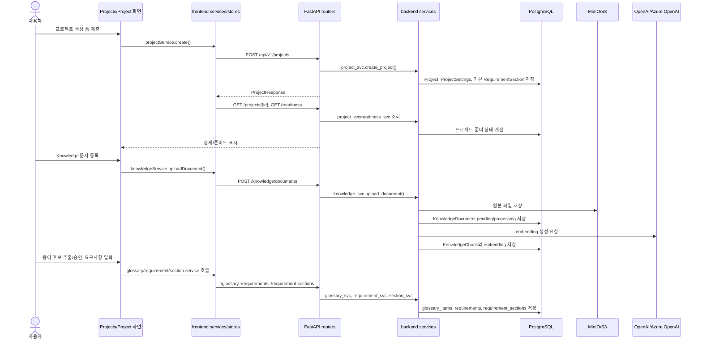
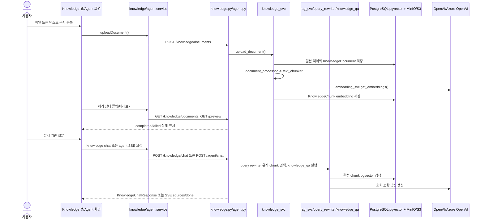
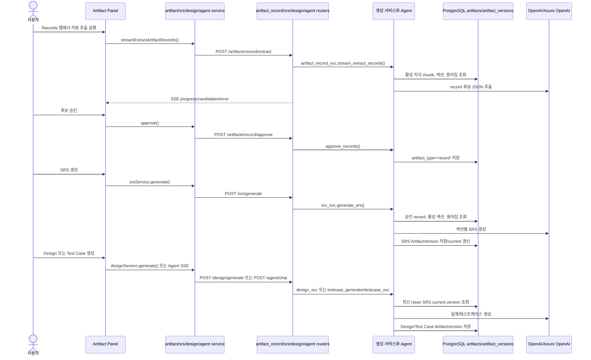
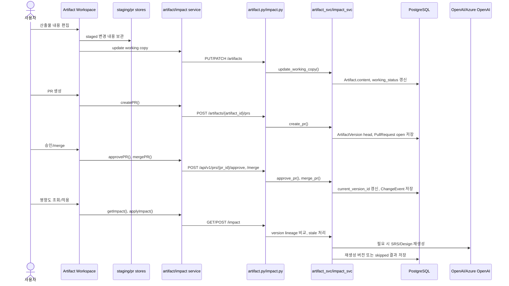
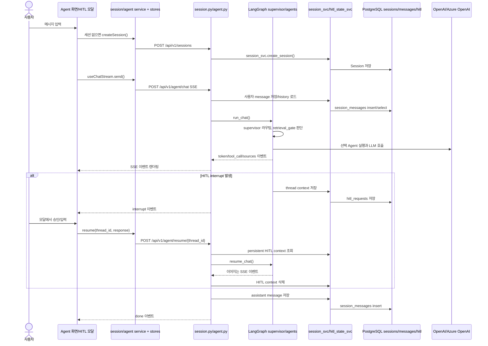

# 기능 명세

이 문서는 신입 개발자가 AISE v3 코드베이스의 주요 기능을 빠르게 파악할 수 있도록 기능별 사용자 흐름, 구현 파일, API, 데이터 흐름, 검증 방법, 유지보수 주의점을 정리한다. 내용은 현재 저장소에서 확인되는 코드에 근거한다.

## 기능 개요

아래 표는 현재 코드에서 확인되는 주요 기능 목록과 처음 추적할 진입점이다. 프론트엔드는 `frontend/src/app`의 App Router 페이지에서 화면 흐름을 시작하고, API 호출은 `frontend/src/services`에서 확인한다. 백엔드는 `backend/src/main.py`가 라우터를 등록하고, 각 라우터가 서비스 계층과 모델/스키마로 내려간다. Agent 기능은 앱 시작 시 `backend/src/main.py`에서 `load_builtin_agents()`를 호출해 `backend/src/agents/registry.py`의 명시 목록을 등록한다.

| 기능 | 사용자 화면/프론트엔드 진입점 | 주요 백엔드 API 진입점 | 핵심 서비스/에이전트 모듈 | 핵심 데이터 |
| --- | --- | --- | --- | --- |
| 프로젝트 관리와 준비도 | `/projects`, `/projects/{id}`; `frontend/src/app/(main)/projects/page.tsx`, `frontend/src/app/(main)/projects/[id]/layout.tsx` | `backend/src/routers/project.py` (`/api/v1/projects`) | `backend/src/services/project_svc.py`, `backend/src/services/readiness_svc.py`, `backend/src/services/suggestion_svc.py` | `projects`, `project_settings` |
| 지식 문서 업로드와 RAG 질의 | 프로젝트 Knowledge 탭; `frontend/src/components/projects/ProjectKnowledgeTab.tsx`, Agent 출처 패널 | `backend/src/routers/knowledge.py` (`/api/v1/projects/{project_id}/knowledge`) | `backend/src/services/knowledge_svc.py`, `backend/src/services/document_processor.py`, `backend/src/services/rag_svc.py`, `backend/src/services/embedding_svc.py`, `backend/src/agents/knowledge_qa.py` | `knowledge_documents`, `knowledge_chunks` |
| 용어집 관리와 AI 후보 추출 | 프로젝트 Glossary 탭; `frontend/src/components/projects/ProjectGlossaryTab.tsx` | `backend/src/routers/glossary.py` (`/api/v1/projects/{project_id}/glossary`) | `backend/src/services/glossary_svc.py`, `backend/src/prompts/glossary/extract.py`, `backend/src/prompts/glossary/generate.py` | `glossary_items` |
| 요구사항과 섹션 관리 | `/projects/{id}/requirements`, Requirements Artifact; `frontend/src/app/(main)/projects/[id]/requirements/page.tsx` | `backend/src/routers/requirement.py`, `backend/src/routers/section.py` (`/requirements`, `/requirement-sections`) | `backend/src/services/requirement_svc.py`, `backend/src/services/section_svc.py`, `backend/src/agents/requirement.py` | `requirements`, `requirement_sections`, `requirement_versions` |
| 요구사항 리뷰 | Requirements 화면의 Review; `frontend/src/components/requirements/ReviewModal.tsx` | `backend/src/routers/review.py` (`/api/v1/projects/{project_id}/review`) | `backend/src/services/review_svc.py`, `backend/src/agents/critic.py`, `backend/src/prompts/review/requirements.py` | `requirement_reviews` 계열 모델 |
| 레코드 산출물 추출과 승인 | Artifact Panel > Records; `frontend/src/components/artifacts/ArtifactRecordsPanel.tsx` | `backend/src/routers/artifact_record.py` (`/api/v1/projects/{project_id}/artifacts/record`) | `backend/src/services/artifact_record_svc.py`, `backend/src/prompts/extraction.py` | `artifacts` 중 `artifact_type='record'` |
| SRS 생성과 버전 조회 | Artifact Panel > SRS; `frontend/src/components/artifacts/SrsArtifact.tsx` | `backend/src/routers/srs.py` (`/api/v1/projects/{project_id}/srs`) | `backend/src/services/srs_svc.py`, `backend/src/agents/srs_generator.py`, `backend/src/prompts/srs/generate.py` | `artifacts`, `artifact_versions` |
| Design 생성과 버전 조회 | Artifact Panel > Design; `frontend/src/components/artifacts/DesignArtifact.tsx` | `backend/src/routers/design.py` (`/api/v1/projects/{project_id}/design`) | `backend/src/services/design_svc.py`, `backend/src/agents/design_generator.py`, `backend/src/prompts/design/generate.py` | `artifacts`, `artifact_versions` |
| Test Case 생성과 조회 | Artifact Panel > Test Cases, Agent; `frontend/src/components/artifacts/TestCaseArtifact.tsx` | Agent `testcase_generator`, 공통 Artifact API (`backend/src/routers/artifact.py`) | `backend/src/services/testcase_svc.py`, `backend/src/agents/testcase_generator.py`, `backend/src/prompts/testcase/generate.py` | `artifacts`, `artifact_versions` |
| Artifact 버전/PR/영향도 관리 | Artifact Workspace, Impact Modal; `frontend/src/components/artifacts/workspace/ChangesWorkspaceModal.tsx`, `ImpactPanel.tsx` | `backend/src/routers/artifact.py`, `backend/src/routers/impact.py` (`/artifacts`, `/prs`, `/versions`, `/impact`) | `backend/src/services/artifact_svc.py`, `backend/src/services/impact_svc.py` | `artifacts`, `artifact_versions`, `pull_requests`, `change_events`, `artifact_dependencies` |
| Agent 채팅과 HITL 재개 | `/agent`; `frontend/src/app/(main)/agent/[[...sessionId]]/page.tsx`, `frontend/src/hooks/useChatStream.ts` | `backend/src/routers/agent.py`, `backend/src/routers/agents.py`, `backend/src/routers/session.py` (`/api/v1/agent/chat`, `/resume/{thread_id}`, `/api/v1/sessions`) | `backend/src/orchestration/graph.py`, `backend/src/orchestration/supervisor.py`, `backend/src/orchestration/retrieval_gate.py`, `backend/src/services/session_svc.py`, `backend/src/services/hitl_state_svc.py` | `sessions`, `session_messages`, HITL 상태 |

### 주요 기능 식별 매트릭스

이 표는 기능을 처음 맡은 개발자가 "어떤 화면 또는 이벤트에서 시작되는가", "어떤 모듈을 함께 열어야 하는가", "사용자 조작인지 시스템 내부 트리거인지"를 빠르게 구분하기 위한 색인이다. `사용자 트리거`는 화면 조작이나 채팅 입력처럼 사용자가 직접 시작하는 동작이고, `시스템 트리거`는 라우터 등록, 백그라운드 처리, readiness 갱신, SSE resume처럼 코드가 자동으로 이어서 수행하는 동작이다.

| 주요 기능 | 사용자/프론트엔드 진입점 | 백엔드/API 진입점 | 관련 모듈 | 사용자 트리거 | 시스템 트리거 |
| --- | --- | --- | --- | --- | --- |
| 프로젝트 관리와 준비도 | `frontend/src/app/(main)/projects/page.tsx`, `frontend/src/app/(main)/projects/[id]/layout.tsx`, `frontend/src/components/projects/ProjectOverviewTab.tsx`, `frontend/src/components/projects/ProjectReadinessCard.tsx` | `backend/src/routers/project.py`의 `/api/v1/projects`, `/readiness`, `/settings` | `frontend/src/services/project-service.ts`, `frontend/src/stores/project-store.ts`, `frontend/src/stores/readiness-store.ts`, `backend/src/services/project_svc.py`, `backend/src/services/readiness_svc.py`, `backend/src/services/suggestion_svc.py`, `backend/src/models/project.py` | 프로젝트 목록 진입, 생성/수정/삭제/복구, 설정 저장, 상세 화면 진입 | 프로젝트 생성 시 기본 `ProjectSettings`와 기본 요구사항 섹션 생성, 관련 데이터 변경 후 readiness 재계산, delete preview 조회 |
| 지식 문서 업로드와 RAG 질의 | `frontend/src/components/projects/ProjectKnowledgeTab.tsx`, `frontend/src/components/projects/KnowledgePreviewModal.tsx`, `frontend/src/components/chat/SourceViewerPanel.tsx` | `backend/src/routers/knowledge.py`의 `/knowledge/documents`, `/knowledge/chat`, `/preview`, `/reprocess` | `frontend/src/services/knowledge-service.ts`, `backend/src/services/knowledge_svc.py`, `backend/src/services/document_processor.py`, `backend/src/services/storage_svc.py`, `backend/src/services/embedding_svc.py`, `backend/src/services/rag_svc.py`, `backend/src/services/query_rewriter.py`, `backend/src/agents/knowledge_qa.py`, `backend/src/models/knowledge.py` | 파일/텍스트 문서 등록, 문서 활성 토글, 미리보기, 재처리, Knowledge Chat 또는 Agent 질문 | 업로드 후 문서 원본 저장, 텍스트 추출, 청킹, embedding 생성, 처리 상태 전이, 활성 chunk 검색, 출처 생성 |
| 용어집 관리와 AI 후보 추출 | `frontend/src/components/projects/ProjectGlossaryTab.tsx`, `frontend/src/components/projects/GlossaryGeneratePanel.tsx`, `frontend/src/components/projects/GlossaryTable.tsx` | `backend/src/routers/glossary.py`의 `/glossary`, `/generate`, `/extract`, `/approve` | `frontend/src/services/glossary-service.ts`, `backend/src/services/glossary_svc.py`, `backend/src/prompts/glossary/extract.py`, `backend/src/prompts/glossary/generate.py`, `backend/src/models/glossary.py` | 용어 직접 추가/수정/삭제, AI 후보 생성/추출, 후보 선택 승인 | 완료된 지식 문서와 프로젝트 맥락 수집, LLM 후보 생성, 승인 항목 저장, readiness 관련 상태 무효화 |
| 요구사항과 섹션 관리 | `frontend/src/app/(main)/projects/[id]/requirements/page.tsx`, `frontend/src/components/requirements/RequirementTable.tsx`, `frontend/src/components/requirements/RequirementInput.tsx`, `frontend/src/components/artifacts/RequirementsArtifact.tsx` | `backend/src/routers/requirement.py`의 `/requirements`, `/selection`, `/reorder`, `/save`; `backend/src/routers/section.py`의 `/requirement-sections`, `/extract` | `frontend/src/services/requirement-service.ts`, `frontend/src/services/section-service.ts`, `backend/src/services/requirement_svc.py`, `backend/src/services/section_svc.py`, `backend/src/agents/requirement.py`, `backend/src/models/requirement.py` | 요구사항/섹션 조회, 추가/수정/삭제, Include 변경, 순서 변경, 현재 목록 저장, 섹션 후보 추출 | display ID와 order index 부여, 기본 섹션 보호, `RequirementVersion` 스냅샷 저장, 후속 리뷰/산출물 생성 입력 갱신 |
| 요구사항 리뷰 | `frontend/src/components/requirements/ReviewModal.tsx`, `frontend/src/hooks/useReview.ts` | `backend/src/routers/review.py`의 `/review/requirements`, `/review/results/latest` | `frontend/src/services/review-service.ts`, `backend/src/services/review_svc.py`, `backend/src/agents/critic.py`, `backend/src/prompts/review/requirements.py`, `backend/src/models/review.py` | Review 모달에서 선택 요구사항 리뷰 실행, 최신 리뷰 결과 재조회 | 선택된 요구사항 조회, critic Agent/LLM 분석, 충돌/중복 결과 저장, 최신 결과 캐시성 조회 |
| 레코드 산출물 추출과 승인 | `frontend/src/components/artifacts/ArtifactRecordsPanel.tsx`, `frontend/src/components/artifacts/ManualRecordForm.tsx`, `frontend/src/components/artifacts/ManualRecordModal.tsx` | `backend/src/routers/artifact_record.py`의 `/artifacts/record`, `/extract`, `/approve`, `/status`, `/reorder` | `frontend/src/services/artifact-record-service.ts`, `frontend/src/stores/artifact-record-store.ts`, `backend/src/services/artifact_record_svc.py`, `backend/src/prompts/extraction.py`, `backend/src/models/artifact.py` | Record 목록 조회, 수동 생성/수정/삭제, 자동 추출 시작, 후보 승인, 상태/순서 변경 | 지식 문서/요구사항 섹션/용어집 컨텍스트 수집, SSE 후보 스트림 전송, 승인 후보에 section type 기반 display ID 부여 |
| SRS 생성과 버전 조회 | `frontend/src/components/artifacts/SrsArtifact.tsx`, `frontend/src/services/srs-service.ts`, Agent 채팅 명령 | `backend/src/routers/srs.py`의 `/srs/generate`, `/srs`, `/srs/{srs_id}`, `/regenerate`; Agent `srs_generator` | `backend/src/services/srs_svc.py`, `backend/src/agents/srs_generator.py`, `backend/src/prompts/srs/generate.py`, `backend/src/models/artifact.py` | SRS 생성/재생성 버튼, SRS 버전 목록/상세 조회, Agent를 통한 SRS 생성 요청 | 활성 요구사항 섹션, 승인 Record, 용어집 조회, 섹션별 LLM 생성, `SRS-001` ArtifactVersion 생성과 current version 갱신 |
| Design 생성과 버전 조회 | `frontend/src/components/artifacts/DesignArtifact.tsx`, `frontend/src/services/design-service.ts`, Agent 채팅 명령 | `backend/src/routers/design.py`의 `/design/generate`, `/design`, `/design/{design_id}`, `/regenerate`; Agent `design_generator` | `backend/src/services/design_svc.py`, `backend/src/agents/design_generator.py`, `backend/src/prompts/design/generate.py`, `backend/src/models/artifact.py` | Design 생성/재생성 버튼, Design 버전 목록/상세 조회, Agent를 통한 설계 생성 요청 | 최신 clean SRS current version 조회, 용어집 결합, 설계 섹션 생성, source artifact lineage 저장 |
| Test Case 생성과 조회 | `frontend/src/components/artifacts/TestCaseArtifact.tsx`, `/agent` 화면 `frontend/src/app/(main)/agent/[[...sessionId]]/page.tsx` | `backend/src/routers/agent.py`의 `/api/v1/agent/chat`; 공통 `backend/src/routers/artifact.py`; Agent `testcase_generator` | `frontend/src/services/artifact-service.ts`, `frontend/src/hooks/useChatStream.ts`, `backend/src/orchestration/graph.py`, `backend/src/services/testcase_svc.py`, `backend/src/agents/testcase_generator.py`, `backend/src/prompts/testcase/generate.py`, `backend/src/schemas/api/artifact_testcase.py` | Agent에 테스트케이스 생성 명령 입력, Test Case Artifact 목록/상세 조회 | 명시적 생성 라우팅 또는 supervisor 선택, 최신 clean SRS 조회, LLM JSON 생성, schema 검증, 부분 실패 `skipped_sections` 반환 |
| Artifact 버전, PR, 영향도 관리 | `frontend/src/components/artifacts/workspace/ChangesWorkspaceModal.tsx`, `frontend/src/components/artifacts/workspace/ImpactPanel.tsx`, workspace editor 하위 컴포넌트 | `backend/src/routers/artifact.py`의 `/artifacts`, `/versions`, `/prs`; `backend/src/routers/impact.py`의 `/impact`, `/impact/apply` | `frontend/src/services/artifact-service.ts`, `frontend/src/services/impact-service.ts`, `frontend/src/stores/staging-store.ts`, `frontend/src/stores/pr-store.ts`, `backend/src/services/artifact_svc.py`, `backend/src/services/impact_svc.py`, `backend/src/models/artifact.py` | 산출물 편집, staged 변경 확인, PR 생성, approve/reject/merge, 영향도 패널 조회, stale 처리 실행 | working copy 상태 전이, open PR 단일성 제약, merge 시 current version 갱신과 `ChangeEvent` 저장, upstream version 비교로 stale 계산 |
| Agent 채팅과 HITL 재개 | `frontend/src/app/(main)/agent/[[...sessionId]]/page.tsx`, `frontend/src/hooks/useChatStream.ts`, `frontend/src/components/hitl/HITLPromptModal.tsx` | `backend/src/routers/session.py`의 `/api/v1/sessions`; `backend/src/routers/agent.py`의 `/api/v1/agent/chat`, `/api/v1/agent/resume/{thread_id}`; `backend/src/routers/agents.py` | `frontend/src/services/agent-service.ts`, `frontend/src/services/session-service.ts`, `frontend/src/stores/chat-store.ts`, `frontend/src/stores/hitl-store.ts`, `backend/src/orchestration/graph.py`, `backend/src/orchestration/supervisor.py`, `backend/src/orchestration/retrieval_gate.py`, `backend/src/services/session_svc.py`, `backend/src/services/hitl_state_svc.py`, `backend/src/agents/registry.py` | Agent 화면 진입, 사용자 메시지 전송, 세션 선택/삭제/제목 변경, HITL 모달 응답 | 앱 시작 시 `load_builtin_agents()` 실행, LangGraph lazy compile, supervisor 라우팅, SSE event 전송, thread context 저장, resume 후 같은 작업 계속 실행 |

공통 실행/검증 명령:

```bash
# 로컬 개발 서버 실행
./start-dev.sh

# Docker Compose 기반 통합 실행
docker compose up --build

# 백엔드 테스트
cd backend
uv sync
uv run pytest

# 프론트엔드 정적 검사
cd frontend
pnpm install
pnpm lint
```

공통 빌드/패키징 명령:

| 변경 범위 | 명령 | 목적 | 관련 파일 | 확인 필요 |
| --- | --- | --- | --- | --- |
| 프론트엔드 화면, service, store, 타입 변경 | `cd frontend && pnpm install --frozen-lockfile && pnpm build` | Next.js route, server/client component, API rewrite, 타입 기반 production build를 확인한다. | `frontend/package.json`, `frontend/next.config.ts`, `frontend/src/app`, `frontend/src/services`, `frontend/src/stores` | 운영/preview별 `BACKEND_URL`과 frontend E2E 필수 시나리오 |
| 백엔드 API, service, model, agent 변경 | `docker build -t aise2-backend:local ./backend` | FastAPI 앱과 Python runtime dependency를 컨테이너 이미지로 패키징할 수 있는지 확인한다. | `backend/Dockerfile`, `backend/pyproject.toml`, `backend/uv.lock`, `backend/src/main.py` | Python 3.14 RC 운영 허용 여부와 image tag 정책 |
| 프론트엔드 컨테이너 영향 변경 | `docker build -t aise2-frontend:local ./frontend` | Next.js standalone 산출물을 runner 이미지로 복사할 수 있는지 확인한다. | `frontend/Dockerfile`, `frontend/package.json`, `frontend/next.config.ts` | Dockerfile의 `npm ci`와 pnpm 정책 불일치 |
| 기능이 frontend/backend 계약을 함께 바꾸는 경우 | `docker compose build && docker compose up -d` | compose 네트워크에서 frontend, backend, PostgreSQL, MinIO, Redis가 함께 동작하는지 확인한다. | `docker-compose.yml`, `backend/Dockerfile`, `frontend/Dockerfile` | 운영 compose 용도, registry, rollback 절차 |
| preview 배포 전 기능 확인 | `docker compose -f docker-compose.preview.yml build` | preview 포트와 `.env.preview` 기준 패키징 가능 여부를 확인한다. | `docker-compose.preview.yml`, `deploy/preview.sh` | preview secret, Redis 대상, cache/tag 정책 |

확인 필요:

- 실제 운영에서 사용하는 서버 주소, 클라우드 계정, 객체 스토리지 계정, DB 계정은 코드만으로 확정할 수 없다.
- OpenAI/Azure OpenAI 등 LLM 공급자 계정과 모델 배정 정책은 환경변수 또는 운영 설정 확인이 필요하다.
- CI/CD에서 어떤 테스트 세트를 필수 게이트로 쓰는지는 저장소 코드만으로 확정할 수 없다.

## 기능 흐름 공통 코드/설정 진입점

개별 기능을 추적하기 전에 아래 파일을 먼저 열어두면 프론트엔드 요청이 어떤 백엔드 라우터로 들어가고, 어떤 실행 환경 설정에 의존하는지 빠르게 파악할 수 있다. 이 표의 경로는 기능별 섹션의 `관련 파일`과 함께 확인한다.

| 범위 | 관련 코드/설정 파일 | 기능 흐름에서 확인할 내용 |
| --- | --- | --- |
| 프론트엔드 API 호출 공통부 | `frontend/src/lib/api.ts`, `frontend/next.config.ts`, `frontend/package.json`, `frontend/tsconfig.json` | `NEXT_PUBLIC_API_URL`이 있으면 직접 백엔드를 호출하고, 없으면 Next rewrite가 `/api/:path*`를 `BACKEND_URL`로 프록시한다. 기능별 `frontend/src/services/*-service.ts`는 이 공통 `api` 래퍼를 사용한다. |
| 프론트엔드 라우팅/레이아웃 | `frontend/src/app/(main)/layout.tsx`, `frontend/src/app/(main)/projects/page.tsx`, `frontend/src/app/(main)/projects/[id]/layout.tsx`, `frontend/src/app/(main)/agent/[[...sessionId]]/page.tsx`, `frontend/src/config/navigation.ts` | 프로젝트, 요구사항, Agent 화면의 첫 진입점과 좌우 패널/네비게이션 구성을 확인한다. 기능 화면이 어디에서 마운트되는지 추적할 때 시작점으로 사용한다. |
| 백엔드 앱 부트스트랩 | `backend/src/main.py`, `backend/src/routers/__init__.py`, `backend/src/core/cors.py`, `backend/src/core/exceptions.py`, `backend/src/middleware/logging_middleware.py` | FastAPI 앱 생성, CORS, 예외 처리, 로깅 미들웨어, 라우터 등록 순서를 확인한다. 신규 API를 추가할 때 라우터가 앱에 포함되는지 여기서 확인한다. |
| DB와 마이그레이션 | `backend/src/core/database.py`, `backend/alembic.ini`, `backend/alembic/env.py`, `backend/alembic/versions/*`, `backend/src/models/__init__.py` | `DATABASE_URL` 기본값, async SQLAlchemy 세션, Alembic migration 위치를 확인한다. 기능별 모델 변경은 migration과 테스트 fixture까지 함께 확인해야 한다. |
| LLM/임베딩/외부 API | `backend/src/services/llm_svc.py`, `backend/src/services/embedding_svc.py`, `backend/src/services/rag_svc.py`, `backend/src/services/query_rewriter.py`, `.env.prod.example`, `.env.preview.example` | `LLM_PROVIDER`, `OPENAI_API_KEY`, `SRS_API_KEY`, `TC_API_KEY`, endpoint/model 환경변수와 embedding/RAG 호출 경로를 확인한다. 실제 운영 계정과 모델 배정은 `확인 필요`다. |
| 스토리지/문서 처리 | `backend/src/services/storage_svc.py`, `backend/src/services/document_processor.py`, `backend/src/utils/text_chunker.py`, `docker-compose.yml`, `docker-compose.preview.yml` | MinIO endpoint/bucket 기본값, 업로드 원본 저장, 문서 파싱, 청킹, 임베딩 저장 흐름을 확인한다. 운영 버킷 정책과 백업은 `확인 필요`다. |
| Agent/SSE/HITL 이벤트 계약 | `backend/src/routers/agent.py`, `backend/src/orchestration/graph.py`, `backend/src/orchestration/supervisor.py`, `backend/src/orchestration/retrieval_gate.py`, `backend/src/schemas/events.py`, `frontend/src/hooks/useChatStream.ts`, `frontend/src/types/agent-events.ts`, `docs/events.md` | Agent 라우팅, SSE event envelope, HITL interrupt/resume, 프론트엔드 스트림 파싱 타입을 함께 확인한다. 이벤트 필드 변경 시 백엔드 스키마, 프론트엔드 타입, 문서를 같이 수정한다. |
| 로컬/컨테이너 실행 설정 | `start-dev.sh`, `start-local.sh`, `deploy.sh`, `deploy/preview.sh`, `docker-compose.yml`, `docker-compose.preview.yml`, `backend/Dockerfile`, `frontend/Dockerfile` | 기능 검증에 필요한 백엔드, 프론트엔드, PostgreSQL/pgvector, MinIO, Redis 실행 경로를 확인한다. 운영 배포 서버, CI/CD 승인 게이트, 장애 대응 기준은 코드만으로 확정할 수 없어 `확인 필요`다. |

## 주요 기능 실행 흐름

이 섹션은 사용자의 화면 조작 또는 Agent 트리거가 들어온 순간부터 처리 완료까지 어떤 프론트엔드, API, 서비스, 저장소 계층을 통과하는지 요약한다. 세부 필드와 API 목록은 각 기능별 섹션을 함께 확인한다.

### 기능 흐름별 관련 코드/설정 추적표

아래 표는 각 흐름을 디버깅하거나 변경할 때 함께 열어야 하는 코드와 설정 파일이다. `설정/운영 경로`는 기능 동작에 직접 영향을 주는 환경변수, 프록시, DB, 컨테이너, 이벤트 계약 파일을 중심으로 적었다.

| 기능 흐름 | 관련 코드 파일 | 관련 설정/운영 파일 |
| --- | --- | --- |
| 프로젝트 생성, 조회, 삭제 | `frontend/src/services/project-service.ts`, `frontend/src/stores/project-store.ts`, `backend/src/routers/project.py`, `backend/src/services/project_svc.py`, `backend/src/services/readiness_svc.py`, `backend/src/models/project.py`, `backend/src/models/requirement.py` | `frontend/src/lib/api.ts`, `backend/src/main.py`, `backend/src/core/database.py`, `backend/alembic/versions/87a2d3f47ca6_initial_mvp_models.py`, `backend/alembic/versions/ef0c54ab26e1_add_project_settings_fk.py`, `docker-compose.yml` |
| 지식 문서 등록과 RAG 답변 | `frontend/src/services/knowledge-service.ts`, `backend/src/routers/knowledge.py`, `backend/src/services/knowledge_svc.py`, `backend/src/services/document_processor.py`, `backend/src/services/storage_svc.py`, `backend/src/services/embedding_svc.py`, `backend/src/services/rag_svc.py`, `backend/src/models/knowledge.py` | `backend/src/services/llm_svc.py`, `backend/src/core/database.py`, `backend/alembic/versions/a1b2c3d4e5f6_add_knowledge_documents_and_chunks.py`, `backend/alembic/versions/b726d9c9f754_add_is_active_to_knowledge_documents.py`, `docker-compose.yml`, `.env.prod.example`, `.env.preview.example` |
| 용어집 관리와 AI 후보 승인 | `frontend/src/services/glossary-service.ts`, `backend/src/routers/glossary.py`, `backend/src/services/glossary_svc.py`, `backend/src/prompts/glossary/extract.py`, `backend/src/prompts/glossary/generate.py`, `backend/src/models/glossary.py` | `backend/src/services/llm_svc.py`, `backend/src/core/database.py`, `backend/alembic/versions/8f8875d1d811_extend_glossary_items_phase2.py`, `.env.prod.example`, `.env.preview.example` |
| 요구사항과 섹션 편집 | `frontend/src/services/requirement-service.ts`, `frontend/src/services/section-service.ts`, `backend/src/routers/requirement.py`, `backend/src/routers/section.py`, `backend/src/services/requirement_svc.py`, `backend/src/services/section_svc.py`, `backend/src/models/requirement.py` | `backend/src/core/database.py`, `backend/alembic/versions/cef0a99d1daf_add_requirement_sections.py`, `backend/alembic/versions/86e012962feb_extend_sections_phase2.py`, `backend/alembic/versions/f1a971c0434d_add_display_id_and_order_index_to_.py` |
| 요구사항 리뷰 | `frontend/src/services/review-service.ts`, `frontend/src/hooks/useReview.ts`, `backend/src/routers/review.py`, `backend/src/services/review_svc.py`, `backend/src/agents/critic.py`, `backend/src/prompts/review/requirements.py`, `backend/src/models/review.py` | `backend/src/services/llm_svc.py`, `backend/src/core/database.py`, `backend/alembic/versions/f50f3e142f86_add_requirement_reviews_table.py`, `backend/alembic/versions/bcdc56812745_add_updated_at_to_requirement_reviews.py`, `.env.prod.example`, `.env.preview.example` |
| 레코드 산출물 추출과 승인 | `frontend/src/services/artifact-record-service.ts`, `frontend/src/stores/artifact-record-store.ts`, `backend/src/routers/artifact_record.py`, `backend/src/services/artifact_record_svc.py`, `backend/src/prompts/extraction.py`, `backend/src/models/artifact.py` | `backend/src/services/llm_svc.py`, `backend/src/core/database.py`, `backend/alembic/versions/a4c1b2d3e4f5_add_artifacts_core.py`, `backend/alembic/versions/c6e3d4f50607_backfill_records_to_artifacts.py`, `frontend/src/lib/api.ts`, `.env.prod.example` |
| SRS 생성과 버전 조회 | `frontend/src/services/srs-service.ts`, `backend/src/routers/srs.py`, `backend/src/services/srs_svc.py`, `backend/src/agents/srs_generator.py`, `backend/src/prompts/srs/generate.py`, `backend/src/models/artifact.py` | `backend/src/services/llm_svc.py`, `backend/src/core/database.py`, `backend/alembic/versions/f1df240269cf_add_srs_tables.py`, `backend/alembic/versions/535a79769c7e_add_artifact_version_lineage.py`, `.env.prod.example`, `.env.preview.example` |
| Design 생성과 버전 조회 | `frontend/src/services/design-service.ts`, `backend/src/routers/design.py`, `backend/src/services/design_svc.py`, `backend/src/agents/design_generator.py`, `backend/src/prompts/design/generate.py`, `backend/src/models/artifact.py` | `backend/src/services/llm_svc.py`, `backend/src/core/database.py`, `backend/alembic/versions/535a79769c7e_add_artifact_version_lineage.py`, `.env.prod.example`, `.env.preview.example` |
| Test Case 생성과 조회 | `frontend/src/services/artifact-service.ts`, `backend/src/services/testcase_svc.py`, `backend/src/agents/testcase_generator.py`, `backend/src/prompts/testcase/generate.py`, `backend/src/schemas/api/artifact_testcase.py`, `backend/src/orchestration/graph.py` | `backend/src/services/llm_svc.py`, `backend/src/core/database.py`, `backend/alembic/versions/535a79769c7e_add_artifact_version_lineage.py`, `docs/events.md`, `.env.prod.example`, `.env.preview.example` |
| Artifact 편집, PR, merge, 영향도 | `frontend/src/services/artifact-service.ts`, `frontend/src/services/impact-service.ts`, `frontend/src/stores/staging-store.ts`, `frontend/src/stores/pr-store.ts`, `backend/src/routers/artifact.py`, `backend/src/routers/impact.py`, `backend/src/services/artifact_svc.py`, `backend/src/services/impact_svc.py`, `backend/src/models/artifact.py` | `backend/src/core/database.py`, `backend/alembic/versions/a4c1b2d3e4f5_add_artifacts_core.py`, `backend/alembic/versions/b5d2c3e4f506_add_artifact_dependencies.py`, `backend/alembic/versions/535a79769c7e_add_artifact_version_lineage.py`, `PLAN_ARTIFACT_LINEAGE.md` |
| Agent 채팅과 HITL 재개 | `frontend/src/services/agent-service.ts`, `frontend/src/services/session-service.ts`, `frontend/src/hooks/useChatStream.ts`, `frontend/src/stores/chat-store.ts`, `frontend/src/stores/hitl-store.ts`, `backend/src/routers/agent.py`, `backend/src/routers/session.py`, `backend/src/orchestration/graph.py`, `backend/src/services/session_svc.py`, `backend/src/services/hitl_state_svc.py` | `backend/src/services/llm_svc.py`, `backend/src/schemas/events.py`, `frontend/src/types/agent-events.ts`, `docs/events.md`, `backend/alembic/versions/a2b3c4d5e6f7_add_sessions_and_session_messages.py`, `backend/alembic/versions/9d8f1e2c3b4a_add_hitl_requests.py`, `docker-compose.yml`, `.env.prod.example` |

### 프로젝트 생성, 조회, 삭제 흐름

1. 사용자가 `/projects` 화면(`frontend/src/app/(main)/projects/page.tsx`)에서 프로젝트 목록을 열면 `frontend/src/services/project-service.ts`가 `GET /api/v1/projects`를 호출한다.
2. 백엔드 `backend/src/routers/project.py`는 요청을 받아 `backend/src/services/project_svc.py`로 위임하고, 서비스는 `backend/src/models/project.py`의 `Project`, `ProjectSettings`를 조회해 응답 스키마로 변환한다.
3. 사용자가 프로젝트를 생성하면 같은 프론트엔드 서비스가 `POST /api/v1/projects`를 호출한다. 서비스 계층은 프로젝트 본문, 설정, 기본 요구사항 섹션을 트랜잭션으로 만든 뒤 생성된 프로젝트를 반환한다.
4. 프로젝트 상세 레이아웃(`frontend/src/app/(main)/projects/[id]/layout.tsx`)은 프로젝트 상세와 readiness를 조회하고, `ProjectOverviewTab`, `ProjectReadinessCard`가 화면 상태를 갱신한다.
5. 삭제 요청은 먼저 delete preview로 영향 범위를 확인한 뒤 soft delete 또는 hard delete API로 이어진다. hard delete는 DB 레코드 삭제와 스토리지 prefix 정리 경로가 `project_svc.py`에 구현되어 있다.
6. 완료 지점은 프론트엔드 project store가 최신 목록/상세 상태를 다시 반영하고, 백엔드 DB에 프로젝트 상태 또는 삭제 결과가 commit된 시점이다.

### 지식 문서 등록과 RAG 답변 흐름

1. 사용자가 프로젝트 Knowledge 탭(`frontend/src/components/projects/ProjectKnowledgeTab.tsx`)에서 파일을 업로드하거나 텍스트 문서를 등록하면 `frontend/src/services/knowledge-service.ts`가 `POST /api/v1/projects/{project_id}/knowledge/documents`를 호출한다.
2. `backend/src/routers/knowledge.py`는 업로드 본문을 `backend/src/services/knowledge_svc.py`로 넘기고, 서비스는 문서 메타데이터를 `KnowledgeDocument`로 저장하며 파일 기반 입력은 `backend/src/services/storage_svc.py`를 통해 객체 스토리지에 저장한다.
3. 백그라운드 처리에서 `backend/src/services/document_processor.py`가 원문을 추출하고 `backend/src/utils/text_chunker.py`로 청크를 나눈다. `backend/src/services/embedding_svc.py`는 청크별 임베딩을 만들고 `KnowledgeChunk`에 저장한다.
4. 처리 상태는 `pending` 또는 `processing`에서 `completed` 또는 `failed`로 바뀌며, 프론트엔드는 처리 중 문서가 있으면 주기적으로 문서 목록을 재조회한다.
5. 사용자가 Knowledge Chat 또는 Agent에서 문서 기반 질문을 하면 `backend/src/services/rag_svc.py`와 `backend/src/services/query_rewriter.py`가 활성 문서 청크를 검색하고, `backend/src/prompts/knowledge/chat.py` 기반 응답과 출처를 만든다.
6. 완료 지점은 문서 등록의 경우 문서와 청크/임베딩 저장 및 상태 갱신이고, RAG 질의의 경우 답변 본문과 `KnowledgeChatSource` 출처가 API 또는 Agent SSE 이벤트로 프론트엔드에 전달된 시점이다.

### 용어집 직접 관리와 AI 후보 승인 흐름

1. 사용자가 Glossary 탭(`frontend/src/components/projects/ProjectGlossaryTab.tsx`)에 진입하면 `frontend/src/services/glossary-service.ts`가 `GET /api/v1/projects/{project_id}/glossary`를 호출해 현재 용어를 가져온다.
2. 직접 추가, 수정, 삭제는 `backend/src/routers/glossary.py`의 CRUD API를 거쳐 `backend/src/services/glossary_svc.py`가 `backend/src/models/glossary.py`의 `GlossaryItem`을 변경한다.
3. 사용자가 AI 후보 추출을 실행하면 프론트엔드 `GlossaryGeneratePanel`이 `POST /api/v1/projects/{project_id}/glossary/extract`를 호출한다.
4. 백엔드 서비스는 프로젝트의 지식 문서 컨텍스트와 `backend/src/prompts/glossary/extract.py` 프롬프트를 사용해 후보 목록을 만들고, 프론트엔드는 후보를 선택 가능한 목록으로 표시한다.
5. 사용자가 후보를 승인하면 `POST /api/v1/projects/{project_id}/glossary/approve`가 선택 항목만 저장하고 readiness 관련 캐시/상태를 갱신할 수 있는 완료 응답을 반환한다.
6. 완료 지점은 승인된 용어가 `glossary_items`에 저장되고, 이후 SRS, Design, Test Case 생성 서비스가 같은 용어집을 컨텍스트로 읽을 수 있는 상태다.

### 요구사항과 섹션 편집 흐름

1. 사용자가 `/projects/{id}/requirements` 화면(`frontend/src/app/(main)/projects/[id]/requirements/page.tsx`)에 진입하면 `frontend/src/services/requirement-service.ts`와 `frontend/src/services/section-service.ts`가 요구사항과 섹션 목록을 조회한다.
2. `RequirementsArtifact`, `RequirementTable`, `RequirementInput`은 조회 결과를 탭/섹션별로 렌더링하고, 사용자의 추가/수정/삭제/Include 변경/순서 변경 조작을 서비스 함수 호출로 변환한다.
3. 백엔드 `backend/src/routers/requirement.py`, `backend/src/routers/section.py`는 각각 `backend/src/services/requirement_svc.py`, `backend/src/services/section_svc.py`에 위임한다.
4. 서비스 계층은 `Requirement`, `RequirementSection`, `RequirementVersion` 모델을 변경한다. display ID, order index, 기본 섹션 보호 같은 규칙은 서비스와 DB 제약을 함께 따른다.
5. 사용자가 현재 상태를 저장하면 `POST /api/v1/projects/{project_id}/requirements/save`가 현재 요구사항 목록을 JSON 스냅샷으로 `RequirementVersion`에 남긴다.
6. 완료 지점은 UI가 변경된 행/섹션 상태를 다시 그리며, 백엔드 트랜잭션이 commit되어 Review, Record 추출, SRS 생성 입력에서 최신 선택 상태를 읽을 수 있는 시점이다.

### 요구사항 리뷰 흐름

1. 사용자가 Requirements 화면의 리뷰 모달(`frontend/src/components/requirements/ReviewModal.tsx`)에서 리뷰를 실행하면 `frontend/src/hooks/useReview.ts`와 `frontend/src/services/review-service.ts`가 선택된 요구사항 ID 목록으로 `POST /api/v1/projects/{project_id}/review/requirements`를 호출한다.
2. `backend/src/routers/review.py`는 요청을 `backend/src/services/review_svc.py`에 전달한다.
3. 서비스는 `is_selected=true`인 요구사항 본문을 조회하고 `backend/src/agents/critic.py`, `backend/src/prompts/review/requirements.py` 기반 분석으로 충돌과 중복을 판정한다.
4. 분석 결과는 `backend/src/models/review.py`의 리뷰 모델에 저장되고, API 응답으로도 즉시 반환된다.
5. 사용자가 나중에 모달을 다시 열면 `GET /api/v1/projects/{project_id}/review/results/latest`가 최신 저장 결과를 반환한다.
6. 완료 지점은 리뷰 결과가 DB에 저장되고 프론트엔드 모달이 conflict/duplicate 결과를 표시한 시점이다. 수락/거절에 따른 자동 요구사항 수정은 현재 코드에서 비활성화되어 있다.

### 레코드 산출물 추출과 승인 흐름

1. 사용자가 Artifact Panel의 Records 영역(`frontend/src/components/artifacts/ArtifactRecordsPanel.tsx`)을 열면 `frontend/src/services/artifact-record-service.ts`가 `GET /api/v1/projects/{project_id}/artifacts/record`로 record Artifact 목록을 조회한다.
2. 수동 생성/수정/삭제/상태 변경은 같은 특화 라우터(`backend/src/routers/artifact_record.py`)를 통해 `backend/src/services/artifact_record_svc.py`가 공통 `Artifact` 테이블 중 `artifact_type='record'`인 항목만 변경한다.
3. 자동 추출 트리거는 `POST /api/v1/projects/{project_id}/artifacts/record/extract`다. 백엔드는 지식 문서 청크, 요구사항 섹션, 용어집을 컨텍스트로 모으고 `backend/src/prompts/extraction.py`를 사용해 후보를 생성한다.
4. 추출 결과는 SSE 형식으로 프론트엔드 `streamExtractArtifactRecords()`에 전달되고, 사용자는 후보를 검토한다.
5. 사용자가 승인하면 `POST /api/v1/projects/{project_id}/artifacts/record/approve`가 선택 후보에 section type 기반 display ID를 부여해 `Artifact`로 저장한다.
6. 완료 지점은 승인된 record가 `artifacts`에 저장되고, 이후 `srs_svc.generate_srs()`가 SRS 입력으로 읽을 수 있는 상태다.

### SRS 생성과 버전 조회 흐름

1. 사용자가 SRS 생성 버튼 또는 Agent 명령으로 SRS 생성을 트리거하면 `frontend/src/services/srs-service.ts` 또는 Agent 라우팅 경로가 `POST /api/v1/projects/{project_id}/srs/generate` 또는 `srs_generator` 실행으로 이어진다.
2. `backend/src/routers/srs.py`는 `backend/src/services/srs_svc.py`에 생성을 위임한다.
3. 서비스는 활성 요구사항 섹션, 승인된 record Artifact, 용어집을 조회하고 `backend/src/prompts/srs/generate.py`로 섹션별 프롬프트를 만든다.
4. LLM 응답은 프로젝트당 하나의 SRS Artifact(`display_id='SRS-001'`)에 새 `ArtifactVersion`으로 저장된다. 이미 SRS Artifact가 있으면 새 version이 추가되고 `current_version_id`가 갱신된다.
5. 프론트엔드 `frontend/src/components/artifacts/SrsArtifact.tsx`는 버전 목록과 선택된 버전 상세를 조회해 섹션별 Markdown을 표시한다.
6. 완료 지점은 SRS Artifact current version이 새 버전을 가리키고, 응답의 `srs_id`로 해당 `ArtifactVersion`을 조회할 수 있는 시점이다.

### Design 생성과 버전 조회 흐름

1. 사용자가 Design 생성 버튼 또는 Agent 명령으로 설계 생성을 트리거하면 `frontend/src/services/design-service.ts` 또는 Agent 라우팅 경로가 `POST /api/v1/projects/{project_id}/design/generate` 또는 `design_generator` 실행으로 이어진다.
2. `backend/src/routers/design.py`는 `backend/src/services/design_svc.py`에 생성을 위임한다.
3. 서비스는 SRS Artifact의 최신 clean current version을 읽고, 용어집과 함께 `backend/src/prompts/design/generate.py` 프롬프트 입력을 구성한다.
4. LLM은 SRS 섹션에 대응하는 설계 섹션을 생성하고, 서비스는 프로젝트당 하나의 Design Artifact(`display_id='DSG-001'`)에 새 `ArtifactVersion`을 추가한다.
5. 새 버전에는 `based_on_srs`와 `source_artifact_versions`가 기록되어 영향도 분석이 upstream SRS 변경을 추적할 수 있다.
6. 완료 지점은 Design current version 갱신과 버전 목록 조회 가능 상태이며, 프론트엔드 `DesignArtifact`가 최신 결과를 렌더링한 시점이다.

### Test Case 생성과 조회 흐름

1. 사용자가 `/agent`에서 "테스트케이스 생성" 같은 명시적 명령을 보내면 `frontend/src/hooks/useChatStream.ts`가 `POST /api/v1/agent/chat` SSE 요청을 시작한다.
2. 백엔드 `backend/src/orchestration/graph.py`의 `_explicit_artifact_generation_agent()`는 생성 의도와 test case 관련 키워드를 감지해 `testcase_generator`로 우선 라우팅한다.
3. `backend/src/agents/testcase_generator.py`는 `backend/src/services/testcase_svc.py`를 호출한다.
4. 서비스는 최신 clean SRS current version을 조회하고 `backend/src/prompts/testcase/generate.py`로 섹션별 테스트케이스 JSON 생성을 요청한다.
5. 파싱과 `backend/src/schemas/api/artifact_testcase.py` 검증을 통과한 항목은 `display_id='TC-001'` 형식의 Test Case Artifact와 v1 `ArtifactVersion`으로 저장된다.
6. 완료 지점은 Agent SSE `token` 또는 `done` 이벤트가 생성 결과를 전달하고, Artifact Panel의 Test Cases 탭이 공통 Artifact API로 생성된 TC를 조회할 수 있는 상태다.

### Artifact 편집, PR, merge, 영향도 처리 흐름

1. 사용자가 SRS/Design/TestCase/Record를 편집하면 workspace 컴포넌트(`frontend/src/components/artifacts/workspace/ChangesWorkspaceModal.tsx`, editor 하위 컴포넌트)가 `frontend/src/stores/staging-store.ts`에 변경 내용을 모으고 `frontend/src/services/artifact-service.ts`로 공통 Artifact API를 호출한다.
2. `backend/src/routers/artifact.py`는 `backend/src/services/artifact_svc.py`로 요청을 넘기고, 서비스는 working copy인 `Artifact.content`와 `working_status`를 dirty 또는 staged로 바꾼다.
3. 사용자가 PR을 만들면 `POST /api/v1/projects/{project_id}/artifacts/{artifact_id}/prs`가 현재 working copy를 head version으로 만들고 `PullRequest`를 open 상태로 저장한다.
4. 승인, 거절, merge는 global PR API(`POST /api/v1/prs/{pr_id}/approve`, `reject`, `merge`)가 처리한다. merge 시 새 current version이 확정되고 `ChangeEvent`가 남는다.
5. 영향도 화면(`frontend/src/components/artifacts/workspace/ImpactPanel.tsx`) 또는 stale 일괄 처리 요청은 `backend/src/routers/impact.py`, `backend/src/services/impact_svc.py`가 `source_artifact_versions`를 비교해 downstream 산출물이 stale인지 계산한다.
6. `/api/v1/projects/{project_id}/impact/apply`는 현재 코드에서 stale SRS/Design 재생성 중심으로 처리하고, record/testcase는 skipped로 응답한다.
7. 완료 지점은 merge의 경우 `Artifact.current_version_id` 갱신과 PR 상태 변경, 영향도 처리의 경우 재생성된 산출물 버전 또는 skipped 결과가 응답으로 반환된 시점이다.

### Agent 채팅과 HITL 재개 흐름

1. 사용자가 `/agent` 화면(`frontend/src/app/(main)/agent/[[...sessionId]]/page.tsx`)에서 메시지를 보내면 세션이 없을 경우 `frontend/src/services/session-service.ts`가 먼저 `POST /api/v1/sessions`를 호출한다.
2. `frontend/src/hooks/useChatStream.ts`는 `POST /api/v1/agent/chat`로 SSE 요청을 열고, 사용자 입력과 `session_id`를 `backend/src/routers/agent.py`에 전달한다.
3. 라우터는 기존 대화 history를 `backend/src/services/session_svc.py`에서 로드하고 사용자 메시지를 `session_messages`에 먼저 저장한다.
4. `_get_graph()`는 `backend/src/orchestration/graph.py`의 LangGraph를 lazy compile하고, graph는 `supervisor`에서 `knowledge_qa`, `requirement`, 또는 명시적 산출물 생성 Agent로 라우팅한다.
5. 실행 중 백엔드는 `docs/events.md`, `backend/src/schemas/events.py` 계약에 맞춰 `token`, `tool_call`, `tool_result`, `sources`, `interrupt`, `error`, `done` 이벤트를 SSE로 보낸다. 프론트엔드는 `frontend/src/types/agent-events.ts`와 `useChatStream.ts`에서 이를 채팅 메시지와 출처, 도구 호출 UI로 변환한다.
6. interrupt가 발생하면 `backend/src/services/hitl_state_svc.py`가 thread context를 저장하고, 프론트엔드 `frontend/src/components/hitl/HITLPromptModal.tsx`가 사용자 확인/입력을 받는다.
7. 사용자가 HITL 모달에 응답하면 `POST /api/v1/agent/resume/{thread_id}`가 호출되고, `resume_chat()`이 저장된 checkpoint/thread 상태에서 이어서 SSE를 보낸다.
8. 완료 지점은 assistant 응답 조각, tool call, sources가 `session_messages`에 저장되고, 프론트엔드 채팅 UI가 `done` 이벤트를 받아 pending 상태를 해제한 시점이다.

## 주요 기능 호출 순서

이 섹션은 기능별 요청을 디버깅할 때 따라갈 실제 호출 순서를 요약한다. 이 코드베이스에서 백엔드 "컨트롤러" 역할은 FastAPI 라우터(`backend/src/routers/*.py`)가 맡고, 비즈니스 규칙과 DB/외부 연동은 서비스(`backend/src/services/*.py`)로 내려간다. 표의 순서대로 파일을 열면 프론트엔드 이벤트가 API, 라우터, 서비스, 모델, 외부 시스템으로 이어지는 경로를 추적할 수 있다.

| 기능/요청 | 1. 화면/사용자 이벤트 | 2. 프론트엔드 API 호출 | 3. 백엔드 라우터/컨트롤러 | 4. 서비스 호출 순서 | 5. 외부 연동/저장소 | 완료 신호 |
| --- | --- | --- | --- | --- | --- | --- |
| 프로젝트 생성 | `/projects`의 `ProjectCreateForm` 제출 | `frontend/src/services/project-service.ts`의 `projectService.create()` -> `POST /api/v1/projects` | `backend/src/routers/project.py`의 `create_project()` | `project_svc.create_project()` -> 기본 `ProjectSettings` 생성 -> 기본 `RequirementSection` 생성 | PostgreSQL `projects`, `project_settings`, `requirement_sections` | 생성된 `ProjectResponse` 반환, 목록/상세 재조회 가능 |
| 프로젝트 삭제와 hard delete | 삭제 모달에서 preview 후 삭제 확정 | `projectService.getDeletePreview()` -> `DELETE /api/v1/projects/{id}` 또는 `hardDelete()` | `project.py`의 `get_delete_preview()`, `delete_project()`, `hard_delete_project()` | `project_svc.get_delete_preview()` -> `project_svc.delete_project()` 또는 `project_svc.hard_delete_project()` -> `_delete_project_storage()` | PostgreSQL soft delete/cascade, hard delete 시 `storage_svc.delete_prefix()`로 MinIO/S3 prefix 삭제 | soft delete는 `status='deleted'`, hard delete는 204 응답과 스토리지 삭제 로그 |
| 지식 문서 업로드 | Knowledge 탭 파일/텍스트 등록 | `knowledge-service.ts`의 `uploadDocument()` -> `POST /api/v1/projects/{project_id}/knowledge/documents` | `backend/src/routers/knowledge.py`의 `upload_document()` | `knowledge_svc.upload_document()` -> `storage_svc.upload_file()` -> `document_processor.process_document()` 백그라운드 실행 -> `text_chunker.chunk_text()` -> `embedding_svc.get_embeddings()` | MinIO/S3 원본 파일, PostgreSQL `knowledge_documents`, `knowledge_chunks`, OpenAI/Azure OpenAI embedding API | 문서 상태가 `completed` 또는 `failed`로 전이, 청크/임베딩 조회 가능 |
| Knowledge/RAG 질문 | Knowledge 문서 기반 질문 또는 Agent 질문 | 백엔드 직접 API는 `POST /api/v1/projects/{project_id}/knowledge/chat`; 현재 프론트엔드에서 확인되는 실시간 질문 경로는 `agent-service.ts` SSE -> `POST /api/v1/agent/chat` | `knowledge.py`의 `knowledge_chat()` 또는 `agent.py`의 `agent_chat()` | 직접 질의: `rag_svc.chat()` -> `query_rewriter.rewrite_query()` -> `rag_svc.search_similar_chunks()` -> `llm_svc.chat_completion()`; Agent 질의: `graph.run_chat()` -> `retrieval_gate` -> `knowledge_qa` -> `rag_svc.search_and_prepare()` | PostgreSQL pgvector 검색, OpenAI/Azure OpenAI embedding/chat API, SSE 이벤트 | 직접 API는 `KnowledgeChatResponse`, Agent는 `sources`와 `done` SSE 이벤트 |
| 용어집 AI 후보 추출/승인 | Glossary 탭에서 AI 후보 추출 후 선택 승인 | `glossary-service.ts`의 `extract()` -> `POST /glossary/extract`, `approve()` -> `POST /glossary/approve` | `backend/src/routers/glossary.py`의 `extract_glossary()`, `approve_glossary()` | `glossary_svc.extract_glossary()` -> 지식 문서 로드 -> `prompts/glossary/extract.py` -> `llm_svc.chat_completion()` -> `parse_llm_json()`; 승인 시 `glossary_svc.approve_glossary()` | PostgreSQL `knowledge_documents`, `glossary_items`, OpenAI/Azure OpenAI chat API | 후보 목록 응답, 승인 후 `GlossaryListResponse`에 저장 용어 포함 |
| 요구사항/섹션 편집 | Requirements 화면에서 추가, 수정, Include, 순서 변경, 저장 | `requirement-service.ts`, `section-service.ts`의 CRUD/selection/reorder/save 호출 | `backend/src/routers/requirement.py`, `backend/src/routers/section.py` | `requirement_svc.*`와 `section_svc.*`가 display ID, order index, 기본 섹션 보호, version snapshot 저장 처리 | PostgreSQL `requirements`, `requirement_sections`, `requirement_versions`; 섹션 추출은 LLM 사용 | API 응답과 화면 행/섹션 상태 갱신, 저장 시 `RequirementVersion` 생성 |
| 요구사항 리뷰 | Review 모달에서 선택 요구사항 리뷰 실행 | `review-service.ts`의 `reviewRequirements()` -> `POST /api/v1/projects/{project_id}/review/requirements` | `backend/src/routers/review.py`의 `review_requirements_endpoint()` | `review_svc.review_requirements()` -> 선택 요구사항 조회 -> `prompts/review/requirements.py` -> `llm_svc.chat_completion()` -> `_parse_review_response()` | PostgreSQL `requirement_reviews` 계열 모델, OpenAI/Azure OpenAI chat API | conflict/duplicate 결과 저장 및 응답, latest API로 재조회 가능 |
| Record 자동 추출과 승인 | Artifact Records 패널에서 추출 실행 후 후보 승인 | `artifact-record-service.ts`의 `streamExtractArtifactRecords()` -> `POST /artifacts/record/extract`; 승인은 `approve()` | `backend/src/routers/artifact_record.py`의 `extract_records()`, `approve_records()` | `artifact_record_svc.stream_extract_records()` -> `extract_records()` -> 지식 청크/섹션/용어집 컨텍스트 수집 -> `prompts/extraction.py` -> `llm_svc.chat_completion()` -> 승인 시 `approve_records()` | PostgreSQL `knowledge_chunks`, `requirement_sections`, `glossary_items`, `artifacts`; OpenAI/Azure OpenAI chat API; SSE | 추출 SSE `progress`/`candidates`/`error`, 승인 후 `artifact_type='record'` 저장 |
| SRS 생성/재생성 | SRS 탭 또는 Agent에서 생성 요청 | `srs-service.ts`의 `generate()` -> `POST /api/v1/projects/{project_id}/srs/generate`; Agent는 `srs_generator` 선택 | `backend/src/routers/srs.py`의 `generate_srs()` 또는 `agent.py` -> `graph.py` | HTTP 경로: `srs_svc.generate_srs()`; Agent 경로: `graph.run_chat()` -> `srs_generator.run()` -> `srs_svc.generate_srs()` -> record/섹션/용어집 로드 -> `prompts/srs/generate.py` -> `llm_svc.chat_completion()` | PostgreSQL `artifacts`, `artifact_versions`, `glossary_items`; OpenAI/Azure OpenAI chat API | `SRS-001` current version 갱신, `SrsDocumentResponse` 또는 Agent `done` 이벤트 |
| Design 생성/재생성 | Design 탭 또는 Agent에서 생성 요청 | `design-service.ts`의 `generate()` -> `POST /api/v1/projects/{project_id}/design/generate`; Agent는 `design_generator` 선택 | `backend/src/routers/design.py`의 `generate_design()` 또는 `agent.py` -> `graph.py` | `design_svc.generate_design()` -> 최신 clean SRS version 조회 -> 용어집 로드 -> `prompts/design/generate.py` -> `llm_svc.chat_completion()` -> artifact/version 저장 | PostgreSQL `artifacts`, `artifact_versions`; OpenAI/Azure OpenAI chat API | `DSG-001` current version 갱신, `source_artifact_versions`에 SRS lineage 기록 |
| Test Case 생성 | Agent 화면에서 테스트케이스 생성 명령 | `useChatStream.ts`/`agent-service.ts` -> `POST /api/v1/agent/chat` SSE | `backend/src/routers/agent.py`의 `agent_chat()` | `_stream_chat()` -> `graph.run_chat()` -> `_explicit_artifact_generation_agent()` 또는 `supervisor` -> `testcase_generator.run()` -> `testcase_svc.generate_testcases()` -> `prompts/testcase/generate.py` -> JSON 파싱/스키마 검증 | PostgreSQL `artifacts`, `artifact_versions`; OpenAI/Azure OpenAI chat API; SSE | `TC-###` Artifact 저장, `skipped_sections` 포함 가능, Agent `done` 이벤트 |
| Artifact 편집, PR, merge | Workspace editor에서 수정, staged 변경 확인, PR 생성/승인/merge | `artifact-service.ts`의 `update()`, `createPR()`, `approvePR()`, `mergePR()` | `backend/src/routers/artifact.py`의 artifact project/global router | `artifact_svc.update_working_copy()` -> working copy dirty/staged 변경 -> `create_pr()` -> `approve_pr()`/`reject_pr()`/`merge_pr()` -> version/current 갱신 | PostgreSQL `artifacts`, `artifact_versions`, `pull_requests`, `change_events` | PR 상태 전이, merge 후 `current_version_id`와 `ChangeEvent` 갱신 |
| 영향도 조회/적용 | Impact 패널 또는 stale 처리 버튼 | `impact-service.ts`의 `getImpact()`, `applyImpact()` | `backend/src/routers/impact.py`의 `get_impact()`, `apply_impact()` | `impact_svc.get_project_impact()` -> upstream/downstream version 비교; 적용은 `impact_svc.apply_regeneration()` -> SRS/Design 재생성 또는 skipped 처리 | PostgreSQL `artifact_dependencies`, `artifact_versions`; 재생성 시 OpenAI/Azure OpenAI chat API | stale 목록, 재생성된 version 또는 skipped 결과 반환 |
| Agent 채팅과 HITL resume | Agent 화면 메시지 전송, HITL 모달 응답 | `session-service.ts`로 세션 생성/조회 -> `agent-service.ts` SSE chat/resume | `backend/src/routers/session.py`, `backend/src/routers/agent.py`의 `agent_chat()`, `agent_resume()` | chat: `session_svc.add_message()` -> `_get_graph()` -> `run_chat()` -> Agent 실행 -> assistant 저장; resume: `hitl_state_svc.get_persistent()` -> `resume_chat()` -> `hitl_state_svc.delete_persistent()` | PostgreSQL `sessions`, `session_messages`, `hitl_requests`; LangGraph checkpoint; OpenAI/Azure OpenAI chat API; SSE | `token`/`tool_call`/`sources`/`interrupt`/`done` 이벤트, 세션 메시지 저장 |

호출 순서를 확인할 때의 공통 검증 명령:

```bash
cd backend
uv run pytest tests/test_project.py tests/test_rag_isolation.py tests/test_glossary.py tests/test_requirement.py tests/test_review.py tests/test_artifact_record.py tests/test_artifact_svc.py tests/test_orchestration.py tests/test_hitl_interrupt.py

cd frontend
pnpm lint
```

확인 필요:

- 운영 LLM 공급자, Azure/OpenAI deployment 이름, 모델별 라우팅 정책은 `.env.prod.example`, `.env.preview.example`, `backend/src/services/llm_svc.py`로 변수명만 확인되며 실제 계정/배정은 확인 필요다.
- 운영 MinIO/S3 버킷, 백업, 수명주기, 접근 권한은 `docker-compose.yml`, `backend/src/services/storage_svc.py`로 로컬/preview 구성만 확인되며 실제 운영 정책은 확인 필요다.
- SSE 재연결 정책, LangGraph checkpoint 저장소 강제 여부, HITL TTL/retention은 코드 경로가 있으나 운영 기준은 확인 필요다.
- `POST /api/v1/projects/{project_id}/knowledge/chat` 직접 호출 UI/service 함수는 현재 `frontend/src/services/knowledge-service.ts`에서 확인되지 않는다. 운영 화면에서 직접 Knowledge Chat을 노출하는지, Agent 경로만 사용하는지 확인 필요다.

## 기능별 빠른 실행 순서 다이어그램

이 섹션은 상세 기능 설명을 읽기 전에 전체 업무 흐름을 빠르게 잡기 위한 시퀀스 요약이다. 각 다이어그램은 화면 조작, 프론트엔드 service/store, FastAPI router, service, DB/스토리지/LLM 호출 순서만 표현한다. 운영 계정, 승인 권한, 장애 대응 기준처럼 코드에서 확인되지 않는 항목은 다이어그램에 추측으로 넣지 않고 `확인 필요`로 남긴다.

### 프로젝트 준비 데이터 생성 순서

관련 파일: `frontend/src/app/(main)/projects/page.tsx`, `frontend/src/app/(main)/projects/[id]/layout.tsx`, `frontend/src/components/projects/ProjectKnowledgeTab.tsx`, `frontend/src/components/projects/ProjectGlossaryTab.tsx`, `frontend/src/app/(main)/projects/[id]/requirements/page.tsx`, `frontend/src/services/project-service.ts`, `frontend/src/services/knowledge-service.ts`, `frontend/src/services/glossary-service.ts`, `frontend/src/services/requirement-service.ts`, `frontend/src/services/section-service.ts`, `backend/src/routers/project.py`, `backend/src/routers/knowledge.py`, `backend/src/routers/glossary.py`, `backend/src/routers/requirement.py`, `backend/src/routers/section.py`, `backend/src/services/project_svc.py`, `backend/src/services/knowledge_svc.py`, `backend/src/services/glossary_svc.py`, `backend/src/services/requirement_svc.py`, `backend/src/services/section_svc.py`, `backend/src/models/project.py`, `backend/src/models/knowledge.py`, `backend/src/models/glossary.py`, `backend/src/models/requirement.py`.



실행 순서: 프로젝트 생성 -> 상세/준비도 조회 -> 지식 문서 업로드와 처리 완료 확인 -> 용어 후보 승인 -> 요구사항/섹션 입력 또는 추출.  
완료 신호: `projects`, `project_settings`, `knowledge_documents`, `knowledge_chunks`, `glossary_items`, `requirements`, `requirement_sections`가 프로젝트 ID 기준으로 조회되고 readiness 카드가 최신 상태를 반영한다.  
검증 명령: `cd backend && uv run pytest tests/test_project.py tests/test_rag_isolation.py tests/test_glossary.py tests/test_requirement.py tests/test_section.py`, `cd frontend && pnpm lint`.  
유지보수 포인트: 준비 데이터는 이후 Record, SRS, Design, Test Case 생성 입력이므로 모델 필드나 상태명을 바꾸면 생성 서비스와 readiness 계산을 함께 확인한다. 운영 지식 문서 저장소, LLM 계정, 데이터 보존 기준은 확인 필요다.

### Knowledge 업로드와 RAG 질의 순서

관련 파일: `frontend/src/components/projects/ProjectKnowledgeTab.tsx`, `frontend/src/components/projects/KnowledgePreviewModal.tsx`, `frontend/src/components/chat/SourceViewerPanel.tsx`, `frontend/src/services/knowledge-service.ts`, `frontend/src/services/agent-service.ts`, `frontend/src/hooks/useChatStream.ts`, `backend/src/routers/knowledge.py`, `backend/src/routers/agent.py`, `backend/src/services/knowledge_svc.py`, `backend/src/services/document_processor.py`, `backend/src/services/storage_svc.py`, `backend/src/services/embedding_svc.py`, `backend/src/services/rag_svc.py`, `backend/src/services/query_rewriter.py`, `backend/src/agents/knowledge_qa.py`, `backend/src/models/knowledge.py`.



실행 순서: 문서 등록 -> 원본 저장 -> 텍스트 추출/청킹 -> embedding 저장 -> 문서 상태 완료 확인 -> RAG 질문 -> 출처와 답변 렌더링.  
완료 신호: `KnowledgeDocument.status='completed'`, `knowledge_chunks.embedding` 저장, 직접 API 응답 또는 Agent SSE `sources`/`done` 이벤트 수신.  
검증 명령: `cd backend && uv run pytest tests/test_rag_isolation.py tests/test_query_rewriter.py tests/test_text_chunker.py tests/test_general_chat.py`.  
유지보수 포인트: embedding 차원, 문서 상태 전이, MinIO object key, 출처 스키마를 같이 유지한다. 운영 업로드 파일 제한, 버킷 백업/수명주기, 직접 Knowledge Chat UI 노출 여부는 확인 필요다.

### Record 추출에서 SRS, Design, Test Case 생성까지

관련 파일: `frontend/src/components/artifacts/ArtifactRecordsPanel.tsx`, `frontend/src/components/artifacts/SrsArtifact.tsx`, `frontend/src/components/artifacts/DesignArtifact.tsx`, `frontend/src/components/artifacts/TestCaseArtifact.tsx`, `frontend/src/services/artifact-record-service.ts`, `frontend/src/services/srs-service.ts`, `frontend/src/services/design-service.ts`, `frontend/src/hooks/useChatStream.ts`, `backend/src/routers/artifact_record.py`, `backend/src/routers/srs.py`, `backend/src/routers/design.py`, `backend/src/routers/agent.py`, `backend/src/services/artifact_record_svc.py`, `backend/src/services/srs_svc.py`, `backend/src/services/design_svc.py`, `backend/src/services/testcase_svc.py`, `backend/src/agents/srs_generator.py`, `backend/src/agents/design_generator.py`, `backend/src/agents/testcase_generator.py`, `backend/src/models/artifact.py`.



실행 순서: Record 후보 추출 -> 후보 승인 -> SRS 생성 -> 최신 SRS 기반 Design 생성 -> Agent 경로로 Test Case 생성.  
완료 신호: Record Artifact 저장, `SRS-001`/`DSG-001`/`TC-###` Artifact와 `ArtifactVersion` 생성, `current_version_id` 갱신, Agent 경로는 SSE `done` 이벤트 수신.  
검증 명령: `cd backend && uv run pytest tests/test_artifact_record.py tests/test_srs_generator_agent.py tests/test_artifact_generation_routing.py tests/test_artifact_svc.py`, `cd frontend && pnpm lint`.  
유지보수 포인트: SRS 입력은 승인 Record와 활성 섹션/용어집이고, Design/Test Case 입력은 최신 clean SRS다. `source_artifact_versions`가 누락되면 영향도 분석이 깨질 수 있다. 생성 모델, 승인 권한, 품질 검수 기준은 확인 필요다.

### Artifact 편집, PR, merge, 영향도 처리 순서

관련 파일: `frontend/src/components/artifacts/workspace/ChangesWorkspaceModal.tsx`, `frontend/src/components/artifacts/workspace/ImpactPanel.tsx`, `frontend/src/stores/staging-store.ts`, `frontend/src/stores/pr-store.ts`, `frontend/src/services/artifact-service.ts`, `frontend/src/services/impact-service.ts`, `backend/src/routers/artifact.py`, `backend/src/routers/impact.py`, `backend/src/services/artifact_svc.py`, `backend/src/services/impact_svc.py`, `backend/src/models/artifact.py`.



실행 순서: working copy 편집 -> PR 생성 -> 승인/거절/merge -> current version 확정 -> upstream 변경 영향도 조회 -> 재생성 또는 skipped 처리.  
완료 신호: PR 상태 전이, `Artifact.current_version_id` 변경, `ChangeEvent` 저장, 영향도 적용 응답에 재생성/skip 결과 포함.  
검증 명령: `cd backend && uv run pytest tests/test_artifact_svc.py`, `cd frontend && pnpm lint`.  
유지보수 포인트: open PR 단일성, working status, current/head version 구분, upstream lineage를 함께 테스트한다. 운영 승인자 권한, merge 보호 규칙, rollback 기준은 확인 필요다.

### Agent 채팅과 HITL 재개 순서

관련 파일: `frontend/src/app/(main)/agent/[[...sessionId]]/page.tsx`, `frontend/src/hooks/useChatStream.ts`, `frontend/src/components/hitl/HITLPromptModal.tsx`, `frontend/src/services/agent-service.ts`, `frontend/src/services/session-service.ts`, `frontend/src/stores/chat-store.ts`, `frontend/src/stores/hitl-store.ts`, `backend/src/routers/agent.py`, `backend/src/routers/session.py`, `backend/src/routers/agents.py`, `backend/src/orchestration/graph.py`, `backend/src/orchestration/supervisor.py`, `backend/src/orchestration/retrieval_gate.py`, `backend/src/services/session_svc.py`, `backend/src/services/hitl_state_svc.py`, `backend/src/agents/registry.py`, `backend/src/schemas/events.py`, `docs/events.md`.



실행 순서: 세션 생성/선택 -> 사용자 메시지 저장 -> LangGraph supervisor 라우팅 -> Agent 실행 -> SSE 이벤트 렌더링 -> interrupt 시 HITL 상태 저장 -> resume 후 이어서 실행 -> assistant 메시지 저장.  
완료 신호: `token`, `tool_call`, `sources`, `interrupt`, `done` 이벤트가 `frontend/src/types/agent-events.ts` 계약에 맞게 처리되고, 최종 assistant 메시지가 `session_messages`에 저장된다.  
검증 명령: `cd backend && uv run pytest tests/test_orchestration.py tests/test_hitl_interrupt.py tests/test_srs_generator_agent.py tests/test_artifact_generation_routing.py`, `cd frontend && pnpm lint`.  
유지보수 포인트: SSE 이벤트 이름은 `backend/src/schemas/events.py`, `docs/events.md`, `frontend/src/types/agent-events.ts`, `frontend/src/hooks/useChatStream.ts`를 같이 맞춘다. 운영 SSE 재연결 정책, HITL TTL/retention, LangGraph checkpoint 저장소 강제 여부는 확인 필요다.

## 핵심 사용자/비즈니스 시나리오

이 섹션은 개별 API가 아니라 실제 사용자가 수행하는 업무 단위로 흐름을 묶어 설명한다. 신입 개발자는 먼저 아래 시나리오를 따라가며 화면, 프론트엔드 service, 백엔드 router/service, DB 모델이 어떻게 연결되는지 확인하면 된다.

### 시나리오 1: 신규 프로젝트를 만들고 산출물 생성 준비 상태까지 만든다

업무 목표: 새 제품/도메인 프로젝트를 만들고, 지식 문서와 용어/요구사항 입력을 준비해 이후 Record, SRS, Design, Test Case 생성의 기반 데이터를 만든다.

관련 파일:

- 화면: `frontend/src/app/(main)/projects/page.tsx`, `frontend/src/app/(main)/projects/[id]/layout.tsx`, `frontend/src/components/projects/ProjectOverviewTab.tsx`, `frontend/src/components/projects/ProjectKnowledgeTab.tsx`, `frontend/src/components/projects/ProjectGlossaryTab.tsx`, `frontend/src/app/(main)/projects/[id]/requirements/page.tsx`
- 프론트엔드 service/store: `frontend/src/services/project-service.ts`, `frontend/src/services/knowledge-service.ts`, `frontend/src/services/glossary-service.ts`, `frontend/src/services/requirement-service.ts`, `frontend/src/services/section-service.ts`, `frontend/src/stores/project-store.ts`, `frontend/src/stores/readiness-store.ts`
- 백엔드: `backend/src/routers/project.py`, `backend/src/routers/knowledge.py`, `backend/src/routers/glossary.py`, `backend/src/routers/requirement.py`, `backend/src/routers/section.py`, `backend/src/services/project_svc.py`, `backend/src/services/knowledge_svc.py`, `backend/src/services/glossary_svc.py`, `backend/src/services/requirement_svc.py`, `backend/src/services/section_svc.py`
- 데이터: `backend/src/models/project.py`, `backend/src/models/knowledge.py`, `backend/src/models/glossary.py`, `backend/src/models/requirement.py`

단계별 처리 흐름:

1. 사용자는 `/projects`에서 프로젝트 생성 폼을 제출한다. `projectService.create()`가 `POST /api/v1/projects`를 호출하고, `project_svc.py`는 `Project`, `ProjectSettings`, 기본 `RequirementSection`을 한 프로젝트 단위로 생성한다.
2. 프로젝트 상세 진입 후 레이아웃은 `GET /api/v1/projects/{project_id}`와 `GET /api/v1/projects/{project_id}/readiness`를 조회한다. 이때 readiness는 지식 문서, 요구사항, 용어집 등 후속 작업의 준비도를 보여주는 업무 체크포인트로 사용된다.
3. 사용자는 Knowledge 탭에서 파일 또는 텍스트 문서를 등록한다. `knowledge_svc.upload_document()`는 문서 메타데이터를 DB에 저장하고 원본을 `storage_svc.py` 경로로 저장한 뒤, 백그라운드에서 `document_processor.py`, `text_chunker.py`, `embedding_svc.py`를 거쳐 `KnowledgeChunk`를 만든다.
4. 문서가 `completed`가 되면 사용자는 Glossary 탭에서 AI 후보 추출을 실행한다. `glossary_svc.py`는 완료된 지식 문서 컨텍스트와 `backend/src/prompts/glossary/extract.py`를 사용해 후보를 만들고, 사용자가 승인한 후보만 `glossary_items`에 저장한다.
5. 사용자는 Requirements 화면에서 섹션과 요구사항을 직접 입력하거나 지식 문서 기반 섹션 후보 추출을 실행한다. Include 선택값은 `Requirement.is_selected`에 반영되어 리뷰와 산출물 생성 입력을 결정한다.
6. 준비 완료의 코드상 판단 지점은 프로젝트가 `active` 상태이고, 필요한 `knowledge_documents`, `knowledge_chunks`, `glossary_items`, `requirements`, `requirement_sections`가 조회 가능한 상태다.

검증 명령:

```bash
cd backend
uv run pytest tests/test_project.py tests/test_rag_isolation.py tests/test_glossary.py tests/test_requirement.py tests/test_section.py
```

유지보수 포인트:

- 프로젝트 생성 흐름을 바꾸면 기본 설정과 기본 섹션 생성 여부를 함께 확인한다.
- Knowledge 처리 상태와 readiness UI가 어긋나면 사용자는 후속 생성이 가능한지 판단하기 어렵다.
- 준비도 판단 조건을 바꾸면 readiness API, Overview 카드, 후속 산출물 생성 버튼의 활성 조건을 함께 확인한다.

### 시나리오 2: 지식 문서에서 Record를 추출하고 SRS를 생성한다

업무 목표: 업로드된 문서와 프로젝트 설정을 바탕으로 요구사항성 Record 후보를 추출하고, 승인된 Record를 근거로 SRS 버전을 만든다.

관련 파일:

- 화면: `frontend/src/components/artifacts/ArtifactRecordsPanel.tsx`, `frontend/src/components/artifacts/ManualRecordForm.tsx`, `frontend/src/components/artifacts/SrsArtifact.tsx`, `frontend/src/components/artifacts/ArtifactPanel.tsx`
- 프론트엔드 service/store: `frontend/src/services/artifact-record-service.ts`, `frontend/src/services/srs-service.ts`, `frontend/src/stores/artifact-record-store.ts`, `frontend/src/stores/artifact-store.ts`
- 백엔드: `backend/src/routers/artifact_record.py`, `backend/src/routers/srs.py`, `backend/src/services/artifact_record_svc.py`, `backend/src/services/srs_svc.py`, `backend/src/prompts/extraction.py`, `backend/src/prompts/srs/generate.py`
- 데이터: `backend/src/models/artifact.py`, `backend/src/models/knowledge.py`, `backend/src/models/glossary.py`, `backend/src/models/requirement.py`

단계별 처리 흐름:

1. 사용자가 Records 탭을 열면 `artifactRecordService.list()`가 `GET /api/v1/projects/{project_id}/artifacts/record`를 호출해 기존 Record Artifact를 조회한다.
2. 사용자가 자동 추출을 실행하면 `streamExtractArtifactRecords()`가 `POST /api/v1/projects/{project_id}/artifacts/record/extract` SSE 요청을 연다.
3. `artifact_record_svc.py`는 완료된 지식 문서 청크, 활성 요구사항 섹션, 용어집을 컨텍스트로 모아 `backend/src/prompts/extraction.py` 프롬프트로 LLM 후보를 생성한다.
4. 백엔드는 `progress`, `candidates`, `error` 성격의 스트림 이벤트를 보내고, 프론트엔드는 후보 목록을 임시 상태로 보여준다. 이 후보는 아직 업무상 확정 산출물이 아니다.
5. 사용자가 후보를 승인하면 `POST /api/v1/projects/{project_id}/artifacts/record/approve`가 선택 후보에 `FR-001`, `QA-001` 같은 display ID를 부여하고 `artifact_type='record'`인 `Artifact`로 저장한다.
6. 사용자가 SRS 생성을 실행하면 `POST /api/v1/projects/{project_id}/srs/generate`가 호출된다. `srs_svc.py`는 승인된 Record, 활성 섹션, 용어집을 읽어 섹션별 SRS Markdown을 생성한다.
7. 생성 결과는 프로젝트당 하나의 `SRS-001` Artifact의 새 `ArtifactVersion`으로 저장되고, `current_version_id`가 최신 버전을 가리킨다. 응답의 `srs_id`는 조회에 사용하는 버전 ID 성격으로 쓰이는 경로가 있다.
8. 완료 지점은 SRS 탭에서 버전 목록과 섹션별 Markdown을 조회할 수 있고, `source_artifact_versions`로 어떤 Record 버전에서 파생되었는지 추적 가능한 상태다.

검증 명령:

```bash
cd backend
uv run pytest tests/test_artifact_record.py tests/test_srs_generator_agent.py tests/test_artifact_generation_routing.py tests/test_artifact_svc.py
```

유지보수 포인트:

- Record 승인 전 후보와 승인 후 Artifact를 같은 데이터처럼 다루면 변경 통제와 추적성이 흐려진다.
- SRS 입력은 현재 요구사항 테이블 단독이 아니라 승인된 Record Artifact 중심이다.
- 자동 추출 후보와 승인 후 Artifact의 상태 구분을 바꾸면 SRS 생성 입력과 PR 흐름을 함께 확인한다.

### 시나리오 3: SRS에서 Design과 Test Case를 파생 생성한다

업무 목표: 확정된 clean SRS 버전을 기반으로 설계 문서와 테스트케이스 산출물을 생성하고, 산출물 lineage를 유지한다.

관련 파일:

- 화면: `frontend/src/components/artifacts/SrsArtifact.tsx`, `frontend/src/components/artifacts/DesignArtifact.tsx`, `frontend/src/components/artifacts/TestCaseArtifact.tsx`, `frontend/src/app/(main)/agent/[[...sessionId]]/page.tsx`
- 프론트엔드 service: `frontend/src/services/design-service.ts`, `frontend/src/services/artifact-service.ts`, `frontend/src/services/agent-service.ts`
- 백엔드: `backend/src/routers/design.py`, `backend/src/routers/agent.py`, `backend/src/services/design_svc.py`, `backend/src/services/testcase_svc.py`, `backend/src/agents/design_generator.py`, `backend/src/agents/testcase_generator.py`, `backend/src/orchestration/graph.py`
- 프롬프트/스키마: `backend/src/prompts/design/generate.py`, `backend/src/prompts/testcase/generate.py`, `backend/src/schemas/api/artifact_testcase.py`

단계별 처리 흐름:

1. 사용자가 Design 생성 버튼을 누르면 `designService.generate()`가 `POST /api/v1/projects/{project_id}/design/generate`를 호출한다.
2. `design_svc.py`는 SRS Artifact의 최신 clean `current_version_id`를 찾고, 해당 버전의 섹션 내용과 용어집을 프롬프트 입력으로 구성한다.
3. LLM이 설계 섹션을 생성하면 서비스는 프로젝트당 하나의 `DSG-001` Design Artifact에 새 `ArtifactVersion`을 추가하고 `based_on_srs`, `source_artifact_versions`를 기록한다.
4. Test Case는 현재 전용 HTTP 생성 라우터가 아니라 Agent 경로에서 주로 생성된다. 사용자가 `/agent`에서 테스트케이스 생성을 명시하면 `useChatStream.ts`가 `POST /api/v1/agent/chat` SSE 요청을 열고, `graph.py`의 명시적 라우팅이 `testcase_generator`를 선택한다.
5. `testcase_svc.py`는 최신 clean SRS version을 읽고 `backend/src/prompts/testcase/generate.py`로 JSON 배열 생성을 요청한다. 응답은 `backend/src/schemas/api/artifact_testcase.py`로 검증된다.
6. 검증된 항목은 `TC-001` 형식의 Test Case Artifact와 v1 `ArtifactVersion`으로 저장된다. 일부 섹션 실패는 `skipped_sections`로 반환될 수 있고, 전체 실패는 오류로 처리된다.
7. 완료 지점은 Design/Test Case가 공통 Artifact API에서 조회 가능하고, 어느 SRS 버전에서 파생되었는지 `source_artifact_versions`로 추적 가능한 상태다.

검증 명령:

```bash
cd backend
uv run pytest tests/test_design_generator_agent.py tests/test_testcase_generator_agent.py tests/test_artifact_generation_routing.py
```

유지보수 포인트:

- Design과 Test Case 입력은 dirty/staged SRS가 아니라 clean current version이다.
- TC 전용 생성 라우터가 없는 상태에서 프론트엔드 버튼을 추가하면 Agent 경로와 공통 Artifact API의 책임을 먼저 분리해야 한다.
- 설계와 테스트케이스의 lineage 필드가 누락되면 영향도 분석과 downstream 재생성 판단이 깨진다.

### 시나리오 4: 산출물을 수정하고 PR로 병합한 뒤 영향도를 처리한다

업무 목표: 생성된 Record/SRS/Design/Test Case를 직접 수정하되, 변경 검토와 버전 lineage를 보존하고 downstream 산출물 stale 여부를 처리한다.

관련 파일:

- 화면: `frontend/src/components/artifacts/workspace/ChangesWorkspaceModal.tsx`, `frontend/src/components/artifacts/workspace/StagedChangesTray.tsx`, `frontend/src/components/artifacts/workspace/PullRequestCreateForm.tsx`, `frontend/src/components/artifacts/workspace/ImpactPanel.tsx`, `frontend/src/components/artifacts/workspace/diff/DiffViewer.tsx`
- 프론트엔드 service/store: `frontend/src/services/artifact-service.ts`, `frontend/src/services/impact-service.ts`, `frontend/src/stores/staging-store.ts`, `frontend/src/stores/pr-store.ts`, `frontend/src/stores/artifact-action-store.ts`
- 백엔드: `backend/src/routers/artifact.py`, `backend/src/routers/impact.py`, `backend/src/services/artifact_svc.py`, `backend/src/services/impact_svc.py`
- 데이터: `backend/src/models/artifact.py`, `PLAN_ARTIFACT_LINEAGE.md`

단계별 처리 흐름:

1. 사용자가 산출물 편집 UI에서 내용을 바꾸면 workspace store가 변경 내용을 staging 상태로 모으고, `artifactService.update()`가 공통 Artifact API로 working copy인 `Artifact.content`를 갱신한다.
2. 백엔드 `artifact_svc.py`는 변경된 working copy를 `dirty` 또는 `staged` 상태로 관리한다. 이 시점의 변경은 아직 current version으로 확정되지 않았다.
3. 사용자가 PR을 만들면 `POST /api/v1/projects/{project_id}/artifacts/{artifact_id}/prs`가 open PR을 생성하고, artifact당 open PR은 DB 제약으로 하나만 허용된다.
4. reviewer 동작은 global PR API인 `POST /api/v1/prs/{pr_id}/approve`, `reject`, `merge`로 처리된다. merge가 완료되면 새 `ArtifactVersion`이 current가 되고 `ChangeEvent`가 남는다.
5. 사용자가 영향도 패널을 열면 `impact_svc.py`가 downstream artifact의 `source_artifact_versions`와 현재 upstream version을 비교해 stale 여부를 계산한다.
6. `/api/v1/projects/{project_id}/impact/apply`는 현재 코드에서 stale SRS/Design 재생성 중심으로 동작한다. record/testcase 영향도 자동 처리는 skipped 응답으로 반환된다.
7. 완료 지점은 PR merge로 `current_version_id`와 PR 상태가 바뀌고, 영향도 처리 결과가 재생성된 버전 또는 skipped 목록으로 사용자에게 반환된 시점이다.

검증 명령:

```bash
cd backend
uv run pytest tests/test_artifact_svc.py tests/test_artifact_record.py tests/test_artifact_generation_routing.py
```

유지보수 포인트:

- `ArtifactVersion`은 append-only 스냅샷으로 다뤄야 하며 기존 버전을 수정하면 diff, 영향도, 감사 추적이 깨진다.
- `source_artifact_versions` 기록 누락은 downstream stale 계산 실패로 이어진다.
- PR 상태 전이와 `ChangeEvent` 기록을 바꾸면 version diff, 영향도 분석, 감사 조회 경로를 함께 확인한다.

### 시나리오 5: Agent가 사용자의 질문을 처리하고 HITL로 중단/재개한다

업무 목표: 사용자가 프로젝트 맥락에서 질문하거나 산출물 생성을 요청하면 Agent가 적절한 도구/에이전트를 선택하고, 사람 확인이 필요한 지점에서는 HITL로 멈췄다가 이어서 처리한다.

관련 파일:

- 화면: `frontend/src/app/(main)/agent/[[...sessionId]]/page.tsx`, `frontend/src/components/chat/ChatArea.tsx`, `frontend/src/components/chat/MessageRenderer.tsx`, `frontend/src/components/hitl/HITLPromptModal.tsx`
- 프론트엔드 service/store/type: `frontend/src/hooks/useChatStream.ts`, `frontend/src/services/agent-service.ts`, `frontend/src/services/session-service.ts`, `frontend/src/stores/chat-store.ts`, `frontend/src/stores/hitl-store.ts`, `frontend/src/types/agent-events.ts`
- 백엔드: `backend/src/routers/agent.py`, `backend/src/routers/session.py`, `backend/src/orchestration/graph.py`, `backend/src/orchestration/supervisor.py`, `backend/src/orchestration/retrieval_gate.py`, `backend/src/services/session_svc.py`, `backend/src/services/hitl_state_svc.py`
- Agent/이벤트: `backend/src/agents/registry.py`, `backend/src/agents/knowledge_qa.py`, `backend/src/agents/requirement.py`, `backend/src/agents/srs_generator.py`, `backend/src/agents/design_generator.py`, `backend/src/agents/testcase_generator.py`, `backend/src/schemas/events.py`, `docs/events.md`

단계별 처리 흐름:

1. 사용자가 `/agent`에서 메시지를 보내면 세션이 없는 경우 `sessionService.create()`가 먼저 `POST /api/v1/sessions`를 호출하고, 생성된 세션 ID로 URL이 `/agent/{sessionId}` 형태로 갱신된다.
2. `useChatStream.ts`는 `agent-service.ts`를 통해 `POST /api/v1/agent/chat` SSE 요청을 시작한다. 백엔드 라우터는 사용자 메시지를 `session_messages`에 저장한 뒤 LangGraph 실행을 시작한다.
3. `supervisor.py`와 `retrieval_gate.py`는 메시지 의도와 프로젝트 컨텍스트를 보고 일반 대화, 지식 Q&A, 요구사항 지원, SRS/Design/Test Case 생성 등으로 라우팅한다. 명시적 산출물 생성 키워드는 `graph.py`의 우선 라우팅 가드가 처리한다.
4. 실행 중 백엔드는 `token`, `tool_call`, `tool_result`, `sources`, `interrupt`, `error`, `done` 이벤트를 `backend/src/schemas/events.py` 계약에 맞춰 전송한다. 프론트엔드는 `frontend/src/types/agent-events.ts`와 `useChatStream.ts`에서 이를 메시지, 도구 실행 결과, 출처 패널, 진행 상태로 바꾼다.
5. 사람 확인이 필요한 지점에서 interrupt가 발생하면 `hitl_state_svc.py`가 thread context와 요청 상태를 저장하고, 프론트엔드는 `HITLPromptModal`로 사용자 입력을 받는다.
6. 사용자가 응답하면 `POST /api/v1/agent/resume/{thread_id}`가 호출되고, 백엔드는 저장된 checkpoint/thread context를 사용해 같은 작업을 이어간다.
7. 완료 지점은 `done` 이벤트 수신 후 프론트엔드 pending 상태가 해제되고, assistant/tool/source 결과가 세션 메시지로 조회 가능한 상태다.

검증 명령:

```bash
cd backend
uv run pytest tests/test_agent.py tests/test_agents_router.py tests/test_agent_registry.py tests/test_orchestration.py tests/test_hitl_interrupt.py
uv run python scripts/smoke_langgraph_chat.py
```

유지보수 포인트:

- SSE 이벤트 필드 변경은 `docs/events.md`, `backend/src/schemas/events.py`, `frontend/src/types/agent-events.ts`, `frontend/src/hooks/useChatStream.ts`를 함께 수정해야 한다.
- Agent 추가는 registry 등록, supervisor capability, graph routing, 테스트가 한 묶음이다.
- 서버 재시작 후에도 HITL resume을 보장해야 하는 환경에서는 checkpoint 설정과 상태 저장소 동작을 같이 검증한다.

## 주요 기능 데이터 흐름

이 섹션은 주요 기능을 데이터 관점에서 다시 정리한다. 각 기능의 입력 데이터가 어떤 API와 서비스 계층을 거쳐 어떤 저장소에 남고, 어떤 출력 데이터와 상태 변화로 이어지는지 확인할 때 사용한다. 근거 파일은 기능별 섹션과 `기능별 핵심 파일 경로 매트릭스`의 경로를 함께 본다.

| 기능 | 입력 데이터 | 처리와 외부 연동 | 저장소/주요 모델 | 출력 데이터 | 상태 변화 |
| --- | --- | --- | --- | --- | --- |
| 프로젝트 관리와 준비도 | 프로젝트 이름, 설명, 도메인, 제품 유형, 모듈, 설정 값, 삭제/복원 요청 | `frontend/src/services/project-service.ts`가 프로젝트 API를 호출하고 `backend/src/services/project_svc.py`가 프로젝트, 설정, 기본 요구사항 섹션을 트랜잭션으로 처리한다. hard delete는 `backend/src/services/storage_svc.py`를 통해 MinIO prefix 삭제를 시도한다. | PostgreSQL `projects`, `project_settings`, 기본 `requirement_sections`; hard delete 시 MinIO `MINIO_BUCKET`의 `{project_id}/` prefix | 프로젝트 목록/상세, readiness 요약, delete preview, 삭제/복원 결과 | `Project.status`: `active` -> `deleted` -> `active`; hard delete는 DB cascade와 스토리지 객체 삭제로 종료 |
| 지식 문서 업로드와 RAG | 업로드 파일, 텍스트 문서, 문서 활성 토글, 재처리 요청, 사용자 질문 | `knowledge_svc.py`가 문서 메타데이터를 만들고 원본 파일은 `storage_svc.py`로 MinIO에 저장한다. `document_processor.py`가 원문 추출, `text_chunker.py`가 청킹, `embedding_svc.py`가 OpenAI/Azure OpenAI embedding 생성을 수행한다. RAG 질의는 `rag_svc.py`와 `query_rewriter.py`가 활성 청크를 검색하고 LLM에 질의한다. | PostgreSQL `knowledge_documents`, `knowledge_chunks`; `KnowledgeChunk.embedding`은 pgvector `Vector(1536)`; 원본 파일은 MinIO object key로 참조 | 문서 목록/미리보기, 처리 상태, 청크 본문, RAG 답변, `KnowledgeChatSource` 출처 | `KnowledgeDocument.status`: `pending` 또는 `processing` -> `completed`/`failed`; `is_active` 토글로 검색 포함 여부 변경 |
| 용어집 관리와 AI 후보 추출 | 수동 용어, 정의, 동의어/약어, product group, 후보 추출 요청, 승인 후보 목록 | `glossary_svc.py`가 CRUD와 후보 승인을 처리한다. 후보 추출은 완료된 지식 문서를 컨텍스트로 모으고 `backend/src/prompts/glossary/extract.py` 또는 레거시 `generate.py` 프롬프트와 LLM을 사용한다. | PostgreSQL `glossary_items`; 후보의 `source_document_id`는 `knowledge_documents.id`를 참조할 수 있다. | 용어 목록, AI 후보 목록, 승인 저장 결과 | `is_auto_extracted`, `is_approved`로 수동/자동/승인 여부를 표현한다. 삭제는 DB 행 삭제 흐름이다. |
| 요구사항과 섹션 관리 | 요구사항 원문/정제문, 섹션 ID/type, Include 선택, 순서, 섹션 후보 추출 요청 | `requirement-service.ts`, `section-service.ts`가 요구사항/섹션 API를 호출하고 `requirement_svc.py`, `section_svc.py`가 display ID, order index, 기본 섹션 보호를 처리한다. 섹션 후보 추출은 완료된 지식 문서와 LLM을 사용한다. | PostgreSQL `requirements`, `requirement_sections`, 저장 스냅샷 `requirement_versions` | 요구사항 목록, 섹션 목록, 저장 버전, 섹션 후보 | `Requirement.is_selected`가 Review/SRS 입력 포함 여부를 결정한다. `Requirement.status` 기본값은 `draft`; `RequirementSection.is_active`로 화면/생성 입력 포함 여부가 달라진다. |
| 요구사항 리뷰 | 선택된 요구사항 ID 목록, Include된 요구사항 본문 | `review_svc.py`가 요구사항을 조회하고 `critic.py`, `backend/src/prompts/review/requirements.py`, LLM을 사용해 conflict/duplicate를 분석한다. | PostgreSQL `requirement_reviews` 계열 모델(`backend/src/models/review.py`) | 리뷰 결과, 충돌/중복 이슈, 최신 리뷰 조회 응답 | 리뷰 결과는 저장되지만 이슈 수락/거절에 따른 요구사항 자동 수정 상태 전이는 현재 코드에서 주석 처리되어 있다. |
| 레코드 산출물 추출과 승인 | 수동 record content, 지식 문서 기반 추출 요청, 추출 후보 승인 목록, record 상태 변경 | `artifact_record_svc.py`가 공통 Artifact 중 `artifact_type='record'`만 처리한다. 자동 추출은 완료된 `KnowledgeDocument` 청크, `RequirementSection`, `GlossaryItem`을 컨텍스트로 모으고 `backend/src/prompts/extraction.py`와 LLM을 사용한다. 후보는 SSE `progress`, `candidates`, `error` 이벤트로 전송된다. | PostgreSQL `artifacts` JSONB content; record source는 `source_document_id`, `source_chunk_id`, source location 등으로 지식 문서와 연결된다. | record 목록, 추출 후보 SSE, 승인된 record, display ID(`FR-001`, `QA-001` 등) | record 업무 상태는 `Artifact.content.metadata.status`: `draft`/`approved`/`excluded`; Artifact 자체는 생성/승인 시 `working_status='dirty'`, 삭제 시 `lifecycle_status='deleted'` |
| SRS 생성과 버전 조회 | 승인된 record Artifact, 활성 요구사항 섹션, 용어집, 생성/재생성 요청 | `srs_svc.py`가 record와 용어집을 읽고 `backend/src/prompts/srs/generate.py`로 섹션별 LLM 생성을 수행한다. Agent 명령은 `srs_generator.py`를 통해 같은 서비스로 연결된다. | PostgreSQL `artifacts`의 SRS working copy, `artifact_versions`의 불변 snapshot, `source_artifact_versions={"record": ...}` lineage | SRS 문서 응답, 섹션별 Markdown content, 버전 목록/상세 | 생성 중 content snapshot의 `status`는 `completed` 또는 `failed`로 기록된다. 생성 완료 후 SRS Artifact는 `dirty`에서 `clean`으로 바뀌고 `current_version_id`가 새 version을 가리킨다. |
| Design 생성과 버전 조회 | 최신 clean SRS current version, 용어집, 생성/재생성 요청 | `design_svc.py`가 SRS current version을 읽고 `backend/src/prompts/design/generate.py`와 LLM으로 설계 섹션을 생성한다. Agent 명령은 `design_generator.py`를 통해 같은 서비스로 연결된다. | PostgreSQL `artifacts`, `artifact_versions`; `source_artifact_versions`에 기반 SRS version lineage 기록 | Design 문서 응답, 설계 섹션 content, 버전 목록/상세 | 생성 결과 snapshot의 `status`는 `completed`/`failed`; Artifact는 새 version 생성 후 `working_status='clean'`, `current_version_id` 갱신 |
| Test Case 생성과 조회 | Agent 사용자의 테스트케이스 생성 명령, 최신 clean SRS current version | `graph.py`의 명시적 생성 라우팅 또는 supervisor가 `testcase_generator.py`를 선택하고, `testcase_svc.py`가 `backend/src/prompts/testcase/generate.py`로 LLM JSON 생성을 요청한다. 응답은 `artifact_testcase.py` 스키마로 검증한다. | PostgreSQL `artifacts`의 `artifact_type='testcase'`, `artifact_versions`; SRS source lineage 저장 | Agent SSE 응답, 생성된 Test Case Artifact, TC 목록/상세 | 새 TC Artifact는 `working_status='clean'`, `lifecycle_status='active'`로 생성된다. 일부 섹션 실패는 `skipped_sections`로 반환되고 전체 실패는 오류 응답이 된다. |
| Artifact 버전, PR, 영향도 | Artifact 편집 content, PR 제목/설명, approve/reject/merge 요청, 영향도 조회/적용 요청 | `artifact_svc.py`가 working copy, PR, version, diff를 처리하고 `impact_svc.py`가 current upstream version과 downstream `source_artifact_versions`를 비교한다. 영향도 적용은 현재 SRS/Design 재생성 중심이다. | PostgreSQL `artifacts`, `artifact_versions`, `pull_requests`, `change_events`, `artifact_dependencies` | Artifact 목록/상세, version diff, PR 목록/상태, stale 영향도 결과, 재생성 또는 skipped 결과 | `Artifact.working_status`: `clean` -> `dirty` -> `staged` -> `clean`; `PullRequest.status`: `open` -> `approved`/`rejected`/`merged`; `lifecycle_status`: `active`/`archived`/`deleted` |
| Agent 채팅과 HITL 재개 | 사용자 메시지, 프로젝트 ID, 세션 ID, 선택/확인 응답, resume thread ID | `agent-service.ts`가 POST 기반 SSE를 열고 `backend/src/routers/agent.py`가 LangGraph를 실행한다. `graph.py`, `supervisor.py`, `retrieval_gate.py`가 Agent를 라우팅하며 LLM, RAG, 산출물 생성 서비스를 호출한다. HITL은 `hitl_state_svc.py`와 LangGraph checkpoint를 사용한다. | PostgreSQL `sessions`, `session_messages`, `hitl_requests`; 운영 checkpoint는 `LANGGRAPH_CHECKPOINT_URL`이 있으면 Postgres, 없으면 MemorySaver | SSE `token`, `tool_call`, `tool_result`, `sources`, `interrupt`, `error`, `done`; 저장된 assistant message와 tool data | `HitlRequest.status`: `pending` -> `resumed`/`expired`/`cancelled`; 세션 메시지는 user 저장 후 assistant/tool 결과가 누적 저장된다. |

### 주요 기능별 상세 데이터 흐름 매트릭스

아래 표는 Sub-AC 기준에 맞춰 각 기능을 입력 데이터, 변환/검증, 저장소 접근, 출력 데이터 중심으로 다시 쪼갠 것이다. 신입 개발자가 기능을 수정할 때는 `입력 데이터`에서 프론트엔드 타입과 API body를 확인하고, `변환/검증`에서 실패 조건과 자동 보강 로직을 확인한 뒤, `저장소 접근`에서 실제 테이블/외부 저장소의 변경 범위를 추적한다.

| 기능 | 입력 데이터 | 변환/검증 | 저장소 접근 | 출력 데이터 |
| --- | --- | --- | --- | --- |
| 프로젝트 관리와 준비도 | `ProjectCreate`, `ProjectUpdate`, `ProjectSettingsUpdate`, 삭제 확인 이름, readiness 조회의 `project_id`. 프론트엔드 입력은 `frontend/src/components/projects/ProjectCreateForm.tsx`, API 호출은 `frontend/src/services/project-service.ts`에서 시작한다. | `backend/src/schemas/api/project.py`가 모듈 enum을 검증하고, `backend/src/services/project_svc.py`가 삭제 확인 이름 일치 여부, soft-deleted 프로젝트 제외, 기본 설정/기본 섹션 생성을 처리한다. readiness는 완료/활성 지식 문서, 승인 용어, 활성 섹션 개수를 집계한다. | `projects`, `project_settings`, `requirement_sections`, `knowledge_documents`, `glossary_items`를 SQLAlchemy로 조회/변경한다. hard delete는 `backend/src/services/storage_svc.py`로 `{project_id}/` object prefix 삭제를 시도한다. | `ProjectResponse`, `ProjectListResponse`, `ProjectSettingsResponse`, `ReadinessResponse`, `ProjectDeletePreview`, 204 삭제 응답. 화면은 프로젝트 목록, 상세 헤더, readiness 카드, 삭제 preview 모달을 갱신한다. |
| 지식 문서 업로드와 RAG | 업로드 파일(`pdf`, `txt`, `md`), `overwrite` query, 문서 활성 토글 body, 재처리 요청, RAG 질문의 `message`, `history`, `top_k`. 파일 업로드 UI는 `ProjectKnowledgeTab.tsx`, SSE/Agent 질문은 `useChatStream.ts`에서 이어진다. | `knowledge_svc._get_file_type()`가 확장자를 제한하고 빈 파일과 중복 파일을 차단한다. `document_processor.py`가 원문을 추출하고 `text_chunker.py`가 chunk를 만든 뒤 `embedding_svc.py`가 embedding을 생성한다. RAG는 `query_rewriter.py`와 `rag_svc.search_similar_chunks()`가 project 격리, active/completed 문서, embedding 존재 여부를 필터링한다. | 원본 파일은 MinIO/S3 object로 저장되고, 문서 메타는 `knowledge_documents`, chunk와 embedding은 `knowledge_chunks`에 저장된다. RAG 질의는 `knowledge_chunks.embedding` pgvector 검색과 `glossary_items` 조회를 함께 사용한다. | 업로드 직후 `KnowledgeDocumentResponse(status='processing')`, 처리 후 `completed` 또는 `failed`, 미리보기/청크 응답, 직접 chat의 `KnowledgeChatResponse`, Agent 경로의 `sources`와 `done` SSE 이벤트. |
| 용어집 관리와 AI 후보 추출 | 수동 용어 생성/수정 body(`term`, `definition`, `product_group`, `synonyms`, `abbreviations`, `source_document_id`), `/extract` 요청, `/approve`의 후보 목록. | `glossary_svc.create_glossary()`는 프로젝트 존재와 출처 문서 소속을 검증한다. `/extract`는 active/completed 지식 문서 chunk를 문서별로 묶고 기존 용어를 중복 방지 목록으로 전달한다. LLM 응답은 `parse_llm_json()`으로 JSON 파싱 후 `GlossaryExtractedItem`으로 정규화한다. | `projects`, `knowledge_documents`, `knowledge_chunks`, `glossary_items`를 조회한다. 승인 시 후보가 `glossary_items`에 `is_auto_extracted=True`, `is_approved=True` 상태로 저장된다. | `GlossaryListResponse`, `GlossaryResponse`, `GlossaryExtractResponse(candidates)`, `GlossaryGenerateResponse`. 프론트엔드는 용어 테이블과 후보 승인 패널을 갱신한다. |
| 요구사항과 섹션 관리 | 요구사항 CRUD body(`type`, `original_text`, `refined_text`, `section_id`, `is_selected`), selection/reorder 요청, 섹션 CRUD body, 섹션 후보 추출 요청. | `requirement_svc._validate_section()`이 섹션의 프로젝트 소속과 요구사항 type 일치를 검증한다. display ID는 type별 prefix 최대값으로 생성하고, order index는 현재 최대값 또는 `build_reordered_ids()` 결과로 갱신한다. `section_svc._ensure_default_sections()`는 누락된 기본 섹션을 보강하고 기본 섹션 삭제/비활성 정책을 보호한다. | `projects`, `requirements`, `requirement_sections`, `requirement_versions`, 섹션 추출 시 `knowledge_documents`와 `knowledge_chunks`를 접근한다. 저장 API는 현재 목록을 JSON snapshot으로 묶어 version row를 만든다. | `RequirementResponse`, `RequirementListResponse`, `SectionResponse`, `RequirementSaveResponse`, 섹션 후보 응답. 화면의 Requirements 테이블, Include 상태, 섹션 목록, 저장 버전 표시가 갱신된다. |
| 요구사항 리뷰 | Review 모달에서 선택한 요구사항 ID 목록 또는 Include된 요구사항 본문, 프로젝트 ID. | `review_svc.py`가 프로젝트 내 요구사항만 조회하고, review prompt 입력으로 정규화한다. `critic.py`와 `prompts/review/requirements.py`가 충돌/중복 관점으로 LLM 메시지를 구성하며, `_parse_review_response()`가 응답을 저장 가능한 구조로 파싱한다. | `requirements`를 읽고 `requirement_reviews` 계열 모델에 리뷰 실행 결과와 이슈를 저장한다. 최신 리뷰 조회는 같은 저장 결과를 시간 기준으로 읽는다. | conflict/duplicate 리뷰 결과, latest review 응답, Review 모달의 이슈 목록. 현재 코드에서 리뷰 이슈 수락/거절이 요구사항 row를 자동 수정하지는 않는다. |
| 레코드 산출물 추출과 승인 | 수동 record body(`content`, `section_id`, `source_document_id`, `status`), `/extract`의 optional `section_id`, `/approve`의 후보 목록, reorder/status update 요청. | `artifact_record_svc.py`가 record content를 표준 JSONB payload로 변환하고, section type에 따라 `FR-001`, `QA-001` 같은 display ID를 예약한다. 자동 추출은 active/completed 지식 chunk, 섹션, 용어집을 prompt 입력으로 모으고 LLM JSON을 `ArtifactRecordExtractedItem`으로 파싱한다. SSE는 `progress`, `candidates`, `error` 이벤트로 직렬화된다. | record는 공통 `artifacts` 테이블에 `artifact_type='record'`로 저장된다. 출처 보강을 위해 `requirement_sections`, `knowledge_documents`, `knowledge_chunks`, `glossary_items`를 조회한다. 삭제는 `lifecycle_status='deleted'`로 처리한다. | record 목록/상세, 추출 후보 SSE, 승인 후 `ArtifactRecordListResponse`, status/reorder 갱신 응답. 승인 record는 이후 SRS 생성 입력으로 사용된다. |
| SRS 생성과 버전 조회 | `/srs/generate` 요청 또는 Agent `srs_generator` 명령, 활성 요구사항 섹션, 승인 record, 승인 용어집. | `srs_svc.generate_srs()`가 활성 섹션과 record 존재를 검증하고, record를 section별로 그룹화한다. 섹션별 prompt를 만들고 LLM 결과를 Markdown content로 저장하며, content hash와 version number를 계산한다. 생성 실패 섹션은 snapshot의 `status='failed'`와 `error_message`로 남긴다. | `requirement_sections`, `artifacts(artifact_type='record')`, `artifact_versions`, `glossary_items`, `knowledge_documents`를 읽고, 프로젝트당 하나의 `artifacts(artifact_type='srs', display_id='SRS-001')`와 새 `artifact_versions` row를 쓴다. | `SrsDocumentResponse`, `SrsListResponse`, 섹션별 Markdown, `based_on_records`, `based_on_documents`, `source_artifact_versions`. current version 갱신 후 SRS 탭과 Agent 응답에서 조회된다. |
| Design 생성과 버전 조회 | `/design/generate` 요청 또는 Agent `design_generator` 명령, 최신 clean SRS current version, 승인 용어집. | `design_svc._get_srs_clean_version()`이 SRS Artifact와 current version 존재를 검증한다. SRS snapshot의 `sections`를 order index로 정렬하고, 각 섹션 content와 glossary를 설계 prompt 입력으로 변환한다. 빈 SRS 섹션은 별도 메시지로 처리하고 LLM 실패는 snapshot status/error로 기록한다. | `artifacts(artifact_type='srs')`, `artifact_versions`의 SRS snapshot, `glossary_items`를 읽고, `artifacts(artifact_type='design', display_id='DSG-001')`와 새 Design `artifact_versions`를 쓴다. `source_artifact_versions`에는 기반 SRS version이 저장된다. | `DesignDocumentResponse`, `DesignListResponse`, 설계 섹션 content, `based_on_srs`, source lineage. Design 탭은 버전 목록과 선택 버전 상세를 렌더링한다. |
| Test Case 생성과 조회 | Agent 채팅 메시지의 테스트케이스 생성 의도, 프로젝트 ID, 최신 clean SRS current version. | `graph.py`가 명시적 산출물 생성 키워드 또는 supervisor 결과로 `testcase_generator.py`를 선택한다. `testcase_svc.py`는 SRS 섹션을 prompt 입력으로 변환하고, LLM JSON을 `backend/src/schemas/api/artifact_testcase.py` 스키마로 검증한다. 섹션별 실패는 `skipped_sections`로 분리한다. | `artifacts(artifact_type='srs')`, SRS `artifact_versions`, 생성된 `artifacts(artifact_type='testcase')`, Test Case `artifact_versions`에 접근한다. Agent 흐름에서는 `sessions`와 `session_messages`도 함께 갱신된다. | Agent SSE `token`/`tool_result`/`done`, 생성된 `TC-###` Artifact, Test Case 목록/상세, `skipped_sections`. |
| Artifact 버전, PR, 영향도 | Artifact working copy 수정 내용, PR 제목/설명, approve/reject/merge 요청, version diff 요청, impact apply 요청. | `artifact_svc.py`가 content 변경을 working copy로 반영하고 상태를 dirty/staged/clean으로 전이한다. PR 생성은 open PR 중복을 제한하고, merge는 새 current version과 change event를 만든다. `impact_svc.py`는 downstream `source_artifact_versions`와 upstream current version을 비교해 stale 여부를 계산한다. | `artifacts`, `artifact_versions`, `pull_requests`, `change_events`, `artifact_dependencies`를 읽고 쓴다. 영향도 적용이 재생성을 수행하면 SRS/Design 서비스와 LLM 저장 경로도 함께 사용한다. | Artifact/Version/PR 응답, diff 결과, impact stale 목록, apply 결과의 regenerated/skipped 항목. 화면은 workspace editor, PR 목록, Impact 패널을 갱신한다. |
| Agent 채팅과 HITL 재개 | 사용자 메시지, `session_id`, `project_id`, history, HITL `thread_id`, 사용자 decision/input. | `agent.py`가 사용자 메시지를 먼저 저장하고 LangGraph를 lazy compile한다. `retrieval_gate.py`는 검색 필요성과 질의 재작성을 판단하고, `supervisor.py`는 Agent를 선택한다. HITL interrupt는 `hitl_state_svc.py`가 thread context를 저장하고 resume 요청은 기존 checkpoint/thread 상태로 이어진다. SSE 이벤트는 `backend/src/schemas/events.py` 계약에 맞게 직렬화된다. | `sessions`, `session_messages`, `hitl_requests`를 읽고 쓴다. RAG Agent는 `knowledge_chunks`, 산출물 생성 Agent는 각 artifact/version 테이블을 추가로 사용한다. checkpoint는 `LANGGRAPH_CHECKPOINT_URL` 설정 여부에 따라 Postgres 또는 MemorySaver를 사용한다. | SSE `token`, `tool_call`, `tool_result`, `sources`, `artifact_created`, `interrupt`, `error`, `done`, 저장된 assistant message, HITL resume 결과. |

공통 외부 연동과 확인 필요:

- LLM 호출은 `backend/src/services/llm_svc.py`의 LiteLLM 경로 또는 legacy OpenAI SDK 경로를 사용한다. `LLM_PROVIDER=openai`이면 `OPENAI_API_KEY`, Azure이면 `SRS_API_KEY`/`SRS_ENDPOINT`, `TC_API_KEY`/`TC_ENDPOINT`가 필요하다. 실제 운영 모델 배정과 계정은 확인 필요다.
- 문서 원본 저장은 `backend/src/services/storage_svc.py`의 MinIO 클라이언트를 사용한다. 기본값은 `MINIO_ENDPOINT=localhost:9000`, `MINIO_BUCKET=aise-knowledge`지만 운영 endpoint, 버킷 정책, 백업 정책은 확인 필요다.
- 주요 영속 저장소는 PostgreSQL이며 embedding 검색은 pgvector에 의존한다. 운영 DB 계정, 백업/복구 절차, 마이그레이션 승인 절차는 코드만으로 확정할 수 없어 확인 필요다.
- 프론트엔드 장기 스트리밍은 Agent SSE(`frontend/src/services/agent-service.ts`)와 record 추출 SSE(`frontend/src/services/artifact-record-service.ts`) 두 경로가 있다. 프록시 timeout, buffering 비활성화, 장애 재시도 기준은 확인 필요다.

## 기능 흐름 확인 필요 항목

아래 항목은 기능 흐름을 설명하는 과정에서 드러난 불확실성이다. 사용자 조작, API 호출, 서비스 처리, DB 상태 전이처럼 코드로 확인되는 내용은 위의 흐름 섹션에 남기고, 운영 정책이나 조직별 승인 기준처럼 저장소만으로 확정할 수 없는 내용은 이 섹션에서 별도로 추적한다.

| 기능 흐름 | 확인 필요 항목 | 코드에서 확인한 근거 | 확인 후 갱신할 문서/코드 |
| --- | --- | --- | --- |
| 프로젝트 생성, 준비도, 삭제 | soft delete 보관 기간을 실제로 실행하는 cron/job, 조직별 산출물 생성 가능 승인 기준, 운영 문서 업로드 제한과 승인자 | `backend/src/services/project_svc.py`, `backend/src/services/readiness_svc.py`, `frontend/src/components/projects/ProjectReadinessCard.tsx`에는 delete/readiness 로직이 있으나 운영 job과 승인자 정책은 없다. | `docs/features.md`, `docs/deployment-ops.md`, `docs/maintenance.md`, 필요 시 readiness UI/API |
| Record 추출과 SRS 생성 | 자동 추출 후보 승인 권한, 승인 후 변경 통제 기준, SRS 공식 승인 기준 | `backend/src/services/artifact_record_svc.py`, `backend/src/services/srs_svc.py`, `frontend/src/components/artifacts/ArtifactRecordsPanel.tsx`는 후보 승인과 SRS version 저장을 처리하지만 조직 승인 권한은 모델/라우터에서 확인되지 않는다. | `docs/features.md`, `docs/maintenance.md`, Artifact workspace 권한/상태 설계 |
| Design/Test Case 파생 생성 | 설계 문서 품질 기준, 테스트케이스 커버리지 기준, 공식 승인 절차 | `backend/src/services/design_svc.py`, `backend/src/services/testcase_svc.py`, `backend/src/prompts/design/generate.py`, `backend/src/prompts/testcase/generate.py`는 생성/검증 경로를 제공하지만 업무상 합격 기준은 없다. | `docs/features.md`, prompt, schema, reviewer/approval UI |
| Artifact PR과 영향도 처리 | PR 승인자 권한, 감사 로그 보관 기간, 운영 변경 승인 기준, record/testcase skipped 영향도의 수동 후속 조치 기준 | `backend/src/services/artifact_svc.py`, `backend/src/services/impact_svc.py`, `backend/src/models/artifact.py`에는 PR 상태 전이와 영향도 계산이 있으나 운영 권한/보관/수동 처리 정책은 없다. | `docs/features.md`, `docs/deployment-ops.md`, `docs/maintenance.md`, 권한/감사 로그 구현 |
| Agent 채팅과 HITL 재개 | 운영에서 LangGraph checkpoint를 Postgres로 강제하는지, Redis/HITL 상태 TTL, 서버 재시작 후 resume 보장 기준, 채팅 기록 보관/마스킹 정책 | `backend/src/routers/agent.py`, `backend/src/services/hitl_state_svc.py`, `backend/src/models/hitl.py`, `backend/src/models/session.py`는 HITL/session 저장 경로를 제공하지만 운영 retention과 checkpoint 강제 정책은 없다. | `docs/features.md`, `docs/deployment-ops.md`, `docs/events.md`, Agent/HITL 운영 설정 |
| 공통 LLM/스토리지/CI | 운영 LLM 계정과 모델 배정, MinIO 버킷 수명주기/백업/접근 권한, CI/CD 필수 게이트와 장애 대응 기준 | `.env.prod.example`, `.env.preview.example`, `backend/src/services/llm_svc.py`, `backend/src/services/storage_svc.py`, `docker-compose.yml`은 환경변수와 로컬/preview 구성만 제공한다. | `docs/setup.md`, `docs/deployment-ops.md`, `docs/maintenance.md`, 운영 runbook |

## 기능별 핵심 파일 경로 매트릭스

처음 기능을 추적할 때는 아래 순서로 보면 된다. 프론트엔드는 `app` 라우트와 컴포넌트에서 사용자 흐름을 확인하고, `services`에서 API 호출 계약을 확인한 뒤, 백엔드 라우터, 서비스, 모델/스키마 순서로 내려가면 된다.

| 기능 | 프론트엔드 진입점 | 프론트엔드 서비스/상태 | 백엔드 라우터/서비스 | 모델/스키마/프롬프트/테스트 |
| --- | --- | --- | --- | --- |
| 프로젝트 관리와 준비도 | `frontend/src/app/(main)/projects/page.tsx`, `frontend/src/app/(main)/projects/[id]/layout.tsx`, `frontend/src/components/projects/ProjectOverviewTab.tsx`, `frontend/src/components/projects/ProjectReadinessCard.tsx` | `frontend/src/services/project-service.ts`, `frontend/src/stores/project-store.ts`, `frontend/src/stores/readiness-store.ts` | `backend/src/routers/project.py`, `backend/src/services/project_svc.py`, `backend/src/services/readiness_svc.py`, `backend/src/services/suggestion_svc.py` | `backend/src/models/project.py`, `backend/src/schemas/api/project.py`, `backend/src/schemas/api/readiness.py`, `backend/tests/test_project.py` |
| 지식 문서와 RAG | `frontend/src/components/projects/ProjectKnowledgeTab.tsx`, `frontend/src/components/projects/KnowledgePreviewModal.tsx`, `frontend/src/components/chat/SourceViewerPanel.tsx` | `frontend/src/services/knowledge-service.ts` | `backend/src/routers/knowledge.py`, `backend/src/services/knowledge_svc.py`, `backend/src/services/document_processor.py`, `backend/src/services/storage_svc.py`, `backend/src/services/embedding_svc.py`, `backend/src/services/rag_svc.py`, `backend/src/services/query_rewriter.py` | `backend/src/models/knowledge.py`, `backend/src/schemas/api/knowledge.py`, `backend/src/prompts/knowledge/chat.py`, `backend/tests/test_rag_isolation.py`, `backend/tests/test_query_rewriter.py` |
| 용어집 관리와 AI 후보 추출 | `frontend/src/components/projects/ProjectGlossaryTab.tsx`, `frontend/src/components/projects/GlossaryTable.tsx`, `frontend/src/components/projects/GlossaryGeneratePanel.tsx` | `frontend/src/services/glossary-service.ts` | `backend/src/routers/glossary.py`, `backend/src/services/glossary_svc.py` | `backend/src/models/glossary.py`, `backend/src/schemas/api/glossary.py`, `backend/src/prompts/glossary/extract.py`, `backend/src/prompts/glossary/generate.py`, `backend/tests/test_glossary.py` |
| 요구사항과 섹션 관리 | `frontend/src/app/(main)/projects/[id]/requirements/page.tsx`, `frontend/src/components/artifacts/RequirementsArtifact.tsx`, `frontend/src/components/requirements/RequirementTable.tsx`, `frontend/src/components/requirements/RequirementInput.tsx`, `frontend/src/components/projects/ProjectSectionsTab.tsx` | `frontend/src/services/requirement-service.ts`, `frontend/src/services/section-service.ts` | `backend/src/routers/requirement.py`, `backend/src/routers/section.py`, `backend/src/services/requirement_svc.py`, `backend/src/services/section_svc.py` | `backend/src/models/requirement.py`, `backend/src/schemas/api/requirement.py`, `backend/tests/test_requirement.py`, `backend/tests/test_section.py` |
| 요구사항 리뷰 | `frontend/src/components/requirements/ReviewModal.tsx` | `frontend/src/hooks/useReview.ts`, `frontend/src/services/review-service.ts` | `backend/src/routers/review.py`, `backend/src/services/review_svc.py` | `backend/src/models/review.py`, `backend/src/schemas/api/review.py`, `backend/src/prompts/review/requirements.py`, `backend/tests/test_review.py` |
| 레코드 산출물 추출과 승인 | `frontend/src/components/artifacts/ArtifactRecordsPanel.tsx`, `frontend/src/components/artifacts/ManualRecordForm.tsx`, `frontend/src/components/artifacts/ManualRecordModal.tsx` | `frontend/src/services/artifact-record-service.ts`, `frontend/src/stores/artifact-record-store.ts` | `backend/src/routers/artifact_record.py`, `backend/src/services/artifact_record_svc.py` | `backend/src/models/artifact.py`, `backend/src/schemas/api/artifact_record.py`, `backend/src/prompts/extraction.py`, `backend/tests/test_artifact_record.py` |
| SRS 생성과 조회 | `frontend/src/components/artifacts/SrsArtifact.tsx`, `frontend/src/components/artifacts/workspace/editor/SrsSectionEditor.tsx` | `frontend/src/services/srs-service.ts` | `backend/src/routers/srs.py`, `backend/src/services/srs_svc.py` | `backend/src/schemas/api/srs.py`, `backend/src/prompts/srs/generate.py`, `backend/tests/test_srs_generator_agent.py`, `backend/tests/test_artifact_generation_routing.py` |
| Design 생성과 조회 | `frontend/src/components/artifacts/DesignArtifact.tsx`, `frontend/src/components/artifacts/workspace/editor/ArtifactRecordEditor.tsx` | `frontend/src/services/design-service.ts` | `backend/src/routers/design.py`, `backend/src/services/design_svc.py` | `backend/src/schemas/api/design.py`, `backend/src/prompts/design/generate.py`, `backend/tests/test_design_generator_agent.py` |
| Test Case 생성과 조회 | `frontend/src/components/artifacts/TestCaseArtifact.tsx`, `frontend/src/components/artifacts/ArtifactPanel.tsx`, `frontend/src/components/artifacts/workspace/editor/TestCaseEditor.tsx` | `frontend/src/services/artifact-service.ts`, `frontend/src/stores/artifact-store.ts` | `backend/src/services/testcase_svc.py`, `backend/src/agents/testcase_generator.py`, `backend/src/routers/agent.py` | `backend/src/schemas/api/artifact_testcase.py`, `backend/src/prompts/testcase/generate.py`, `backend/tests/test_testcase_generator_agent.py` |
| Artifact 버전, PR, 영향도 관리 | `frontend/src/components/artifacts/workspace/ChangesWorkspaceModal.tsx`, `frontend/src/components/artifacts/workspace/StagedChangesTray.tsx`, `frontend/src/components/artifacts/workspace/PullRequestCreateForm.tsx`, `frontend/src/components/artifacts/workspace/ImpactPanel.tsx`, `frontend/src/components/artifacts/workspace/diff/DiffViewer.tsx` | `frontend/src/services/artifact-service.ts`, `frontend/src/services/impact-service.ts`, `frontend/src/stores/staging-store.ts`, `frontend/src/stores/pr-store.ts`, `frontend/src/stores/artifact-action-store.ts` | `backend/src/routers/artifact.py`, `backend/src/routers/impact.py`, `backend/src/services/artifact_svc.py`, `backend/src/services/impact_svc.py` | `backend/src/models/artifact.py`, `backend/src/schemas/api/artifact.py`, `backend/src/schemas/api/impact.py`, `backend/tests/test_artifact_svc.py`, `backend/tests/test_artifact_generation_routing.py` |
| Agent 채팅과 HITL 재개 | `frontend/src/app/(main)/agent/[[...sessionId]]/page.tsx`, `frontend/src/components/chat/ChatArea.tsx`, `frontend/src/components/chat/MessageRenderer.tsx`, `frontend/src/components/hitl/HITLPromptModal.tsx` | `frontend/src/hooks/useChatStream.ts`, `frontend/src/services/agent-service.ts`, `frontend/src/services/session-service.ts`, `frontend/src/stores/chat-store.ts`, `frontend/src/stores/hitl-store.ts` | `backend/src/routers/agent.py`, `backend/src/routers/agents.py`, `backend/src/routers/session.py`, `backend/src/orchestration/graph.py`, `backend/src/orchestration/supervisor.py`, `backend/src/orchestration/retrieval_gate.py`, `backend/src/services/session_svc.py`, `backend/src/services/hitl_state_svc.py` | `backend/src/agents/registry.py`, `backend/src/agents/general_chat.py`, `backend/src/agents/knowledge_qa.py`, `backend/src/agents/requirement.py`, `backend/src/agents/srs_generator.py`, `backend/src/agents/design_generator.py`, `backend/src/agents/testcase_generator.py`, `backend/src/schemas/events.py`, `frontend/src/types/agent-events.ts`, `docs/events.md`, `backend/tests/test_orchestration.py`, `backend/tests/test_hitl_interrupt.py` |

## 프로젝트 관리와 준비도

사용자 기능:

- 프로젝트 목록 조회, 검색, 카드/리스트 보기 전환, 프로젝트 생성, soft delete가 가능하다.
- 프로젝트 상세 Overview 탭에서 이름, 설명, 도메인, 제품 유형, 선택 모듈을 수정한다.
- 삭제 전 영향 범위를 확인하고 soft delete, 복원, hard delete 흐름을 지원한다.
- 프로젝트 준비도는 별도 readiness API로 조회한다.
- 프로젝트 설정에는 LLM 모델, 언어, export format, diagram tool, Polarion PAT 필드가 있다.

관련 파일:

- 프론트엔드 화면: `frontend/src/app/(main)/projects/page.tsx`, `frontend/src/app/(main)/projects/[id]/layout.tsx`, `frontend/src/components/projects/ProjectOverviewTab.tsx`, `frontend/src/components/projects/ProjectDeleteConfirmModal.tsx`
- 프론트엔드 서비스/상태: `frontend/src/services/project-service.ts`, `frontend/src/stores/project-store.ts`, `frontend/src/stores/readiness-store.ts`
- 백엔드 API/서비스: `backend/src/routers/project.py`, `backend/src/services/project_svc.py`, `backend/src/services/readiness_svc.py`, `backend/src/services/suggestion_svc.py`
- 모델/스키마: `backend/src/models/project.py`, `backend/src/schemas/api/project.py`, `backend/src/schemas/api/readiness.py`

주요 API:

- `GET /api/v1/projects`
- `POST /api/v1/projects`
- `GET /api/v1/projects/{project_id}`
- `PUT /api/v1/projects/{project_id}`
- `DELETE /api/v1/projects/{project_id}`
- `GET /api/v1/projects/{project_id}/delete-preview`
- `POST /api/v1/projects/{project_id}/restore`
- `DELETE /api/v1/projects/{project_id}/hard`
- `GET/PUT /api/v1/projects/{project_id}/settings`
- `GET /api/v1/projects/{project_id}/readiness`
- `GET /api/v1/projects/{project_id}/prompt-suggestions`

기능 흐름:

1. `/projects` 화면이 `projectService.list()`로 프로젝트 목록을 가져온다.
2. 사용자가 프로젝트를 만들면 `POST /api/v1/projects`가 호출되고, 서비스가 프로젝트와 기본 설정/기본 섹션을 생성한다.
3. 프로젝트 상세 화면은 `projectService.get()`과 `projectService.getReadiness()`로 상세 정보와 준비도를 병렬로 조회한다.
4. 삭제는 기본적으로 `status='deleted'`로 표시하는 soft delete이며, hard delete는 DB cascade와 MinIO prefix 정리를 수행하도록 서비스에 구현되어 있다.

검증 명령:

```bash
cd backend
uv run pytest tests/test_project.py

cd frontend
pnpm lint
```

유지보수 포인트:

- 프로젝트 삭제 정책은 soft delete와 hard delete가 분리되어 있으므로 UI에서 복구 가능 여부를 혼동하지 않게 유지한다.
- `ProjectSettings.polarion_pat`는 민감 정보 가능성이 있으므로 노출/로그 정책 확인이 필요하다.
- 프로젝트 생성 시 기본 섹션이 함께 준비되는지 `project_svc.py`와 `models/requirement.py`의 `DEFAULT_SECTIONS`를 함께 확인한다.

확인 필요:

- soft delete 30일 retention을 실제로 실행하는 cron/job은 코드에서 확인되지 않는다.
- Polarion 연동 계정, 토큰 저장/암호화 정책, 운영 권한 정책은 확인 필요.

## 지식 문서 업로드와 RAG 질의

사용자 기능:

- Knowledge 탭에서 파일 업로드와 텍스트 입력 방식으로 지식 문서를 등록한다.
- 문서 상태는 `pending`, `processing`, `completed`, `failed`로 표시되고 처리 중에는 프론트엔드가 5초마다 폴링한다.
- 문서 활성/비활성 토글, 재처리, 미리보기, 삭제를 지원한다.
- Knowledge Chat은 활성 문서의 청크를 검색해 출처와 함께 답변한다.

관련 파일:

- 프론트엔드 화면/서비스: `frontend/src/components/projects/ProjectKnowledgeTab.tsx`, `frontend/src/components/projects/KnowledgePreviewModal.tsx`, `frontend/src/services/knowledge-service.ts`
- 백엔드 API/서비스: `backend/src/routers/knowledge.py`, `backend/src/services/knowledge_svc.py`, `backend/src/services/document_processor.py`, `backend/src/services/storage_svc.py`, `backend/src/services/embedding_svc.py`, `backend/src/services/rag_svc.py`, `backend/src/services/query_rewriter.py`
- 모델/스키마: `backend/src/models/knowledge.py`, `backend/src/schemas/api/knowledge.py`

주요 API:

- `POST /api/v1/projects/{project_id}/knowledge/documents`
- `GET /api/v1/projects/{project_id}/knowledge/documents`
- `PATCH /api/v1/projects/{project_id}/knowledge/documents/{document_id}/toggle`
- `POST /api/v1/projects/{project_id}/knowledge/documents/{document_id}/reprocess`
- `GET /api/v1/projects/{project_id}/knowledge/documents/{document_id}/preview`
- `DELETE /api/v1/projects/{project_id}/knowledge/documents/{document_id}`
- `POST /api/v1/projects/{project_id}/knowledge/chat`
- `GET /api/v1/projects/{project_id}/knowledge/documents/{document_id}/chunks/{chunk_index}`

기능 흐름:

1. 사용자가 문서를 업로드하면 라우터가 `UploadFile`을 받아 `knowledge_svc.upload_document()`에 위임한다.
2. 파일은 MinIO 계열 스토리지에 저장되고, 백그라운드 작업에서 문서 파싱, 청킹, 임베딩 저장이 진행된다.
3. `KnowledgeDocument`는 파일 메타데이터와 처리 상태를 저장하고, `KnowledgeChunk`는 원문 청크와 1536차원 embedding을 저장한다.
4. RAG 질의는 `rag_svc.chat()`이 문서 청크를 검색하고 `KnowledgeChatSource` 형태의 출처를 포함해 응답한다.
5. Agent 채팅의 `knowledge_qa` 에이전트도 같은 RAG 계층을 활용한다.

검증 명령:

```bash
cd backend
uv run pytest tests/test_rag_isolation.py tests/test_query_rewriter.py tests/test_text_chunker.py tests/test_general_chat.py
```

유지보수 포인트:

- `KnowledgeChunk.embedding`은 pgvector `Vector(1536)`으로 정의되어 있어 embedding 모델 차원이 바뀌면 DB migration과 검색 로직을 같이 수정해야 한다.
- 중복 파일 처리, overwrite 동작, MinIO object 삭제는 DB 상태와 스토리지 상태가 어긋나지 않게 테스트해야 한다.
- 처리 중 문서 폴링 간격은 프론트엔드 `ProjectKnowledgeTab.tsx`에 고정되어 있다.

확인 필요:

- 실제 지원 파일 확장자 정책은 모델 주석과 문서 처리 코드가 다를 수 있으므로 운영 업로드 제한을 확인해야 한다.
- MinIO 버킷 수명주기, 백업, 접근 권한은 코드만으로 확정할 수 없다.

## 용어집 관리와 AI 후보 추출

사용자 기능:

- 용어를 직접 추가, 수정, 삭제, 일괄 삭제한다.
- 지식 문서 기반 용어 후보를 AI로 추출하고 사용자가 선택한 후보를 승인 저장한다.
- 기존 요구사항 기반 자동 생성 API도 남아 있으나 라우터 주석상 레거시로 표시된다.

관련 파일:

- 프론트엔드 화면/서비스: `frontend/src/components/projects/ProjectGlossaryTab.tsx`, `frontend/src/components/projects/GlossaryTable.tsx`, `frontend/src/components/projects/GlossaryGeneratePanel.tsx`, `frontend/src/services/glossary-service.ts`
- 백엔드 API/서비스: `backend/src/routers/glossary.py`, `backend/src/services/glossary_svc.py`
- 프롬프트/모델: `backend/src/prompts/glossary/generate.py`, `backend/src/prompts/glossary/extract.py`, `backend/src/models/glossary.py`, `backend/src/schemas/api/glossary.py`

주요 API:

- `GET /api/v1/projects/{project_id}/glossary`
- `POST /api/v1/projects/{project_id}/glossary`
- `PUT /api/v1/projects/{project_id}/glossary/{glossary_id}`
- `DELETE /api/v1/projects/{project_id}/glossary/{glossary_id}`
- `POST /api/v1/projects/{project_id}/glossary/generate`
- `POST /api/v1/projects/{project_id}/glossary/extract`
- `POST /api/v1/projects/{project_id}/glossary/approve`

기능 흐름:

1. Glossary 탭은 `glossaryService.list()`로 프로젝트 용어를 가져온다.
2. 수동 추가/수정/삭제는 CRUD API를 바로 호출한다.
3. AI 후보 추출은 `glossaryService.extract()`가 지식 문서 기반 후보를 받아 모달로 보여준다.
4. 사용자가 선택한 후보만 저장하면 준비도 캐시가 무효화된다.

검증 명령:

```bash
cd backend
uv run pytest tests/test_glossary.py
```

유지보수 포인트:

- `generate`와 `extract`가 모두 존재하므로 신규 UI에서는 어느 경로를 쓰는지 명확히 유지한다. 현재 `ProjectGlossaryTab.tsx`는 `extract`를 호출한다.
- 용어집은 SRS/Design/TestCase 생성 프롬프트 입력으로 사용되므로 필드 변경 시 생성 서비스도 같이 확인한다.

확인 필요:

- 승인된 용어와 후보 용어의 운영 검수 기준은 코드에서 확인되지 않는다.

## 요구사항과 섹션 관리

사용자 기능:

- 요구사항 유형 탭(`fr`, `qa`, `constraints`, 기타)에 따라 요구사항을 관리한다.
- 요구사항 직접 추가, 수정, 삭제, Include 선택/해제, 드래그 앤 드롭 순서 변경을 지원한다.
- 섹션 생성, 이름 변경, 삭제, 활성/비활성, 순서 변경을 지원한다.
- 현재 요구사항 상태를 버전 스냅샷으로 저장한다.
- 지식 문서 기반 섹션 후보 추출 API가 있다.

관련 파일:

- 프론트엔드 화면/서비스: `frontend/src/app/(main)/projects/[id]/requirements/page.tsx`, `frontend/src/components/artifacts/RequirementsArtifact.tsx`, `frontend/src/components/requirements/RequirementTable.tsx`, `frontend/src/components/requirements/RequirementInput.tsx`, `frontend/src/services/requirement-service.ts`, `frontend/src/services/section-service.ts`
- 백엔드 API/서비스: `backend/src/routers/requirement.py`, `backend/src/routers/section.py`, `backend/src/services/requirement_svc.py`, `backend/src/services/section_svc.py`
- 모델/스키마: `backend/src/models/requirement.py`, `backend/src/schemas/api/requirement.py`

주요 API:

- `GET/POST /api/v1/projects/{project_id}/requirements`
- `PUT /api/v1/projects/{project_id}/requirements/selection`
- `PUT /api/v1/projects/{project_id}/requirements/reorder`
- `PUT/DELETE /api/v1/projects/{project_id}/requirements/{requirement_id}`
- `POST /api/v1/projects/{project_id}/requirements/save`
- `GET/POST /api/v1/projects/{project_id}/requirement-sections`
- `PUT /api/v1/projects/{project_id}/requirement-sections/reorder`
- `PUT/PATCH/DELETE /api/v1/projects/{project_id}/requirement-sections/{section_id}`
- `POST /api/v1/projects/{project_id}/requirement-sections/extract`

기능 흐름:

1. 화면은 요구사항과 섹션을 함께 조회해 탭/섹션별로 렌더링한다.
2. 요구사항 추가 시 현재 활성 탭의 `type`과 입력 텍스트를 저장한다.
3. Include 상태는 `selection` API로 업데이트되며, Review와 SRS 생성 입력에서 선택 여부가 중요하다.
4. 저장은 `RequirementVersion`에 현재 상태 JSON 스냅샷과 저장 건수를 기록한다.

검증 명령:

```bash
cd backend
uv run pytest tests/test_requirement.py tests/test_section.py
```

유지보수 포인트:

- `Requirement.display_id`는 프로젝트 내 unique 제약이 있으므로 자동 번호 부여 로직 수정 시 충돌 테스트가 필요하다.
- 기본 섹션 삭제 제한은 서비스에서 보장해야 하며, UI 문구와 실제 API 제약을 맞춰야 한다.
- `RequirementSection.type`이 SRS/Record display prefix와 연결되므로 임의 타입 추가 시 `artifact_record_svc.DISPLAY_ID_PREFIX_MAP`도 검토한다.

확인 필요:

- 요구사항 승인 상태, Include 기준, 버전 저장을 언제 운영상 확정본으로 보는지는 정책 확인이 필요하다.

## 요구사항 리뷰

사용자 기능:

- Include된 요구사항 목록을 대상으로 충돌(conflict)과 중복(duplicate)을 검출한다.
- 마지막 리뷰 결과를 조회한다.
- 수정 제안 수락/거절 API는 주석상 v2 예정으로 비활성화되어 있다.

관련 파일:

- 프론트엔드 화면/훅/서비스: `frontend/src/components/requirements/ReviewModal.tsx`, `frontend/src/hooks/useReview.ts`, `frontend/src/services/review-service.ts`
- 백엔드 API/서비스: `backend/src/routers/review.py`, `backend/src/services/review_svc.py`
- 프롬프트/테스트: `backend/src/prompts/review/requirements.py`, `backend/tests/test_review.py`

주요 API:

- `POST /api/v1/projects/{project_id}/review/requirements`
- `GET /api/v1/projects/{project_id}/review/results/latest`

기능 흐름:

1. UI가 `is_selected=true`인 요구사항 ID 목록을 만든다.
2. `review_svc.review_requirements()`가 대상 요구사항을 분석해 conflict/duplicate 결과를 저장하고 반환한다.
3. 최신 리뷰 결과는 별도 조회 API로 가져온다.

검증 명령:

```bash
cd backend
uv run pytest tests/test_review.py
```

유지보수 포인트:

- 라우터에 수락/거절 엔드포인트가 주석 처리되어 있으므로 UI에서 해당 기능을 노출하지 않는다.
- 리뷰 결과 스키마 변경 시 `ReviewModal` 렌더링과 `LatestReviewResponse`를 함께 수정한다.

확인 필요:

- 리뷰 판정 기준과 운영상 승인 권한은 코드에서 확인되지 않는다.

## 레코드 산출물 추출과 승인

사용자 기능:

- Records 탭에서 산출물 레코드를 조회, 생성, 수정, 삭제, 상태 변경, 순서 변경한다.
- 지식 문서 기반 레코드 후보를 SSE로 스트리밍 추출한다.
- 추출 후보를 일괄 승인해 `artifact_type='record'` 산출물로 저장한다.
- 레코드는 이후 SRS 생성의 입력이 된다.

관련 파일:

- 프론트엔드 화면/서비스: `frontend/src/components/artifacts/ArtifactRecordsPanel.tsx`, `frontend/src/components/artifacts/ManualRecordForm.tsx`, `frontend/src/components/artifacts/ManualRecordModal.tsx`, `frontend/src/services/artifact-record-service.ts`, `frontend/src/stores/artifact-record-store.ts`
- 백엔드 API/서비스: `backend/src/routers/artifact_record.py`, `backend/src/services/artifact_record_svc.py`
- 프롬프트/테스트: `backend/src/prompts/extraction.py`, `backend/tests/test_artifact_record.py`

주요 API:

- `GET/POST /api/v1/projects/{project_id}/artifacts/record`
- `PUT /api/v1/projects/{project_id}/artifacts/record/reorder`
- `PUT /api/v1/projects/{project_id}/artifacts/record/{artifact_id}`
- `PATCH /api/v1/projects/{project_id}/artifacts/record/{artifact_id}/status`
- `DELETE /api/v1/projects/{project_id}/artifacts/record/{artifact_id}`
- `POST /api/v1/projects/{project_id}/artifacts/record/extract`
- `POST /api/v1/projects/{project_id}/artifacts/record/approve`

기능 흐름:

1. 레코드 API는 공통 `artifacts` 테이블의 `artifact_type='record'`만 다루는 특화 라우터다.
2. 레코드 content JSON에는 본문, 섹션 ID, 출처 문서 ID, 출처 위치, confidence, 자동 추출 여부, 순서, 상태 메타데이터가 들어간다.
3. 자동 추출은 문서 청크와 섹션/용어집 컨텍스트를 바탕으로 LLM이 후보를 만들고 SSE로 전송한다.
4. 승인된 후보는 display prefix(`FR-001`, `QA-001` 등)를 부여받아 Artifact로 저장된다.

검증 명령:

```bash
cd backend
uv run pytest tests/test_artifact_record.py tests/test_hitl_interrupt.py
```

유지보수 포인트:

- Record 상태는 content 내부 `metadata.status`에 저장된다. 상태 필드 위치를 바꾸면 리스트/필터/승인 로직 전체를 수정해야 한다.
- display ID prefix는 섹션 타입에 의존한다. 새 섹션 타입을 추가하면 prefix 중복 가능성을 검토한다.
- SSE 추출은 프론트엔드 `streamExtractArtifactRecords()`와 이벤트 형식을 맞춰야 한다.

확인 필요:

- 자동 추출 후보를 누가 승인해야 하는지, 승인 후 변경 통제 기준은 코드에서 확인되지 않는다.

## SRS 생성과 버전 조회

사용자 기능:

- Records 탭에서 승인된 레코드를 기반으로 SRS 문서를 생성한다.
- SRS는 버전 목록에서 선택해 조회한다.
- 섹션별 내용을 Markdown으로 다운로드할 수 있다.
- 수동 편집은 통합 Artifact workspace의 draft/staged/PR 흐름으로 처리한다.

관련 파일:

- 프론트엔드 화면/서비스: `frontend/src/components/artifacts/SrsArtifact.tsx`, `frontend/src/components/artifacts/workspace/editor/SrsSectionEditor.tsx`, `frontend/src/services/srs-service.ts`
- 백엔드 API/서비스: `backend/src/routers/srs.py`, `backend/src/services/srs_svc.py`
- 프롬프트/테스트: `backend/src/prompts/srs/generate.py`, `backend/tests/test_srs_generator_agent.py`, `backend/tests/test_artifact_generation_routing.py`

주요 API:

- `POST /api/v1/projects/{project_id}/srs/generate`
- `GET /api/v1/projects/{project_id}/srs`
- `GET /api/v1/projects/{project_id}/srs/{srs_id}`
- `POST /api/v1/projects/{project_id}/srs/{srs_id}/regenerate`

기능 흐름:

1. `srs_svc.generate_srs()`가 활성 요구사항 섹션, record Artifact, 승인 용어집을 조회한다.
2. 섹션별로 SRS 프롬프트를 구성해 LLM을 호출한다.
3. 프로젝트당 하나의 SRS Artifact(`display_id='SRS-001'`)를 만들거나 재사용한다.
4. 생성 결과는 새 `ArtifactVersion`으로 저장되고 `current_version_id`가 갱신된다.
5. 응답의 `srs_id`는 SRS Artifact ID가 아니라 `ArtifactVersion.id`다.

검증 명령:

```bash
cd backend
uv run pytest tests/test_srs_generator_agent.py tests/test_artifact_generation_routing.py tests/test_artifact_svc.py
```

유지보수 포인트:

- SRS 생성 입력은 record Artifact다. 과거 `requirements` 테이블만 보고 판단하면 현재 흐름과 어긋난다.
- `source_artifact_versions` lineage가 영향도 분석의 기반이므로 생성 시 누락하지 않도록 유지한다.
- Dirty/staged SRS의 사용자 편집은 `srs.py`가 아니라 공통 Artifact API와 staging store에서 처리한다.

확인 필요:

- SRS 생성 모델, 온도, 최대 토큰 운영값은 LLM 설정 확인이 필요하다.

## Design 생성과 버전 조회

사용자 기능:

- 최신 clean SRS 버전을 기반으로 설계 문서를 생성한다.
- 생성된 Design 문서는 버전 목록에서 조회하고, 수동 편집은 Artifact workspace를 통해 처리한다.

관련 파일:

- 프론트엔드 화면/서비스: `frontend/src/components/artifacts/DesignArtifact.tsx`, `frontend/src/services/design-service.ts`
- 백엔드 API/서비스: `backend/src/routers/design.py`, `backend/src/services/design_svc.py`
- 프롬프트/테스트: `backend/src/prompts/design/generate.py`, `backend/tests/test_design_generator_agent.py`

주요 API:

- `POST /api/v1/projects/{project_id}/design/generate`
- `GET /api/v1/projects/{project_id}/design`
- `GET /api/v1/projects/{project_id}/design/{design_id}`
- `POST /api/v1/projects/{project_id}/design/{design_id}/regenerate`

기능 흐름:

1. `design_svc.generate_design()`이 프로젝트의 SRS Artifact와 `current_version_id`를 찾는다.
2. SRS 섹션별 내용을 읽고 용어집을 함께 프롬프트에 넣는다.
3. 각 SRS 섹션에 대응하는 Design 섹션을 생성한다.
4. 프로젝트당 하나의 Design Artifact(`display_id='DSG-001'`)에 새 `ArtifactVersion`을 추가한다.
5. `based_on_srs`와 `source_artifact_versions`로 lineage를 남긴다.

검증 명령:

```bash
cd backend
uv run pytest tests/test_design_generator_agent.py tests/test_artifact_generation_routing.py
```

유지보수 포인트:

- Design은 clean SRS current version만 입력으로 사용한다. 검토되지 않은 dirty/staged 변경을 입력으로 쓰지 않도록 유지한다.
- 일부 섹션 생성 실패 시 실패 메시지를 섹션 content에 남기는 경로가 있으므로 UI 표시 정책을 함께 확인한다.

확인 필요:

- 설계 문서 템플릿의 조직 표준, 산출물 승인 기준은 코드에서 확인되지 않는다.

## Test Case 생성과 조회

사용자 기능:

- Agent에게 테스트케이스 생성을 명시 요청하면 최신 clean SRS 기반으로 Test Case Artifact를 생성한다.
- Artifact Panel에는 Test Cases 탭이 있어 생성된 TC를 확인하는 화면 구조가 있다.

관련 파일:

- 프론트엔드 화면/서비스: `frontend/src/components/artifacts/TestCaseArtifact.tsx`, `frontend/src/components/artifacts/ArtifactPanel.tsx`
- 백엔드 서비스/에이전트: `backend/src/services/testcase_svc.py`, `backend/src/agents/testcase_generator.py`
- 프롬프트/스키마/테스트: `backend/src/prompts/testcase/generate.py`, `backend/src/schemas/api/artifact_testcase.py`, `backend/tests/test_testcase_generator_agent.py`

주요 API/진입점:

- 전용 HTTP 라우터는 현재 코드에서 확인되지 않는다.
- Agent SSE 경로 `POST /api/v1/agent/chat`에서 `testcase_generator`가 호출될 수 있다.
- 생성된 TC 조회/편집/PR은 공통 Artifact API인 `GET /api/v1/projects/{project_id}/artifacts?artifact_type=testcase` 계열을 사용한다.

기능 흐름:

1. Supervisor 또는 명시적 라우팅 가드가 "테스트케이스 생성", "TC 만들어줘" 같은 요청을 `testcase_generator`로 연결한다.
2. `testcase_svc.generate_testcases()`는 프로젝트의 SRS Artifact current clean version을 조회한다.
3. SRS 섹션별로 LLM을 호출해 JSON 배열을 파싱하고 `TestCaseContent` 스키마로 검증한다.
4. 각 TC는 `display_id='TC-001'` 형식의 Artifact와 v1 `ArtifactVersion`으로 저장된다.
5. 생성된 version에는 어떤 SRS version/section에서 파생되었는지 lineage가 기록된다.

검증 명령:

```bash
cd backend
uv run pytest tests/test_testcase_generator_agent.py tests/test_artifact_generation_routing.py
```

유지보수 포인트:

- TC 생성은 JSON 배열 파싱에 의존하므로 프롬프트 변경 시 실패 섹션 처리와 스키마 검증 테스트를 같이 보강한다.
- 일부 섹션 실패는 `skipped_sections`로 계속 진행하지만, 전체 실패는 502로 처리한다.
- 전용 TC 라우터가 없으므로 프론트엔드에서 API를 추가할 때 공통 Artifact API와 중복되지 않게 설계해야 한다.

확인 필요:

- 테스트케이스 품질 기준, 커버리지 기준, 수동 승인 기준은 코드에서 확인되지 않는다.

## Artifact 버전, PR, 영향도 관리

사용자 기능:

- Record/SRS/Design/TestCase를 공통 Artifact로 다룬다.
- Artifact는 clean/dirty/staged working status를 가진다.
- 사용자는 변경 내용을 PR로 만들고 approve/reject/merge할 수 있다.
- version diff 조회와 stale 영향도 분석, stale 산출물 일괄 재생성을 지원한다.

관련 파일:

- 프론트엔드 화면/상태: `frontend/src/components/artifacts/workspace/ChangesWorkspaceModal.tsx`, `frontend/src/components/artifacts/workspace/StagedChangesTray.tsx`, `frontend/src/components/artifacts/workspace/PullRequestCreateForm.tsx`, `frontend/src/components/artifacts/workspace/ImpactPanel.tsx`, `frontend/src/components/artifacts/workspace/diff/DiffViewer.tsx`, `frontend/src/stores/staging-store.ts`, `frontend/src/stores/pr-store.ts`
- 프론트엔드 서비스: `frontend/src/services/artifact-service.ts`, `frontend/src/services/impact-service.ts`
- 백엔드 API/서비스: `backend/src/routers/artifact.py`, `backend/src/routers/impact.py`, `backend/src/services/artifact_svc.py`, `backend/src/services/impact_svc.py`
- 모델/계획: `backend/src/models/artifact.py`, `PLAN_ARTIFACT_LINEAGE.md`

주요 API:

- `GET/POST /api/v1/projects/{project_id}/artifacts`
- `GET/PATCH /api/v1/projects/{project_id}/artifacts/{artifact_id}`
- `POST /api/v1/projects/{project_id}/artifacts/{artifact_id}/prs`
- `GET /api/v1/projects/{project_id}/artifacts/{artifact_id}/versions`
- `GET /api/v1/projects/{project_id}/artifacts/{artifact_id}/impact`
- `GET /api/v1/projects/{project_id}/prs`
- `POST /api/v1/prs/{pr_id}/approve`
- `POST /api/v1/prs/{pr_id}/reject`
- `POST /api/v1/prs/{pr_id}/merge`
- `GET /api/v1/versions/{version_id}/diff`
- `GET /api/v1/projects/{project_id}/impact`
- `POST /api/v1/projects/{project_id}/impact/apply`

기능 흐름:

1. 생성된 산출물은 `Artifact` working copy와 append-only `ArtifactVersion`으로 저장된다.
2. 사용자가 편집하면 working copy가 dirty가 되고, PR 생성 시 staged/open PR 상태가 된다.
3. approve/reject/merge 액션은 global PR API에서 PR ID로 처리한다.
4. merge 시 current version이 갱신되고 변경 이벤트가 남는다.
5. 영향도 분석은 downstream ArtifactVersion의 `source_artifact_versions`와 현재 upstream version을 비교해 stale 산출물을 찾는다.
6. `/impact/apply`는 stale SRS/Design 자동 재생성을 지원하고, record/testcase는 skipped로 응답한다.

검증 명령:

```bash
cd backend
uv run pytest tests/test_artifact_svc.py tests/test_artifact_record.py tests/test_artifact_generation_routing.py
```

유지보수 포인트:

- `ArtifactVersion`은 불변 스냅샷으로 취급해야 한다. 기존 version 수정은 lineage/diff/감사 로그를 깨뜨린다.
- artifact당 open PR은 부분 unique index로 제한된다.
- `working_status='clean'`이면 `current_version_id`가 있어야 하고, `staged`이면 `open_pr_id`가 있어야 하는 DB check constraint가 있다.
- 영향도 재생성 대상 타입은 현재 SRS/Design 중심이다. TestCase 자동 재생성을 추가하려면 `impact_svc.py`와 TC 생성 서비스를 연결해야 한다.

확인 필요:

- PR 승인자 권한, 감사 로그 보관 기간, 운영 감사 기준은 코드에서 확인되지 않는다.

## Agent 채팅과 HITL 재개

사용자 기능:

- `/agent` 화면에서 프로젝트 기반 대화를 시작한다.
- 세션 생성, 세션별 메시지 로드, 제목 수정, 삭제가 가능하다.
- Agent 응답은 SSE로 token, tool_call, tool_result, sources, interrupt, error, done 이벤트를 전달한다.
- HITL interrupt가 발생하면 모달에서 사용자 응답을 받아 같은 thread를 resume한다.

관련 파일:

- 프론트엔드 화면/훅/서비스: `frontend/src/app/(main)/agent/[[...sessionId]]/page.tsx`, `frontend/src/components/chat/ChatArea.tsx`, `frontend/src/components/chat/MessageRenderer.tsx`, `frontend/src/components/hitl/HITLPromptModal.tsx`, `frontend/src/hooks/useChatStream.ts`, `frontend/src/services/agent-service.ts`, `frontend/src/services/session-service.ts`, `frontend/src/stores/chat-store.ts`, `frontend/src/stores/hitl-store.ts`
- 백엔드 API/오케스트레이션: `backend/src/routers/agent.py`, `backend/src/routers/agents.py`, `backend/src/routers/session.py`, `backend/src/orchestration/graph.py`, `backend/src/orchestration/supervisor.py`, `backend/src/orchestration/state.py`, `backend/src/orchestration/retrieval_gate.py`
- Agent 구현: `backend/src/agents/general_chat.py`, `backend/src/agents/knowledge_qa.py`, `backend/src/agents/requirement.py`, `backend/src/agents/srs_generator.py`, `backend/src/agents/design_generator.py`, `backend/src/agents/testcase_generator.py`, `backend/src/agents/critic.py`, `backend/src/agents/registry.py`
- 이벤트 계약: `docs/events.md`, `backend/src/schemas/events.py`
- 세션/HITL 저장: `backend/src/models/session.py`, `backend/src/models/hitl.py`, `backend/src/services/session_svc.py`, `backend/src/services/hitl_state_svc.py`

주요 API:

- `POST /api/v1/sessions`
- `GET /api/v1/sessions?project_id={project_id}`
- `GET/PATCH/DELETE /api/v1/sessions/{session_id}`
- `POST /api/v1/agent/chat`
- `POST /api/v1/agent/resume/{thread_id}`
- `GET /api/v1/agents`
- `GET /api/v1/agents/{agent_name}`

기능 흐름:

1. 사용자가 메시지를 보내면 프론트엔드는 세션이 없을 경우 먼저 `POST /api/v1/sessions`로 세션을 만든다.
2. `POST /api/v1/agent/chat`은 사용자 메시지를 `session_messages`에 저장하고 LangGraph를 실행한다.
3. Supervisor는 Agent registry의 capability와 사용자 입력을 바탕으로 `knowledge_qa`, `requirement` 등으로 라우팅한다.
4. `graph.py`에는 명시적 산출물 생성 요청을 `srs_generator`, `design_generator`, `testcase_generator`로 우선 라우팅하는 가드가 있다.
5. 백엔드는 SSE envelope 형태로 이벤트를 흘리고, 프론트엔드 `useChatStream.ts`가 메시지, tool call, 출처, HITL 상태로 변환한다.
6. interrupt가 발생하면 `hitl_state_svc`가 상태를 저장하고, 사용자의 응답은 `/api/v1/agent/resume/{thread_id}`로 이어진다.

검증 명령:

```bash
cd backend
uv run pytest tests/test_agent.py tests/test_agents_router.py tests/test_agent_registry.py tests/test_orchestration.py tests/test_hitl_interrupt.py
uv run python scripts/smoke_langgraph_chat.py
```

유지보수 포인트:

- Agent 추가 시 `backend/src/agents/registry.py`의 `_BUILTIN_AGENT_MODULES`에 명시적으로 등록해야 한다.
- SSE 이벤트 형식은 `docs/events.md`, `backend/src/schemas/events.py`, `frontend/src/types/agent-events.ts`, `useChatStream.ts`가 동시에 의존한다.
- `LANGGRAPH_CHECKPOINT_URL`이 없으면 MemorySaver를 사용한다. 서버 재시작 후 HITL/체크포인트 복원이 필요한 운영에서는 Postgres checkpointer 설정이 필요하다.
- `build_graph()`에는 현재 직접 node로 `knowledge_qa`, `requirement`만 추가되어 있고, plan 실행 경로와 생성 Agent 실행은 별도 driver/라우팅 코드에 의존한다. Agent wiring 수정 시 `tests/test_orchestration.py`와 생성 라우팅 테스트를 먼저 확인한다.

확인 필요:

- 운영에서 LangGraph checkpoint를 Postgres로 강제하는지, Redis/HITL 상태 TTL을 어떻게 운영하는지 확인 필요.
- 채팅 기록 보관 기간과 개인정보/민감정보 마스킹 정책은 코드에서 확인되지 않는다.

## 기능 확장 포인트와 관련 인터페이스

이 섹션은 새 기능을 추가하거나 기존 기능의 동작을 바꿀 때 어떤 확장 포인트를 수정해야 하는지 정리한다. AISE v3는 기능별로 프론트엔드 route/component/service/type, 백엔드 router/schema/service/model/test가 반복되는 구조다. 한 계층만 수정하면 API 계약, DB schema, UI 상태, Agent/SSE 이벤트가 어긋나기 쉬우므로 아래 표의 "함께 수정할 인터페이스"를 기준으로 변경 범위를 잡는다.

### 확장 포인트 요약

| 확장/변경 목적 | 1차 확장 포인트 | 함께 수정할 인터페이스 | 관련 파일 | 우선 검증 명령 |
| --- | --- | --- | --- | --- |
| 새 REST API 추가 | FastAPI router 함수와 service 함수 추가 | Pydantic request/response schema, `frontend/src/services/*-service.ts`, 프론트엔드 타입 | `backend/src/routers/*.py`, `backend/src/schemas/api/*.py`, `backend/src/services/*_svc.py`, `backend/src/main.py`, `backend/src/routers/__init__.py`, `frontend/src/lib/api.ts`, `frontend/src/services/*-service.ts`, `frontend/src/types/*.ts` | `cd backend && uv run pytest tests/test_도메인.py`; `cd frontend && pnpm lint` |
| 새 도메인 데이터 추가 | SQLAlchemy model과 Alembic migration | API schema, service transaction, 테스트 DB cleanup, frontend 타입 | `backend/src/models/*.py`, `backend/alembic/versions/*.py`, `backend/alembic/env.py`, `backend/tests/conftest.py`, `backend/src/schemas/api/*.py` | `cd backend && uv run alembic upgrade head && uv run pytest` |
| 새 화면/탭 추가 | Next.js App Router page/layout 또는 도메인 component | navigation config, service client, Zustand store, project-scoped reset | `frontend/src/app/(main)`, `frontend/src/components`, `frontend/src/config/navigation.ts`, `frontend/src/services/*-service.ts`, `frontend/src/stores/*.ts`, `frontend/src/hooks/useProjectScopedReset.ts` | `cd frontend && pnpm lint && pnpm build` |
| 새 Agent 추가 | `BaseAgent` 구현과 registry 등록 | `AgentCapability`, supervisor routing, graph node/plan 실행, SSE 결과 payload, agent 목록 API | `backend/src/agents/base.py`, `backend/src/agents/registry.py`, `backend/src/orchestration/supervisor.py`, `backend/src/orchestration/graph.py`, `backend/src/routers/agents.py`, `backend/tests/test_agent_registry.py`, `backend/tests/test_orchestration.py` | `cd backend && uv run pytest tests/test_agent_registry.py tests/test_orchestration.py tests/test_agents_router.py` |
| 새 산출물 생성 기능 추가 | 생성 service, prompt, generator agent | Artifact content schema, `ArtifactVersion`, lineage, impact, frontend artifact tab | `backend/src/services/*_svc.py`, `backend/src/prompts/*/generate.py`, `backend/src/agents/*_generator.py`, `backend/src/models/artifact.py`, `backend/src/services/artifact_svc.py`, `backend/src/services/impact_svc.py`, `frontend/src/components/artifacts`, `frontend/src/services/artifact-service.ts` | `cd backend && uv run pytest tests/test_artifact_generation_routing.py tests/test_artifact_svc.py` |
| Artifact PR/버전 워크플로우 변경 | 공통 Artifact service와 model constraint | PR API, diff API, staging store, workspace editor, impact 계산 | `backend/src/services/artifact_svc.py`, `backend/src/models/artifact.py`, `backend/src/routers/artifact.py`, `frontend/src/stores/staging-store.ts`, `frontend/src/stores/pr-store.ts`, `frontend/src/components/artifacts/workspace/*` | `cd backend && uv run pytest tests/test_artifact_svc.py tests/test_artifact_record.py` |
| SSE 이벤트 추가/변경 | 백엔드 event schema와 stream driver | 프론트엔드 event type, stream parser, 문서 계약 | `backend/src/schemas/events.py`, `backend/src/routers/agent.py`, `backend/src/orchestration/graph.py`, `frontend/src/types/agent-events.ts`, `frontend/src/hooks/useChatStream.ts`, `frontend/src/app/api/v1/agent/chat/route.ts`, `docs/events.md` | `cd backend && uv run pytest tests/test_agents_router.py tests/test_hitl_interrupt.py`; `cd frontend && pnpm lint` |
| LLM 프롬프트/모델 호출 변경 | prompt module과 LLM service | JSON parser, 생성 service, agent test, 환경변수 예시 | `backend/src/services/llm_svc.py`, `backend/src/prompts/*`, `backend/src/utils/json_parser.py`, `backend/src/services/*_svc.py`, `.env.prod.example`, `.env.preview.example` | `cd backend && uv run pytest tests/test_srs_generator_agent.py tests/test_design_generator_agent.py tests/test_testcase_generator_agent.py` |
| 문서 처리/RAG 확장 | document processor, chunker, embedding, RAG service | storage, knowledge model, pgvector dimension, frontend upload/preview UI | `backend/src/services/document_processor.py`, `backend/src/utils/text_chunker.py`, `backend/src/services/embedding_svc.py`, `backend/src/services/rag_svc.py`, `backend/src/services/storage_svc.py`, `backend/src/models/knowledge.py`, `frontend/src/components/projects/ProjectKnowledgeTab.tsx` | `cd backend && uv run pytest tests/test_rag_isolation.py tests/test_text_chunker.py tests/test_query_rewriter.py` |

### 백엔드 API 확장 인터페이스

새 API를 만들 때의 기본 흐름은 `router -> schema -> service -> model/migration -> test`다.

1. URL과 HTTP method는 `backend/src/routers/{domain}.py`의 `APIRouter(prefix=..., tags=...)`에 추가한다. 새 router 파일을 만들면 `backend/src/routers/__init__.py`에서 export하고 `backend/src/main.py`의 `app.include_router(...)`에 포함해야 한다.
2. 요청/응답 body는 `backend/src/schemas/api/{domain}.py`의 Pydantic 모델로 정의한다. 프론트엔드에서 같은 필드를 쓰려면 `frontend/src/types/*.ts`도 수동으로 맞춘다.
3. DB 세션은 기존 라우터처럼 `db: AsyncSession = Depends(get_db)`로 주입하고, 실제 규칙은 `backend/src/services/{domain}_svc.py`에 둔다.
4. 테이블이나 enum, constraint가 바뀌면 `backend/src/models/*.py`, `backend/alembic/versions/*.py`, `backend/tests/conftest.py`의 cleanup 순서를 함께 확인한다.
5. 프론트엔드 호출은 `frontend/src/lib/api.ts`의 `api.get/post/put/patch/delete` 래퍼를 사용하는 `frontend/src/services/*-service.ts`에 추가한다. `NEXT_PUBLIC_API_URL`이 없으면 같은 origin `/api`와 Next rewrite/proxy를 타는 구조다.

확인 필요:

- 신규 API의 인증/권한 정책은 현재 코드에서 명확한 인증 미들웨어가 확인되지 않는다. 운영 권한 모델과 감사 기준은 확인 필요다.
- 신규 API가 CI/CD 필수 테스트 게이트에 포함되는 기준은 저장소만으로 확정할 수 없다.

### Agent와 오케스트레이션 확장 인터페이스

Agent 확장은 `BaseAgent` 계약을 지키는 새 클래스를 만들고, registry와 graph/supervisor가 실제로 그 Agent를 선택할 수 있게 연결하는 작업이다.

1. 새 Agent는 `backend/src/agents/base.py`의 `BaseAgent`를 상속하고 class-level `capability: AgentCapability`를 선언한다. `run(state, ctx)`는 LangGraph state update dict를 반환해야 한다.
2. streaming이 필요하면 `run_stream(state, ctx)`를 override하고 `{"kind": "sources"}`, `{"kind": "token"}`, `{"kind": "partial"}`, `{"kind": "interrupt"}`, `{"kind": "final"}` 이벤트 계약을 지킨다. `interrupt` 뒤에는 `final`을 보내지 않는 것이 현재 계약이다.
3. `@register_agent` decorator를 붙인 뒤 `backend/src/agents/registry.py`의 `_BUILTIN_AGENT_MODULES`에 모듈 경로를 추가한다. 이 목록은 directory walk가 아니라 명시 목록이라 파일을 추가하는 것만으로는 등록되지 않는다.
4. supervisor가 자연어 요청을 고르게 하려면 `AgentCapability.description`, `triggers`, `tags`를 구체적으로 작성하고 `backend/src/orchestration/supervisor.py`의 라우팅 테스트를 확인한다.
5. 명시적 산출물 생성처럼 supervisor보다 먼저 고정 라우팅해야 하는 기능은 `backend/src/orchestration/graph.py`의 `_GENERATION_TERMS`, `_ARTIFACT_GENERATION_ROUTES`, `_explicit_artifact_generation_agent()`를 확장한다.
6. graph node로 직접 실행해야 하는 Agent는 `build_graph()`에 `workflow.add_node(...)`와 conditional edge를 추가한다. plan 실행 경로에서만 실행할 Agent는 `_execute_plan()`이 registry name으로 찾을 수 있는지 확인한다.
7. 프론트엔드가 새 이벤트나 결과 카운터를 보여야 하면 `_result_payload()`와 `backend/src/schemas/events.py`, `frontend/src/types/agent-events.ts`, `frontend/src/hooks/useChatStream.ts`, `docs/events.md`를 함께 갱신한다.

관련 파일:

- `backend/src/agents/base.py`
- `backend/src/agents/registry.py`
- `backend/src/orchestration/graph.py`
- `backend/src/orchestration/supervisor.py`
- `backend/src/orchestration/state.py`
- `backend/src/routers/agent.py`
- `backend/src/routers/agents.py`
- `backend/src/schemas/events.py`
- `frontend/src/types/agent-events.ts`
- `frontend/src/hooks/useChatStream.ts`
- `docs/events.md`

검증 명령:

```bash
cd backend
uv run pytest tests/test_agent_registry.py tests/test_agent.py tests/test_agents_router.py tests/test_orchestration.py tests/test_hitl_interrupt.py
uv run python scripts/smoke_langgraph_chat.py
```

확인 필요:

- 운영에서 새 Agent 사용 권한을 사용자/프로젝트별로 제한하는 정책은 코드에서 확인되지 않는다.
- Agent별 비용 한도, rate limit, 장애 시 fallback 정책은 확인 필요다.

### Artifact와 산출물 확장 인터페이스

Record, SRS, Design, Test Case는 공통 `Artifact`와 `ArtifactVersion` 모델 위에서 동작한다. 새 산출물 타입을 추가하거나 기존 산출물 payload를 바꾸면 저장 모델, 생성 service, UI tab, PR/impact 흐름을 함께 확인한다.

1. 저장 단위는 `backend/src/models/artifact.py`의 `Artifact.artifact_type`, `Artifact.content`, `ArtifactVersion.content`다. `ArtifactVersion`은 append-only 스냅샷으로 취급한다.
2. 생성형 산출물은 보통 `backend/src/services/{artifact}_svc.py`, `backend/src/prompts/{artifact}/generate.py`, `backend/src/agents/{artifact}_generator.py`를 한 묶음으로 추가한다.
3. Agent 명령으로 생성하려면 `backend/src/orchestration/graph.py`의 명시 라우팅 또는 supervisor/plan 라우팅에 새 Agent name을 추가한다.
4. 프론트엔드는 전용 표시 컴포넌트를 `frontend/src/components/artifacts` 아래에 추가하고, 공통 목록/버전/PR 기능은 `frontend/src/services/artifact-service.ts`와 workspace store를 재사용한다.
5. downstream 영향도 계산이 필요하면 생성 시 `source_artifact_versions`를 저장하고 `backend/src/services/impact_svc.py`에서 stale 판정과 재생성 적용 대상에 포함한다.
6. 새 artifact kind가 SSE governance 이벤트에 노출되면 `backend/src/schemas/events.py`의 `ArtifactKind`, `frontend/src/types/agent-events.ts`, `docs/events.md`를 갱신한다.

관련 파일:

- `backend/src/models/artifact.py`
- `backend/src/services/artifact_svc.py`
- `backend/src/services/artifact_record_svc.py`
- `backend/src/services/srs_svc.py`
- `backend/src/services/design_svc.py`
- `backend/src/services/testcase_svc.py`
- `backend/src/services/impact_svc.py`
- `backend/src/routers/artifact.py`
- `backend/src/routers/artifact_record.py`
- `backend/src/routers/srs.py`
- `backend/src/routers/design.py`
- `frontend/src/components/artifacts/*`
- `frontend/src/components/artifacts/workspace/*`
- `frontend/src/services/artifact-service.ts`
- `frontend/src/stores/artifact-store.ts`
- `frontend/src/stores/staging-store.ts`

검증 명령:

```bash
cd backend
uv run pytest tests/test_artifact_svc.py tests/test_artifact_record.py tests/test_artifact_generation_routing.py tests/test_srs_generator_agent.py tests/test_design_generator_agent.py tests/test_testcase_generator_agent.py
```

확인 필요:

- 새 산출물 타입의 운영 승인자, 감사 로그 보관 기간, 외부 시스템 연동 여부는 코드에서 확인되지 않는다.
- impact 자동 재생성 대상에 포함할지, 사용자가 수동으로 검토해야 할지는 제품/운영 정책 확인이 필요하다.

### 프론트엔드 확장 인터페이스

프론트엔드는 Next.js App Router, 도메인별 service, Zustand store, component 조합으로 기능을 구성한다.

1. 새 화면은 `frontend/src/app/(main)` 아래 route 또는 기존 project detail layout의 tab/component로 추가한다.
2. API 호출은 `frontend/src/services/*-service.ts`에 모으고, 백엔드 응답 타입은 `frontend/src/types/*.ts`에 둔다. 백엔드 Pydantic schema와 자동 동기화되지 않으므로 필드명 변경 시 수동으로 맞춰야 한다.
3. 프로젝트별로 초기화되어야 하는 상태는 `frontend/src/hooks/useProjectScopedReset.ts`와 도메인 store를 함께 확인한다.
4. Artifact workspace처럼 여러 컴포넌트가 같은 변경 상태를 공유하는 기능은 `frontend/src/stores/staging-store.ts`, `frontend/src/stores/pr-store.ts`, `frontend/src/stores/artifact-store.ts`의 상태 전이를 먼저 확인한다.
5. Agent stream UI는 `frontend/src/app/api/v1/agent/chat/route.ts`가 백엔드 stream을 proxy하고, `frontend/src/hooks/useChatStream.ts`가 SSE event를 파싱한다. 이벤트 변경은 타입과 hook을 동시에 바꾼다.

관련 파일:

- `frontend/src/app/(main)`
- `frontend/src/components`
- `frontend/src/services/*-service.ts`
- `frontend/src/types/*.ts`
- `frontend/src/stores/*.ts`
- `frontend/src/hooks/useProjectScopedReset.ts`
- `frontend/src/hooks/useChatStream.ts`
- `frontend/src/app/api/v1/agent/chat/route.ts`
- `frontend/src/lib/api.ts`
- `frontend/next.config.ts`

검증 명령:

```bash
cd frontend
pnpm install --frozen-lockfile
pnpm lint
pnpm build
```

확인 필요:

- 신규 화면의 E2E 필수 시나리오, 접근성 기준, 브라우저 지원 범위는 코드에서 확인되지 않는다.
- 운영/preview 환경에서 `NEXT_PUBLIC_API_URL`, `BACKEND_URL`을 어떤 값으로 표준화하는지는 확인 필요다.

## 기능별 변경 시 주의사항 요약

이 섹션은 앞의 기능별 설명을 유지보수 관점에서 다시 묶은 체크리스트다. 기능을 변경할 때는 화면, 프론트엔드 서비스 계약, 백엔드 라우터/서비스, 모델/마이그레이션, 테스트를 한 묶음으로 확인한다.

| 변경 대상 | 반드시 같이 확인할 파일 | 변경 시 주의사항 | 우선 검증 명령 |
| --- | --- | --- | --- |
| 프로젝트 생성/삭제/설정 | `backend/src/services/project_svc.py`, `backend/src/models/project.py`, `backend/src/models/requirement.py`, `frontend/src/services/project-service.ts`, `frontend/src/stores/project-store.ts` | 프로젝트 생성은 기본 `ProjectSettings`와 `DEFAULT_SECTIONS` 생성을 포함한다. 삭제는 soft delete, restore, hard delete가 분리되어 있으며 hard delete는 DB cascade와 MinIO prefix 삭제를 함께 건드린다. 설정 필드에 민감 정보가 추가되면 응답 스키마, 로그, 프론트엔드 표시 여부를 같이 검토한다. | `cd backend && uv run pytest tests/test_project.py tests/test_section.py` |
| 지식 문서/RAG | `backend/src/models/knowledge.py`, `backend/src/services/knowledge_svc.py`, `backend/src/services/document_processor.py`, `backend/src/services/embedding_svc.py`, `backend/src/services/rag_svc.py`, `frontend/src/components/projects/ProjectKnowledgeTab.tsx` | `KnowledgeChunk.embedding`은 `Vector(1536)`으로 고정되어 있다. embedding 모델 차원, 청킹 정책, 상태값(`pending`, `processing`, `completed`, `failed`)을 바꾸면 migration, 검색 쿼리, 폴링 UI, 재처리/삭제 흐름을 같이 수정한다. 원본 파일 저장과 DB 상태가 어긋나면 미리보기와 RAG 출처가 깨질 수 있다. | `cd backend && uv run pytest tests/test_rag_isolation.py tests/test_query_rewriter.py tests/test_text_chunker.py` |
| 용어집 | `backend/src/services/glossary_svc.py`, `backend/src/models/glossary.py`, `backend/src/prompts/glossary/extract.py`, `frontend/src/components/projects/ProjectGlossaryTab.tsx` | 현재 UI는 지식 문서 기반 `extract` 경로를 사용하고, 레거시 `generate` 경로도 남아 있다. 용어 필드를 바꾸면 SRS, Design, Test Case 생성 프롬프트 입력도 같이 맞춰야 한다. 승인 후보와 저장 완료 용어를 같은 타입처럼 다루면 검수 상태가 흐려질 수 있다. | `cd backend && uv run pytest tests/test_glossary.py` |
| 요구사항/섹션 | `backend/src/services/requirement_svc.py`, `backend/src/services/section_svc.py`, `backend/src/models/requirement.py`, `frontend/src/app/(main)/projects/[id]/requirements/page.tsx`, `frontend/src/components/requirements/RequirementTable.tsx` | `Requirement.is_selected`는 리뷰와 SRS 입력 포함 여부를 결정한다. `Requirement.display_id`는 프로젝트 내 unique 제약을 받으며, 섹션 타입은 record display prefix와 연결된다. 기본 섹션 보호, reorder, bulk selection은 UI 낙관 업데이트와 API 실패 복구를 함께 확인한다. | `cd backend && uv run pytest tests/test_requirement.py tests/test_section.py` |
| 요구사항 리뷰 | `backend/src/services/review_svc.py`, `backend/src/routers/review.py`, `backend/src/models/review.py`, `frontend/src/components/requirements/ReviewModal.tsx`, `frontend/src/hooks/useReview.ts` | 리뷰 대상은 `is_selected=true` 요구사항이다. 결과 스키마를 바꾸면 최신 결과 조회와 모달 렌더링을 같이 수정한다. 수락/거절 엔드포인트는 현재 주석 처리된 v2 범위이므로 UI에서 자동 수정 흐름을 켜기 전에 서비스/테스트를 먼저 구현해야 한다. | `cd backend && uv run pytest tests/test_review.py tests/test_critic_agent.py` |
| 레코드 추출/승인 | `backend/src/services/artifact_record_svc.py`, `backend/src/routers/artifact_record.py`, `backend/src/prompts/extraction.py`, `frontend/src/services/artifact-record-service.ts`, `frontend/src/components/artifacts/ArtifactRecordsPanel.tsx` | Record는 독립 테이블이 아니라 공통 `artifacts`의 `artifact_type='record'`다. 상태는 `Artifact.content.metadata.status`에 있고, display ID prefix는 `DISPLAY_ID_PREFIX_MAP`과 섹션 타입에 의존한다. SSE 이벤트 이름이나 payload를 바꾸면 프론트엔드 스트림 파서와 오류 표시를 같이 바꿔야 한다. | `cd backend && uv run pytest tests/test_artifact_record.py` |
| SRS 생성 | `backend/src/services/srs_svc.py`, `backend/src/agents/srs_generator.py`, `backend/src/prompts/srs/generate.py`, `frontend/src/components/artifacts/SrsArtifact.tsx`, `frontend/src/services/srs-service.ts` | SRS 입력은 승인된 record Artifact와 활성 섹션/용어집이다. 생성 결과는 프로젝트당 하나의 `SRS-001` Artifact에 새 `ArtifactVersion`으로 쌓이고, `source_artifact_versions`가 영향도 분석의 근거가 된다. `srs_id` 응답값은 Artifact ID가 아니라 version ID로 쓰이는 경로가 있으므로 API 의미 변경 시 프론트엔드 조회 코드를 같이 수정한다. | `cd backend && uv run pytest tests/test_srs_generator_agent.py tests/test_artifact_generation_routing.py tests/test_artifact_svc.py` |
| Design 생성 | `backend/src/services/design_svc.py`, `backend/src/agents/design_generator.py`, `backend/src/prompts/design/generate.py`, `frontend/src/components/artifacts/DesignArtifact.tsx`, `frontend/src/services/design-service.ts` | Design은 최신 clean SRS current version을 입력으로 사용한다. dirty/staged SRS 편집본을 바로 읽도록 바꾸면 PR 검토 흐름과 lineage 의미가 달라진다. 섹션별 실패 메시지를 content에 저장하는 경로가 있으므로 UI에서 실패 섹션과 정상 섹션을 구분해 보여주는지 확인한다. | `cd backend && uv run pytest tests/test_design_generator_agent.py tests/test_artifact_generation_routing.py` |
| Test Case 생성 | `backend/src/services/testcase_svc.py`, `backend/src/agents/testcase_generator.py`, `backend/src/prompts/testcase/generate.py`, `backend/src/schemas/api/artifact_testcase.py`, `frontend/src/components/artifacts/TestCaseArtifact.tsx` | 전용 TC 라우터는 없고 Agent와 공통 Artifact API가 진입점이다. LLM 응답은 JSON 배열 파싱과 `TestCaseContent` 검증에 의존한다. 일부 섹션 실패는 `skipped_sections`로 계속 진행하고 전체 실패는 오류가 되므로 프롬프트/스키마 변경 시 부분 성공 UX도 함께 확인한다. | `cd backend && uv run pytest tests/test_testcase_generator_agent.py tests/test_artifact_generation_routing.py` |
| Artifact PR/버전/영향도 | `backend/src/models/artifact.py`, `backend/src/services/artifact_svc.py`, `backend/src/services/impact_svc.py`, `frontend/src/stores/staging-store.ts`, `frontend/src/stores/pr-store.ts`, `frontend/src/components/artifacts/workspace/ChangesWorkspaceModal.tsx` | `ArtifactVersion`은 append-only 스냅샷으로 취급한다. `working_status='clean'`이면 `current_version_id`가 필요하고, `staged`이면 `open_pr_id`가 필요하다는 DB check constraint가 있다. artifact당 open PR은 부분 unique index로 제한된다. 영향도 분석은 `source_artifact_versions`를 읽으므로 생성/merge 코드가 lineage를 보존해야 한다. | `cd backend && uv run pytest tests/test_artifact_svc.py tests/test_artifact_record.py tests/test_artifact_generation_routing.py` |
| Agent/HITL/SSE | `backend/src/agents/registry.py`, `backend/src/orchestration/graph.py`, `backend/src/orchestration/supervisor.py`, `backend/src/routers/agent.py`, `backend/src/schemas/events.py`, `frontend/src/hooks/useChatStream.ts`, `frontend/src/types/agent-events.ts`, `docs/events.md` | Agent 추가는 `@register_agent`만으로 끝나지 않고 `_BUILTIN_AGENT_MODULES`, supervisor capability, graph routing, 테스트를 함께 확인해야 한다. `LANGGRAPH_CHECKPOINT_URL`이 없으면 `MemorySaver`라 서버 재시작 후 HITL resume을 보장하지 못한다. SSE 이벤트 계약은 백엔드 스키마, 프론트엔드 타입, 문서가 동시에 의존한다. | `cd backend && uv run pytest tests/test_agent.py tests/test_agents_router.py tests/test_agent_registry.py tests/test_orchestration.py tests/test_hitl_interrupt.py` |

공통 변경 원칙:

- DB 모델 제약이나 enum 값을 바꾸면 `backend/alembic/versions`에 migration을 추가하고 관련 테스트 fixture를 함께 수정한다.
- 프론트엔드 타입(`frontend/src/types/project.ts`, `frontend/src/types/agent-events.ts`)은 백엔드 Pydantic 스키마와 별도로 유지되므로 API 응답 필드 변경 시 수동 동기화가 필요하다.
- LLM 프롬프트 변경은 정상 응답뿐 아니라 JSON 파싱 실패, 부분 생성 실패, retry/에러 메시지까지 테스트한다.
- 운영 계정, CI/CD 승인 게이트, 장애 대응 기준, 백업/복구 기준은 코드에서 확정되지 않는다. 관련 기능을 운영 문서에 반영할 때는 반드시 `확인 필요`로 남기고 담당자 확인 후 갱신한다.

## 기능 변경 영향 범위

아래 표는 기능 변경이 다른 기능으로 전파되는 대표 경로다. 기능 구현을 수정할 때는 직접 수정한 화면/API뿐 아니라 downstream 산출물, 저장 데이터, 운영 검증까지 함께 확인한다.

| 출발 변경 | 직접 영향 | downstream 영향 | 유지보수 시 주의할 포인트 |
| --- | --- | --- | --- |
| 프로젝트 생성/삭제 정책 변경 | 기본 섹션, 프로젝트 설정, soft/hard delete, MinIO prefix 삭제 | 요구사항, 지식 문서, 용어집, 세션, Artifact 전체 데이터 lifecycle | hard delete preview/count, DB cascade, MinIO orphan object, 데이터 보관 정책 확인 필요 항목을 같이 갱신한다. |
| 지식 문서 처리/임베딩 변경 | 업로드 상태, chunk 저장, pgvector 검색, 문서 미리보기 | RAG 답변, 용어 추출, record 추출, SRS 생성 입력 품질 | embedding 차원과 chunk schema 변경은 migration, 재임베딩, 기존 검색 결과 호환성까지 검토한다. |
| 용어집 schema 또는 승인 흐름 변경 | 수동/자동 용어 관리 UI, glossary API, 승인 상태 | RAG prompt, record extraction prompt, SRS/Design/TestCase prompt | 후보와 승인 완료 용어의 타입/상태를 분리해서 유지하고, 프롬프트 입력 변화를 생성 테스트로 확인한다. |
| 요구사항/섹션 타입 변경 | requirement API, section reorder, display_id, review 대상 | record display prefix, legacy SRS 입력, 요구사항 리뷰 결과 | 기본 섹션 보호 정책과 `is_selected` 의미가 바뀌면 리뷰와 생성 입력 범위를 함께 갱신한다. |
| Record payload 변경 | Artifact `artifact_type='record'`, record editor, 승인 상태 | SRS 생성 입력, source document 표시, 영향도 lineage | `Artifact.content` JSONB payload schema를 바꾸면 프론트엔드 editor와 SRS service 파서를 같이 수정한다. |
| SRS/Design/TestCase 생성 로직 변경 | 생성 service, Agent routing, prompt, ArtifactVersion 저장 | version lineage, PR/impact, downstream 재생성 | 생성 결과 content만 보지 말고 `source_artifact_versions`, `current_version_id`, dirty/staged 상태 전이를 함께 검증한다. |
| Agent/SSE 이벤트 변경 | Agent chat stream, HITL modal, session history | 사용자 대화 저장, interrupt resume, 운영 프록시/SSE 설정 | `docs/events.md`, `backend/src/schemas/events.py`, `frontend/src/types/agent-events.ts`, `useChatStream.ts`를 동시에 갱신한다. |
